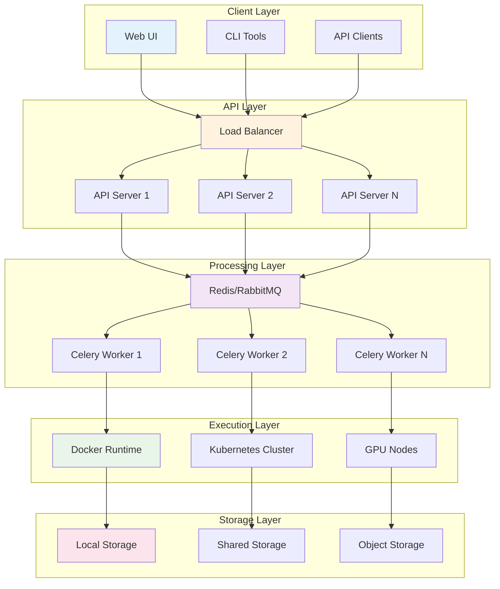

# 部署与运维指南

## 1. 概述

本文档提供AutoScorer系统的完整部署指南，包括开发环境搭建、生产环境部署、监控运维和故障排查。

### 1.1 部署架构



### 1.2 系统要求

#### 1.2.1 最低配置

| 组件 | CPU | 内存 | 存储 | 网络 |
|------|-----|------|------|------|
| API服务器 | 2核 | 4GB | 50GB | 1Gbps |
| Worker节点 | 4核 | 8GB | 100GB | 1Gbps |
| Redis/数据库 | 2核 | 4GB | 50GB | 1Gbps |

#### 1.2.2 推荐配置

| 组件 | CPU | 内存 | 存储 | 网络 |
|------|-----|------|------|------|
| API服务器 | 4核 | 8GB | 200GB SSD | 10Gbps |
| Worker节点 | 8核 | 16GB | 500GB SSD | 10Gbps |
| GPU节点 | 16核 | 64GB | 1TB NVMe | 25Gbps |
| Redis/数据库 | 4核 | 8GB | 200GB SSD | 10Gbps |

#### 1.2.3 软件依赖

- **操作系统**: Ubuntu 20.04+ / CentOS 8+ / RHEL 8+
- **Python**: 3.10+
- **Docker**: 20.10+
- **Kubernetes**: 1.25+ (可选)
- **Redis**: 6.0+
- **数据库**: PostgreSQL 13+ (可选)

## 2. 开发环境搭建

### 2.1 本地开发环境

#### 2.1.1 基础安装

```bash
# 克隆项目
git clone https://github.com/organization/autoscorer.git
cd autoscorer

# 创建虚拟环境
python3.10 -m venv .venv
source .venv/bin/activate  # Linux/macOS
# .venv\Scripts\activate  # Windows

# 安装依赖
pip install --upgrade pip
pip install -e .[dev]

# 验证安装
python -c "import autoscorer; print(autoscorer.__version__)"
```

#### 2.1.2 配置文件设置

```bash
# 复制配置模板
cp config.yaml.example config.yaml

# 编辑配置
vim config.yaml
```

**config.yaml示例**:
```yaml
# 开发环境配置
debug: true
log_level: "debug"

# Docker配置
docker:
  host: "unix:///var/run/docker.sock"
  image_pull_policy: "ifnotpresent"
  defaults:
    cpu: 2.0
    memory: "4Gi"
    timeout: 1800

# Redis配置(开发环境)
redis:
  host: "localhost"
  port: 6379
  db: 0
  password: null

# 调度器配置
scheduler:
  default_executor: "docker"
  max_concurrent_jobs: 5
```

#### 2.1.3 启动开发服务

```bash
# 方式1: 直接启动API服务
python -m autoscorer.api.run

# 方式2: 使用uvicorn
uvicorn autoscorer.api.server:app --reload --host 0.0.0.0 --port 8000

# 方式3: 使用配置入口
autoscorer-api --config config.yaml --port 8000
```

#### 2.1.4 启动Celery Worker

```bash
# 启动Redis(macOS)
brew install redis
brew services start redis

# 启动Redis(Ubuntu)
sudo apt update && sudo apt install redis-server
sudo systemctl start redis
sudo systemctl enable redis

# 启动Celery Worker
PYTHONPATH=src celery -A celery_app.tasks worker --loglevel=info

# 启动Celery监控(可选)
PYTHONPATH=src celery -A celery_app.tasks flower --port=5555
```

### 2.2 Docker Compose开发环境

#### 2.2.1 一键启动

```bash
# 构建并启动所有服务
docker-compose up -d --build

# 查看服务状态
docker-compose ps

# 查看日志
docker-compose logs -f api
docker-compose logs -f worker
```

#### 2.2.2 docker-compose.yml配置

```yaml
version: '3.8'

services:
  redis:
    image: redis:7-alpine
    ports:
      - "6379:6379"
    volumes:
      - redis_data:/data
    command: redis-server --appendonly yes

  api:
    build: .
    ports:
      - "8000:8000"
    environment:
      - REDIS_URL=redis://redis:6379/0
      - PYTHONPATH=/app/src
    volumes:
      - ./config.yaml:/app/config.yaml
      - ./examples:/app/examples
      - /var/run/docker.sock:/var/run/docker.sock:ro
    depends_on:
      - redis
    command: uvicorn autoscorer.api.server:app --host 0.0.0.0 --port 8000

  worker:
    build: .
    environment:
      - REDIS_URL=redis://redis:6379/0  
      - PYTHONPATH=/app/src
    volumes:
      - ./config.yaml:/app/config.yaml
      - ./examples:/app/examples
      - /var/run/docker.sock:/var/run/docker.sock
    depends_on:
      - redis
    command: celery -A celery_app.tasks worker --loglevel=info

  flower:
    build: .
    ports:
      - "5555:5555"
    environment:
      - REDIS_URL=redis://redis:6379/0
      - PYTHONPATH=/app/src
    depends_on:
      - redis
    command: celery -A celery_app.tasks flower --port=5555

volumes:
  redis_data:
```

## 3. 生产环境部署

### 3.1 单机部署

#### 3.1.1 系统准备

```bash
# 更新系统
sudo apt update && sudo apt upgrade -y

# 安装依赖
sudo apt install -y python3.10 python3.10-venv python3-pip
sudo apt install -y docker.io redis-server nginx

# 配置Docker
sudo usermod -aG docker $USER
sudo systemctl enable docker
sudo systemctl start docker

# 配置Redis
sudo systemctl enable redis
sudo systemctl start redis
```

#### 3.1.2 应用部署

```bash
# 创建用户和目录
sudo useradd -r -m -s /bin/bash autoscorer
sudo mkdir -p /opt/autoscorer
sudo chown autoscorer:autoscorer /opt/autoscorer

# 切换到应用用户
sudo su - autoscorer

# 部署应用
cd /opt/autoscorer
git clone https://github.com/organization/autoscorer.git .
python3.10 -m venv venv
source venv/bin/activate
pip install -e .[prod]

# 配置文件
cp config.yaml.prod config.yaml
# 编辑生产配置...
```

#### 3.1.3 Systemd服务配置

**API服务 (/etc/systemd/system/autoscorer-api.service)**:
```ini
[Unit]
Description=AutoScorer API Service
After=network.target redis.service
Requires=redis.service

[Service]
Type=exec
User=autoscorer
Group=autoscorer
WorkingDirectory=/opt/autoscorer
Environment=PATH=/opt/autoscorer/venv/bin
Environment=PYTHONPATH=/opt/autoscorer/src
ExecStart=/opt/autoscorer/venv/bin/uvicorn autoscorer.api.server:app --host 0.0.0.0 --port 8000 --workers 4
Restart=always
RestartSec=10
KillMode=mixed
TimeoutStopSec=10

[Install]
WantedBy=multi-user.target
```

**Worker服务 (/etc/systemd/system/autoscorer-worker.service)**:
```ini
[Unit]
Description=AutoScorer Celery Worker
After=network.target redis.service
Requires=redis.service

[Service]
Type=exec
User=autoscorer
Group=autoscorer
WorkingDirectory=/opt/autoscorer
Environment=PATH=/opt/autoscorer/venv/bin
Environment=PYTHONPATH=/opt/autoscorer/src
ExecStart=/opt/autoscorer/venv/bin/celery -A celery_app.tasks worker --loglevel=info --concurrency=4
Restart=always
RestartSec=10
KillMode=mixed
TimeoutStopSec=30

[Install]
WantedBy=multi-user.target
```

#### 3.1.4 启动服务

```bash
# 重新加载systemd配置
sudo systemctl daemon-reload

# 启动并启用服务
sudo systemctl enable autoscorer-api
sudo systemctl enable autoscorer-worker
sudo systemctl start autoscorer-api
sudo systemctl start autoscorer-worker

# 检查状态
sudo systemctl status autoscorer-api
sudo systemctl status autoscorer-worker
```

### 3.2 Kubernetes部署

#### 3.2.1 命名空间创建

```yaml
# namespace.yaml
apiVersion: v1
kind: Namespace
metadata:
  name: autoscorer
  labels:
    name: autoscorer
```

#### 3.2.2 配置管理

```yaml
# configmap.yaml
apiVersion: v1
kind: ConfigMap
metadata:
  name: autoscorer-config
  namespace: autoscorer
data:
  config.yaml: |
    debug: false
    log_level: "info"
    
    redis:
      host: "redis-service"
      port: 6379
      db: 0
    
    docker:
      host: "unix:///var/run/docker.sock"
      image_pull_policy: "ifnotpresent"
    
    k8s:
      enabled: true
      namespace: "autoscorer"
      
    scheduler:
      default_executor: "k8s"
      max_concurrent_jobs: 50
```

#### 3.2.3 Redis部署

```yaml
# redis.yaml
apiVersion: apps/v1
kind: Deployment
metadata:
  name: redis
  namespace: autoscorer
spec:
  selector:
    matchLabels:
      app: redis
  template:
    metadata:
      labels:
        app: redis
    spec:
      containers:
      - name: redis
        image: redis:7-alpine
        ports:
        - containerPort: 6379
        resources:
          requests:
            cpu: 100m
            memory: 256Mi
          limits:
            cpu: 500m
            memory: 512Mi
        volumeMounts:
        - name: redis-data
          mountPath: /data
      volumes:
      - name: redis-data
        persistentVolumeClaim:
          claimName: redis-pvc

---
apiVersion: v1
kind: Service
metadata:
  name: redis-service
  namespace: autoscorer
spec:
  selector:
    app: redis
  ports:
  - port: 6379
    targetPort: 6379

---
apiVersion: v1
kind: PersistentVolumeClaim
metadata:
  name: redis-pvc
  namespace: autoscorer
spec:
  accessModes:
  - ReadWriteOnce
  resources:
    requests:
      storage: 10Gi
```

#### 3.2.4 API服务部署

```yaml
# api.yaml
apiVersion: apps/v1
kind: Deployment
metadata:
  name: autoscorer-api
  namespace: autoscorer
spec:
  replicas: 3
  selector:
    matchLabels:
      app: autoscorer-api
  template:
    metadata:
      labels:
        app: autoscorer-api
    spec:
      containers:
      - name: api
        image: autoscorer:2.0.0
        ports:
        - containerPort: 8000
        env:
        - name: PYTHONPATH
          value: "/app/src"
        resources:
          requests:
            cpu: 500m
            memory: 1Gi
          limits:
            cpu: 2000m
            memory: 4Gi
        volumeMounts:
        - name: config
          mountPath: /app/config.yaml
          subPath: config.yaml
        livenessProbe:
          httpGet:
            path: /healthz
            port: 8000
          initialDelaySeconds: 30
          periodSeconds: 10
        readinessProbe:
          httpGet:
            path: /healthz
            port: 8000
          initialDelaySeconds: 5
          periodSeconds: 5
      volumes:
      - name: config
        configMap:
          name: autoscorer-config

---
apiVersion: v1
kind: Service
metadata:
  name: autoscorer-api-service
  namespace: autoscorer
spec:
  selector:
    app: autoscorer-api
  ports:
  - port: 80
    targetPort: 8000
  type: ClusterIP

---
apiVersion: networking.k8s.io/v1
kind: Ingress
metadata:
  name: autoscorer-ingress
  namespace: autoscorer
  annotations:
    nginx.ingress.kubernetes.io/rewrite-target: /
spec:
  rules:
  - host: autoscorer.example.com
    http:
      paths:
      - path: /
        pathType: Prefix
        backend:
          service:
            name: autoscorer-api-service
            port:
              number: 80
```

#### 3.2.5 Worker部署

```yaml
# worker.yaml
apiVersion: apps/v1
kind: Deployment
metadata:
  name: autoscorer-worker
  namespace: autoscorer
spec:
  replicas: 5
  selector:
    matchLabels:
      app: autoscorer-worker
  template:
    metadata:
      labels:
        app: autoscorer-worker
    spec:
      containers:
      - name: worker
        image: autoscorer:2.0.0
        env:
        - name: PYTHONPATH
          value: "/app/src"
        resources:
          requests:
            cpu: 1000m
            memory: 2Gi
          limits:
            cpu: 4000m
            memory: 8Gi
        volumeMounts:
        - name: config
          mountPath: /app/config.yaml
          subPath: config.yaml
        - name: docker-sock
          mountPath: /var/run/docker.sock
        command: ["celery"]
        args: ["-A", "celery_app.tasks", "worker", "--loglevel=info", "--concurrency=4"]
      volumes:
      - name: config
        configMap:
          name: autoscorer-config
      - name: docker-sock
        hostPath:
          path: /var/run/docker.sock
```

#### 3.2.6 GPU Worker部署

```yaml
# gpu-worker.yaml
apiVersion: apps/v1
kind: Deployment
metadata:
  name: autoscorer-gpu-worker
  namespace: autoscorer
spec:
  replicas: 2
  selector:
    matchLabels:
      app: autoscorer-gpu-worker
  template:
    metadata:
      labels:
        app: autoscorer-gpu-worker
    spec:
      nodeSelector:
        accelerator: nvidia-tesla-v100
      tolerations:
      - key: nvidia.com/gpu
        operator: Exists
        effect: NoSchedule
      containers:
      - name: worker
        image: autoscorer:2.0.0-gpu
        env:
        - name: PYTHONPATH
          value: "/app/src"
        - name: NVIDIA_VISIBLE_DEVICES
          value: "all"
        resources:
          requests:
            cpu: 2000m
            memory: 8Gi
            nvidia.com/gpu: 1
          limits:
            cpu: 8000m
            memory: 32Gi
            nvidia.com/gpu: 1
        volumeMounts:
        - name: config
          mountPath: /app/config.yaml
          subPath: config.yaml
        command: ["celery"]
        args: ["-A", "celery_app.tasks", "worker", "--loglevel=info", "--concurrency=2", "--queues=gpu"]
      volumes:
      - name: config
        configMap:
          name: autoscorer-config
```

## 4. 监控与运维

### 4.1 日志管理

#### 4.1.1 日志配置

```yaml
# logging.yaml
version: 1
disable_existing_loggers: false

formatters:
  standard:
    format: '%(asctime)s - %(name)s - %(levelname)s - %(message)s'
  json:
    format: '{"timestamp": "%(asctime)s", "level": "%(levelname)s", "logger": "%(name)s", "message": "%(message)s"}'

handlers:
  console:
    class: logging.StreamHandler
    level: INFO
    formatter: standard
    stream: ext://sys.stdout
    
  file:
    class: logging.handlers.RotatingFileHandler
    level: DEBUG
    formatter: json
    filename: /var/log/autoscorer/app.log
    maxBytes: 10485760  # 10MB
    backupCount: 5
    
  syslog:
    class: logging.handlers.SysLogHandler
    level: WARNING
    formatter: json
    address: /dev/log

loggers:
  autoscorer:
    level: DEBUG
    handlers: [console, file, syslog]
    propagate: false
    
  celery:
    level: INFO
    handlers: [console, file]
    propagate: false

root:
  level: WARNING
  handlers: [console]
```

#### 4.1.2 日志收集(ELK Stack)

```yaml
# filebeat.yml
filebeat.inputs:
- type: log
  enabled: true
  paths:
    - /var/log/autoscorer/*.log
  json.keys_under_root: true
  json.add_error_key: true
  fields:
    service: autoscorer
    environment: production

output.elasticsearch:
  hosts: ["elasticsearch:9200"]
  index: "autoscorer-%{+yyyy.MM.dd}"

processors:
- add_host_metadata:
    when.not.contains.tags: forwarded
```

### 4.2 性能监控

#### 4.2.1 Prometheus指标

```python
# metrics.py
from prometheus_client import Counter, Histogram, Gauge, start_http_server

# 业务指标
JOBS_SUBMITTED = Counter('autoscorer_jobs_submitted_total', 'Total submitted jobs')
JOBS_COMPLETED = Counter('autoscorer_jobs_completed_total', 'Total completed jobs', ['status'])
JOB_DURATION = Histogram('autoscorer_job_duration_seconds', 'Job execution duration')
ACTIVE_JOBS = Gauge('autoscorer_active_jobs', 'Currently active jobs')

# 系统指标
CPU_USAGE = Gauge('autoscorer_cpu_usage_percent', 'CPU usage percentage')
MEMORY_USAGE = Gauge('autoscorer_memory_usage_bytes', 'Memory usage in bytes')
DOCKER_CONTAINERS = Gauge('autoscorer_docker_containers', 'Number of Docker containers', ['status'])

def start_metrics_server(port=8001):
    """启动指标服务器"""
    start_http_server(port)
```

#### 4.2.2 Grafana仪表板

```json
{
  "dashboard": {
    "title": "AutoScorer Monitoring",
    "panels": [
      {
        "title": "Job Throughput",
        "type": "graph",
        "targets": [
          {
            "expr": "rate(autoscorer_jobs_completed_total[5m])",
            "legendFormat": "Jobs/sec"
          }
        ]
      },
      {
        "title": "Job Success Rate",
        "type": "stat",
        "targets": [
          {
            "expr": "rate(autoscorer_jobs_completed_total{status=\"success\"}[5m]) / rate(autoscorer_jobs_completed_total[5m]) * 100",
            "legendFormat": "Success Rate %"
          }
        ]
      },
      {
        "title": "System Resources",
        "type": "graph",
        "targets": [
          {
            "expr": "autoscorer_cpu_usage_percent",
            "legendFormat": "CPU %"
          },
          {
            "expr": "autoscorer_memory_usage_bytes / 1024 / 1024 / 1024",
            "legendFormat": "Memory GB"
          }
        ]
      }
    ]
  }
}
```

### 4.3 健康检查

#### 4.3.1 API健康检查

```python
# health.py
from fastapi import APIRouter, HTTPException
from typing import Dict, Any
import redis
import docker

router = APIRouter()

@router.get("/healthz")
async def health_check() -> Dict[str, Any]:
    """系统健康检查"""
    checks = {}
    overall_status = "healthy"
    
    # Redis连接检查
    try:
        r = redis.Redis(host='localhost', port=6379, db=0)
        r.ping()
        checks["redis"] = "healthy"
    except Exception as e:
        checks["redis"] = f"unhealthy: {e}"
        overall_status = "unhealthy"
    
    # Docker连接检查
    try:
        client = docker.from_env()
        client.ping()
        checks["docker"] = "healthy"
    except Exception as e:
        checks["docker"] = f"unhealthy: {e}"
        overall_status = "unhealthy"
    
    # 磁盘空间检查
    import shutil
    disk_usage = shutil.disk_usage("/")
    free_percent = disk_usage.free / disk_usage.total * 100
    if free_percent < 10:
        checks["disk"] = f"warning: {free_percent:.1f}% free"
        if overall_status == "healthy":
            overall_status = "warning"
    else:
        checks["disk"] = "healthy"
    
    if overall_status == "unhealthy":
        raise HTTPException(status_code=503, detail=checks)
    
    return {
        "status": overall_status,
        "checks": checks,
        "timestamp": datetime.utcnow().isoformat()
    }

@router.get("/readyz")
async def readiness_check() -> Dict[str, str]:
    """就绪检查"""
    # 简单的就绪检查，确认服务可以处理请求
    return {"status": "ready"}

@router.get("/livez")
async def liveness_check() -> Dict[str, str]:
    """存活检查"""
    # 简单的存活检查，确认服务进程运行正常
    return {"status": "alive"}
```

#### 4.3.2 Kubernetes健康检查配置

```yaml
# 在deployment中添加健康检查
spec:
  containers:
  - name: api
    image: autoscorer:2.0.0
    livenessProbe:
      httpGet:
        path: /livez
        port: 8000
      initialDelaySeconds: 30
      periodSeconds: 10
      timeoutSeconds: 5
      failureThreshold: 3
      
    readinessProbe:
      httpGet:
        path: /readyz
        port: 8000
      initialDelaySeconds: 5
      periodSeconds: 5
      timeoutSeconds: 3
      failureThreshold: 3
      
    startupProbe:
      httpGet:
        path: /healthz
        port: 8000
      initialDelaySeconds: 10
      periodSeconds: 10
      timeoutSeconds: 5
      failureThreshold: 30
```

### 4.4 备份与恢复

#### 4.4.1 数据备份策略

```bash
#!/bin/bash
# backup.sh - 数据备份脚本

BACKUP_DIR="/backup/autoscorer"
DATE=$(date +%Y%m%d_%H%M%S)

# 创建备份目录
mkdir -p "$BACKUP_DIR/$DATE"

# 备份配置文件
cp /opt/autoscorer/config.yaml "$BACKUP_DIR/$DATE/"

# 备份Redis数据
redis-cli BGSAVE
cp /var/lib/redis/dump.rdb "$BACKUP_DIR/$DATE/"

# 备份数据库(如果使用PostgreSQL)
if command -v pg_dump &> /dev/null; then
    pg_dump -U autoscorer -h localhost autoscorer > "$BACKUP_DIR/$DATE/database.sql"
fi

# 备份重要日志
tar -czf "$BACKUP_DIR/$DATE/logs.tar.gz" /var/log/autoscorer/

# 压缩备份
tar -czf "$BACKUP_DIR/autoscorer_backup_$DATE.tar.gz" -C "$BACKUP_DIR" "$DATE"
rm -rf "$BACKUP_DIR/$DATE"

# 清理旧备份(保留30天)
find "$BACKUP_DIR" -name "autoscorer_backup_*.tar.gz" -mtime +30 -delete

echo "Backup completed: $BACKUP_DIR/autoscorer_backup_$DATE.tar.gz"
```

#### 4.4.2 恢复流程

```bash
#!/bin/bash
# restore.sh - 数据恢复脚本

BACKUP_FILE="$1"
RESTORE_DIR="/tmp/autoscorer_restore"

if [ -z "$BACKUP_FILE" ]; then
    echo "Usage: $0 <backup_file>"
    exit 1
fi

# 解压备份
mkdir -p "$RESTORE_DIR"
tar -xzf "$BACKUP_FILE" -C "$RESTORE_DIR"

# 停止服务
sudo systemctl stop autoscorer-api
sudo systemctl stop autoscorer-worker
sudo systemctl stop redis

# 恢复配置
cp "$RESTORE_DIR"/*/config.yaml /opt/autoscorer/

# 恢复Redis数据
cp "$RESTORE_DIR"/*/dump.rdb /var/lib/redis/
sudo chown redis:redis /var/lib/redis/dump.rdb

# 恢复数据库
if [ -f "$RESTORE_DIR"/*/database.sql ]; then
    psql -U autoscorer -h localhost autoscorer < "$RESTORE_DIR"/*/database.sql
fi

# 启动服务
sudo systemctl start redis
sudo systemctl start autoscorer-api
sudo systemctl start autoscorer-worker

# 清理临时文件
rm -rf "$RESTORE_DIR"

echo "Restore completed from $BACKUP_FILE"
```

## 5. 故障排查

### 5.1 常见问题诊断

#### 5.1.1 服务启动失败

```bash
# 检查服务状态
sudo systemctl status autoscorer-api
sudo systemctl status autoscorer-worker

# 查看详细日志
sudo journalctl -u autoscorer-api -f
sudo journalctl -u autoscorer-worker -f

# 检查端口占用
sudo netstat -tlnp | grep :8000

# 检查配置文件
python -c "import yaml; yaml.safe_load(open('config.yaml'))"
```

#### 5.1.2 连接问题诊断

```bash
# 检查Redis连接
redis-cli ping

# 检查Docker连接
docker version
docker ps

# 检查网络连通性
curl -I http://localhost:8000/healthz

# 检查DNS解析
nslookup redis-service
```

#### 5.1.3 性能问题诊断

```bash
# 检查系统资源
top
htop
iotop

# 检查磁盘空间
df -h
du -sh /opt/autoscorer/

# 检查内存使用
free -h
cat /proc/meminfo

# 检查网络状态
ss -tulnp
iftop
```

### 5.2 故障排查工具

#### 5.2.1 系统诊断脚本

```bash
#!/bin/bash
# diagnostic.sh - 系统诊断脚本

echo "=== AutoScorer System Diagnostic ==="
echo "Timestamp: $(date)"
echo

echo "1. System Information:"
echo "OS: $(cat /etc/os-release | grep PRETTY_NAME | cut -d= -f2 | tr -d '\"')"
echo "Kernel: $(uname -r)"
echo "CPU: $(nproc) cores"
echo "Memory: $(free -h | grep Mem | awk '{print $2}')"
echo "Disk: $(df -h / | grep / | awk '{print $4}') available"
echo

echo "2. Service Status:"
systemctl is-active autoscorer-api && echo "API: Active" || echo "API: Inactive"
systemctl is-active autoscorer-worker && echo "Worker: Active" || echo "Worker: Inactive"
systemctl is-active redis && echo "Redis: Active" || echo "Redis: Inactive"
echo

echo "3. Network Connectivity:"
curl -s -o /dev/null -w "%{http_code}" http://localhost:8000/healthz && echo "API Health: OK" || echo "API Health: FAIL"
redis-cli ping >/dev/null 2>&1 && echo "Redis: OK" || echo "Redis: FAIL"
docker version >/dev/null 2>&1 && echo "Docker: OK" || echo "Docker: FAIL"
echo

echo "4. Resource Usage:"
echo "CPU: $(top -bn1 | grep "Cpu(s)" | awk '{print $2}' | cut -d% -f1)%"
echo "Memory: $(free | grep Mem | awk '{printf "%.1f%%", $3/$2 * 100.0}')"
echo "Disk: $(df / | grep / | awk '{printf "%.1f%%", $3/$2 * 100.0}')"
echo

echo "5. Recent Errors:"
echo "API Errors (last 10):"
sudo journalctl -u autoscorer-api --since "1 hour ago" | grep -i error | tail -10
echo
echo "Worker Errors (last 10):"
sudo journalctl -u autoscorer-worker --since "1 hour ago" | grep -i error | tail -10
echo

echo "=== Diagnostic Complete ==="
```

#### 5.2.2 性能分析工具

```python
# performance_monitor.py
import psutil
import time
import json
from datetime import datetime

def collect_metrics():
    """收集系统性能指标"""
    return {
        "timestamp": datetime.utcnow().isoformat(),
        "cpu": {
            "percent": psutil.cpu_percent(interval=1),
            "count": psutil.cpu_count(),
            "load_avg": psutil.getloadavg()
        },
        "memory": {
            "total": psutil.virtual_memory().total,
            "available": psutil.virtual_memory().available,
            "percent": psutil.virtual_memory().percent
        },
        "disk": {
            "total": psutil.disk_usage('/').total,
            "free": psutil.disk_usage('/').free,
            "percent": psutil.disk_usage('/').percent
        },
        "network": {
            "bytes_sent": psutil.net_io_counters().bytes_sent,
            "bytes_recv": psutil.net_io_counters().bytes_recv
        }
    }

def monitor_performance(duration=300, interval=10):
    """持续监控性能指标"""
    metrics = []
    
    for _ in range(duration // interval):
        metrics.append(collect_metrics())
        time.sleep(interval)
    
    # 保存到文件
    with open(f"/tmp/performance_report_{int(time.time())}.json", "w") as f:
        json.dump(metrics, f, indent=2)
    
    return metrics

if __name__ == "__main__":
    import sys
    duration = int(sys.argv[1]) if len(sys.argv) > 1 else 300
    monitor_performance(duration)
```

### 5.3 故障恢复

#### 5.3.1 自动故障恢复

```bash
#!/bin/bash
# auto_recovery.sh - 自动故障恢复脚本

LOG_FILE="/var/log/autoscorer/recovery.log"

log() {
    echo "[$(date '+%Y-%m-%d %H:%M:%S')] $1" | tee -a "$LOG_FILE"
}

check_and_restart() {
    SERVICE="$1"
    
    if ! systemctl is-active --quiet "$SERVICE"; then
        log "Service $SERVICE is down, attempting restart..."
        systemctl restart "$SERVICE"
        
        sleep 10
        
        if systemctl is-active --quiet "$SERVICE"; then
            log "Service $SERVICE restarted successfully"
        else
            log "Failed to restart service $SERVICE"
            # 发送告警
            curl -X POST -H 'Content-type: application/json' \
                --data '{"text":"AutoScorer: Failed to restart service: '$SERVICE'"}' \
                "$SLACK_WEBHOOK_URL"
        fi
    fi
}

# 检查并恢复服务
check_and_restart "autoscorer-api"
check_and_restart "autoscorer-worker"
check_and_restart "redis"

# 检查磁盘空间
DISK_USAGE=$(df / | grep / | awk '{print $5}' | cut -d% -f1)
if [ "$DISK_USAGE" -gt 90 ]; then
    log "Disk usage is ${DISK_USAGE}%, cleaning up..."
    
    # 清理日志文件
    find /var/log/autoscorer/ -name "*.log" -mtime +7 -delete
    
    # 清理Docker镜像
    docker system prune -f
    
    log "Cleanup completed"
fi
```

#### 5.3.2 告警通知

```python
# alerting.py
import requests
import json
from enum import Enum

class AlertLevel(Enum):
    INFO = "info"
    WARNING = "warning"
    ERROR = "error"
    CRITICAL = "critical"

class AlertManager:
    """告警管理器"""
    
    def __init__(self, slack_webhook=None, email_config=None):
        self.slack_webhook = slack_webhook
        self.email_config = email_config
    
    def send_alert(self, title: str, message: str, level: AlertLevel = AlertLevel.INFO):
        """发送告警"""
        
        # Slack通知
        if self.slack_webhook:
            self._send_slack_alert(title, message, level)
        
        # 邮件通知(关键告警)
        if self.email_config and level in [AlertLevel.ERROR, AlertLevel.CRITICAL]:
            self._send_email_alert(title, message, level)
    
    def _send_slack_alert(self, title: str, message: str, level: AlertLevel):
        """发送Slack告警"""
        color_map = {
            AlertLevel.INFO: "good",
            AlertLevel.WARNING: "warning", 
            AlertLevel.ERROR: "danger",
            AlertLevel.CRITICAL: "danger"
        }
        
        payload = {
            "attachments": [{
                "color": color_map[level],
                "title": f"[{level.value.upper()}] {title}",
                "text": message,
                "footer": "AutoScorer Monitoring",
                "ts": int(time.time())
            }]
        }
        
        try:
            requests.post(self.slack_webhook, json=payload, timeout=10)
        except Exception as e:
            print(f"Failed to send Slack alert: {e}")

# 使用示例
alert_manager = AlertManager(slack_webhook="https://hooks.slack.com/...")

# 服务重启告警
alert_manager.send_alert(
    "Service Restart",
    "AutoScorer API service was automatically restarted due to failure",
    AlertLevel.WARNING
)

# 磁盘空间告警
alert_manager.send_alert(
    "Disk Space Critical", 
    "Disk usage is above 95%, immediate action required",
    AlertLevel.CRITICAL
)
```

---

## 总结

本部署指南涵盖了AutoScorer系统的完整部署流程：

1. **开发环境**: 本地开发和Docker Compose快速搭建
2. **生产部署**: 单机部署和Kubernetes集群部署
3. **监控运维**: 日志管理、性能监控、健康检查
4. **备份恢复**: 数据备份策略和恢复流程
5. **故障排查**: 常见问题诊断和自动恢复机制

遵循本指南可以确保系统的稳定运行和高可用性。
