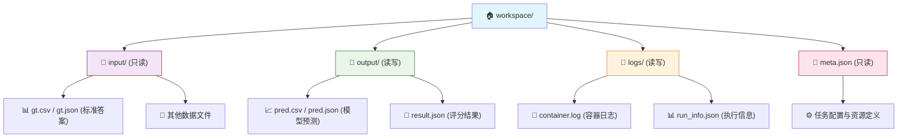
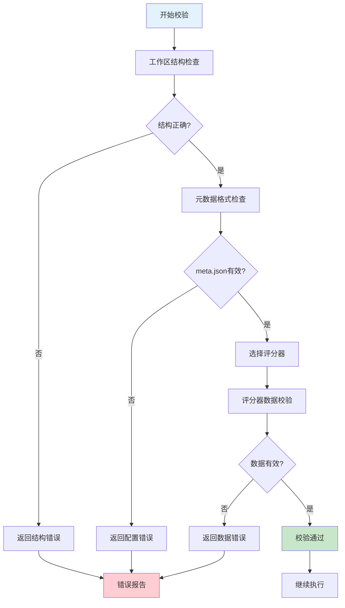

# 自动评分系统输入标准化规范

## 1. 标准概述

本文档定义了AutoScorer系统的输入数据标准，确保跨平台、多算法的一致性和兼容性。

### 1.1 设计原则

- **标准化**: 统一的目录结构和文件格式
- **灵活性**: 支持多种数据类型和评分算法
- **安全性**: 严格的权限控制和数据隔离
- **可扩展性**: 支持自定义评分器和数据格式

## 2. 工作区结构标准



### 2.1 目录结构要求

| 目录/文件 | 权限 | 用途 | 创建时机 | 必需性 |
|-----------|------|------|----------|--------|
| `input/` | 只读 | 标准答案和输入数据 | 任务提交前 | **必需** |
| `output/` | 读写 | 模型预测结果 | 任务执行时自动创建 | **必需** |
| `logs/` | 读写 | 执行日志和调试信息 | 任务执行时自动创建 | **可选** |
| `meta.json` | 只读 | 任务配置和元数据 | 任务提交前 | **必需** |

### 2.2 核心约束

- **挂载路径**: 容器内统一挂载到 `/workspace`
- **文件编码**: 所有文本文件必须使用 UTF-8 编码
- **权限隔离**: `input/` 和 `meta.json` 为只读，防止意外修改
- **自动创建**: `output/` 和 `logs/` 在执行时自动创建
- **路径长度**: 单个路径不超过255字符，总路径深度不超过10层

## 3. 元数据配置 (meta.json)

### 3.1 标准结构

```json
{
  "job_id": "job-demo-001",
  "task_type": "classification",
  "scorer": "classification_f1",
  "input_uri": "file://./input",
  "output_uri": "file://./output",
  "time_limit": 1800,
  "resources": {
    "cpu": 2.0,
    "memory": "4Gi",
    "gpus": 0
  },
  "container": {
    "image": "python:3.10-slim",
    "cmd": ["python", "infer.py"],
    "env": {
      "PYTHONUNBUFFERED": "1"
    }
  }
}
```

### 3.2 字段详细说明

#### 3.2.1 基础字段 (必需)

| 字段名 | 类型 | 说明 | 示例 | 约束 |
|--------|------|------|------|------|
| `job_id` | string | 唯一任务标识符 | "job-demo-001" | 3-50字符，字母数字-_ |
| `task_type` | string | 任务类型 | "classification" | 见支持的任务类型 |
| `scorer` | string | 评分器名称 | "classification_f1" | 必须在注册表中存在 |
| `input_uri` | string | 输入数据路径 | "file://./input" | file:// 或 http:// |
| `output_uri` | string | 输出结果路径 | "file://./output" | file:// 或 http:// |

#### 3.2.2 资源配置 (可选)

| 字段名 | 类型 | 默认值 | 说明 | 约束 |
|--------|------|--------|------|------|
| `time_limit` | int | 1800 | 超时时间(秒) | 60-7200 |
| `resources.cpu` | float | 2.0 | CPU核心数 | 0.1-32.0 |
| `resources.memory` | string | "4Gi" | 内存限制 | 支持Gi/Mi格式 |
| `resources.gpus` | int | 0 | GPU数量 | 0-8 |

#### 3.2.3 容器配置 (可选)

| 字段名 | 类型 | 默认值 | 说明 |
|--------|------|--------|------|
| `container.image` | string | "python:3.10-slim" | 容器镜像 |
| `container.cmd` | array | ["python", "main.py"] | 执行命令 |
| `container.env` | object | {} | 环境变量 |
| `container.working_dir` | string | "/workspace" | 工作目录 |

### 3.3 支持的任务类型

| 任务类型 | 说明 | 推荐评分器 | 数据格式 |
|---------|------|-----------|---------|
| `classification` | 分类任务 | classification_f1, classification_accuracy | CSV |
| `regression` | 回归任务 | regression_rmse | CSV |
| `detection` | 目标检测 | detection_map | JSON |
| `segmentation` | 图像分割 | segmentation_iou | 图像文件 |
| `nlp` | 自然语言处理 | custom_nlp_scorer | JSON/TXT |

### 3.4 评分器注册表

系统通过动态注册机制发现评分器：

| 评分器名称 | 类名 | 适用任务 | 主要指标 |
|-----------|------|---------|---------|
| `classification_f1` | ClassificationF1 | 分类 | Macro-F1 |
| `classification_accuracy` | ClassificationAccuracy | 分类 | 准确率 |
| `regression_rmse` | RegressionRMSE | 回归 | RMSE |
| `detection_map` | DetectionMAP | 检测 | mAP@0.5 |

> **扩展性**: 可通过实现 `BaseScorer` 接口添加自定义评分器

## 4. 数据格式标准

### 4.1 格式规范原则

**核心原则**: 具体的数据格式校验由评分算法实现，系统只保证基本的文件存在性和可读性。

**分层校验**:
1. **系统层**: 文件存在、编码正确、基本结构
2. **算法层**: 数据格式、内容一致性、业务逻辑

### 4.2 通用文件约定

| 文件类型 | 位置 | 命名规则 | 格式 | 用途 |
|---------|------|----------|------|------|
| 标准答案 | `input/gt.*` | gt + 扩展名 | 算法定义 | Ground Truth |
| 模型预测 | `output/pred.*` | pred + 扩展名 | 算法定义 | 预测结果 |
| 评分结果 | `output/result.json` | 固定名称 | JSON | 评分输出 |
| 执行日志 | `logs/container.log` | 固定名称 | 文本 | 调试信息 |

### 4.3 分类任务格式

#### CSV 格式 (推荐)

**标准答案 (input/gt.csv)**:
```csv
id,label
sample_001,cat
sample_002,dog
sample_003,bird
```

**模型预测 (output/pred.csv)**:
```csv
id,label
sample_001,cat
sample_002,cat
sample_003,dog
```

**格式要求**:
- 必须包含 `id` 和 `label` 列
- ID必须完全匹配，顺序可以不同
- 标签值必须是字符串类型

### 4.4 回归任务格式

**标准答案 (input/gt.csv)**:
```csv
id,value
sample_001,2.15
sample_002,3.47
sample_003,1.89
```

**模型预测 (output/pred.csv)**:
```csv
id,value
sample_001,2.10
sample_002,3.52
sample_003,1.95
```

**格式要求**:
- 必须包含 `id` 和 `value` 列
- 数值必须是浮点数类型
- 支持科学计数法

### 4.5 检测任务格式

**标准答案 (input/gt.json)**:
```json
{
  "images": [
    {
      "id": 1,
      "file_name": "image_001.jpg",
      "width": 640,
      "height": 480
    }
  ],
  "annotations": [
    {
      "id": 1,
      "image_id": 1,
      "category_id": 1,
      "bbox": [100, 100, 200, 150],
      "area": 7500
    }
  ],
  "categories": [
    {"id": 1, "name": "person"},
    {"id": 2, "name": "car"}
  ]
}
```

**模型预测 (output/pred.json)**:
```json
[
  {
    "image_id": 1,
    "category_id": 1,
    "bbox": [105, 98, 195, 155],
    "score": 0.95
  }
]
```

**格式要求**:
- 遵循COCO格式标准
- bbox格式: [x, y, width, height]
- score为置信度分数 [0.0, 1.0]

## 5. 校验标准

### 5.1 系统级校验

系统在任务执行前进行基础校验：

#### 5.1.1 工作区结构校验

- [ ] `input/` 目录存在且可读
- [ ] `meta.json` 文件存在且格式正确
- [ ] `output/` 目录可创建或已存在
- [ ] 路径长度和深度符合限制

#### 5.1.2 元数据校验

- [ ] JSON格式正确
- [ ] 包含所有必需字段
- [ ] 字段类型和值范围正确
- [ ] 评分器在注册表中存在
- [ ] 资源配置合理性检查

#### 5.1.3 文件编码校验

- [ ] 所有文本文件使用UTF-8编码
- [ ] 文件大小在合理范围内
- [ ] 文件权限正确设置

### 5.2 算法级校验

由具体评分算法实现的数据校验：

#### 5.2.1 数据格式校验

- [ ] 文件格式符合算法要求
- [ ] 必需字段完整存在
- [ ] 数据类型正确
- [ ] 数据范围合理

#### 5.2.2 数据一致性校验

- [ ] GT和预测文件ID完全匹配
- [ ] 样本数量一致
- [ ] 类别/标签一致性
- [ ] 数据完整性检查

### 5.3 校验流程



## 6. 应用示例

### 6.1 分类任务完整示例

**目录结构**:
```text
examples/classification/
├── input/
│   └── gt.csv              # 标准答案
├── output/                 # 自动创建
├── logs/                   # 自动创建
└── meta.json               # 任务配置
```

**meta.json**:
```json
{
  "job_id": "classification-demo-v1",
  "task_type": "classification",
  "scorer": "classification_f1",
  "input_uri": "file://./input",
  "output_uri": "file://./output",
  "time_limit": 600,
  "resources": {
    "cpu": 2.0,
    "memory": "4Gi",
    "gpus": 0
  },
  "container": {
    "image": "python:3.10-slim",
    "cmd": ["python", "/workspace/inference.py"],
    "env": {
      "PYTHONUNBUFFERED": "1",
      "MODEL_PATH": "/workspace/model"
    },
    "working_dir": "/workspace"
  }
}
```

**input/gt.csv**:
```csv
id,label
img_001,cat
img_002,dog
img_003,bird
img_004,cat
img_005,dog
```

**执行后生成的 output/pred.csv**:
```csv
id,label
img_001,cat
img_002,cat
img_003,bird
img_004,cat
img_005,bird
```

### 6.2 回归任务示例

**meta.json**:
```json
{
  "job_id": "regression-demo-v1",
  "task_type": "regression",
  "scorer": "regression_rmse",
  "input_uri": "file://./input",
  "output_uri": "file://./output",
  "time_limit": 900,
  "resources": {
    "cpu": 4.0,
    "memory": "8Gi",
    "gpus": 1
  },
  "container": {
    "image": "tensorflow/tensorflow:2.13.0-gpu",
    "cmd": ["python", "predict.py"],
    "env": {
      "CUDA_VISIBLE_DEVICES": "0"
    }
  }
}
```

**input/gt.csv**:
```csv
id,value
sample_001,23.45
sample_002,18.92
sample_003,31.67
sample_004,27.83
sample_005,19.21
```

### 6.3 检测任务示例

**meta.json**:
```json
{
  "job_id": "detection-demo-v1",
  "task_type": "detection",
  "scorer": "detection_map",
  "input_uri": "file://./input",
  "output_uri": "file://./output",
  "time_limit": 1200,
  "resources": {
    "cpu": 8.0,
    "memory": "16Gi",
    "gpus": 2
  },
  "container": {
    "image": "pytorch/pytorch:2.0.1-cuda11.7-cudnn8-runtime",
    "cmd": ["python", "detect.py", "--config", "config.yaml"],
    "env": {
      "TORCH_HOME": "/workspace/.torch"
    }
  }
}
```

## 7. 常见错误及解决方案

### 7.1 文件系统错误

| 错误类型 | 错误信息 | 原因 | 解决方案 |
|---------|---------|------|---------|
| `INPUT_DIR_NOT_FOUND` | input目录不存在 | 工作区结构不完整 | 创建input目录并放入数据文件 |
| `META_FILE_NOT_FOUND` | meta.json不存在 | 缺少配置文件 | 创建符合规范的meta.json |
| `FILE_ENCODING_ERROR` | 文件编码错误 | 非UTF-8编码 | 转换文件为UTF-8编码 |
| `PERMISSION_DENIED` | 权限不足 | 文件权限设置错误 | 修正文件权限 |

### 7.2 配置错误

| 错误类型 | 错误信息 | 原因 | 解决方案 |
|---------|---------|------|---------|
| `INVALID_JSON_FORMAT` | JSON格式错误 | meta.json语法错误 | 检查JSON语法，使用验证工具 |
| `MISSING_REQUIRED_FIELD` | 缺少必需字段 | 配置不完整 | 添加所有必需字段 |
| `SCORER_NOT_FOUND` | 评分器不存在 | 评分器名称错误 | 使用有效的评分器名称 |
| `INVALID_RESOURCE_SPEC` | 资源配置无效 | 资源配置不合理 | 检查CPU/内存/GPU配置 |

### 7.3 数据格式错误

| 错误类型 | 错误信息 | 原因 | 解决方案 |
|---------|---------|------|---------|
| `CSV_FORMAT_ERROR` | CSV格式错误 | 缺少必需列或格式不正确 | 确保包含id,label列 |
| `JSON_SCHEMA_ERROR` | JSON结构错误 | JSON数据结构不符合规范 | 检查JSON结构和字段 |
| `DATA_TYPE_ERROR` | 数据类型错误 | 数据类型不匹配 | 确保数值类型正确 |
| `ID_MISMATCH_ERROR` | ID不匹配 | GT和预测文件ID不一致 | 确保ID完全匹配 |

### 7.4 资源限制错误

| 错误类型 | 错误信息 | 原因 | 解决方案 |
|---------|---------|------|---------|
| `MEMORY_LIMIT_EXCEEDED` | 内存超限 | 内存配置不足 | 增加内存配置或优化算法 |
| `CPU_LIMIT_EXCEEDED` | CPU超限 | CPU配置不足 | 增加CPU配置或优化算法 |
| `TIME_LIMIT_EXCEEDED` | 执行超时 | 时间配置不足 | 增加时间限制或优化算法 |
| `DISK_SPACE_INSUFFICIENT` | 磁盘空间不足 | 存储空间不够 | 清理磁盘空间或增加配额 |

### 7.5 容器镜像错误

| 错误类型 | 错误信息 | 原因 | 解决方案 |
|---------|---------|------|---------|
| `IMAGE_PULL_FAILED` | 镜像拉取失败 | 网络问题或镜像不存在 | 检查网络和镜像名称 |
| `IMAGE_NOT_FOUND` | 镜像未找到 | 镜像名称错误 | 使用正确的镜像名称 |
| `CONTAINER_START_FAILED` | 容器启动失败 | 容器配置错误 | 检查容器配置和命令 |
| `COMMAND_NOT_FOUND` | 命令未找到 | 容器内缺少执行文件 | 确保镜像包含所需程序 |

## 8. 最佳实践

### 8.1 文件组织

1. **标准化命名**: 使用一致的文件命名规则
2. **结构清晰**: 保持目录结构简洁明了
3. **文档齐全**: 为复杂数据提供README说明
4. **版本控制**: 对重要数据和配置进行版本管理

### 8.2 数据准备

1. **数据清洗**: 确保数据质量和一致性
2. **格式验证**: 使用工具验证数据格式
3. **编码统一**: 所有文件使用UTF-8编码
4. **大小控制**: 控制文件大小在合理范围内

### 8.3 配置管理

1. **环境分离**: 开发、测试、生产环境配置分离
2. **参数化**: 使用环境变量管理可变参数
3. **安全性**: 避免在配置中存储敏感信息
4. **文档化**: 详细说明每个配置项的作用

### 8.4 测试策略

1. **单元测试**: 对数据格式和配置进行单元测试
2. **集成测试**: 端到端测试完整流程
3. **回归测试**: 确保修改不影响现有功能
4. **性能测试**: 验证资源配置的合理性

---

## 附录

### A. 配置模板

完整的meta.json模板可在 `examples/` 目录中找到。

### B. 相关文档

- [调度标准 (SCHEDULER_STANDARD.md)](./SCHEDULER_STANDARD.md)
- [评分算法 (SCORING_ALGORITHMS.md)](./SCORING_ALGORITHMS.md)
- [输出标准 (OUTPUT_STANDARDS.md)](./OUTPUT_STANDARDS.md)
- [部署指南 (DEPLOYMENT.md)](./DEPLOYMENT.md)

### C. 版本历史

- **v2.0** (2024-08-21): 重构文档结构，增加详细的数据格式和校验标准
- **v1.1** (2024-06-15): 增加检测任务支持
- **v1.0** (2024-05-01): 初始版本
