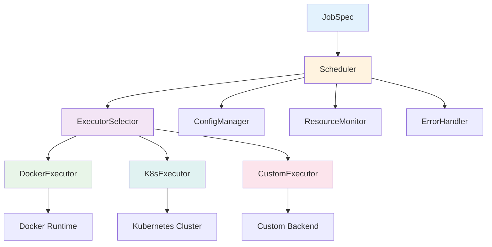
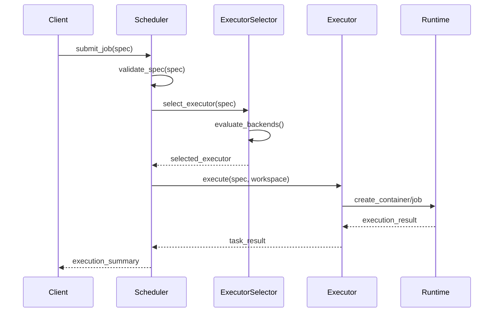
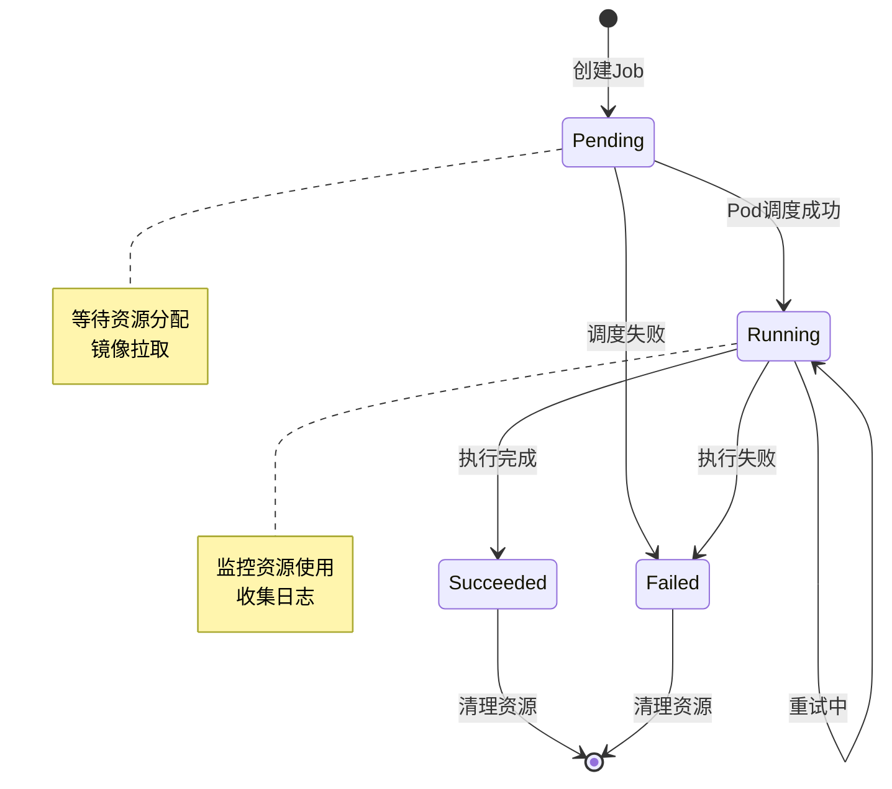

# 调度器标准化文档

## 1. 概述

AutoScorer调度器负责在不同执行环境（Docker、Kubernetes）中运行评分任务，提供统一的调度接口和配置管理。本文档定义了调度器的标准化规范和最佳实践。

### 1.1 设计目标

- **统一接口**: 为不同执行后端提供一致的调度接口
- **资源优化**: 智能的资源分配和负载均衡
- **故障恢复**: 完善的错误处理和自动重试机制  
- **可扩展性**: 支持自定义执行器和调度策略

## 2. 架构设计

### 2.1 核心组件



### 2.2 调度流程



## 3. 执行器标准

### 3.1 基础接口定义

所有执行器必须实现 `Executor` 抽象基类：

```python
from abc import ABC, abstractmethod
from pathlib import Path
from typing import Dict, Any
from ..schemas.job import JobSpec

class Executor(ABC):
    """执行器基类定义标准接口"""
    
    def __init__(self, config_path: str = "config.yaml"):
        """初始化执行器
        
        Args:
            config_path: 配置文件路径
        """
        self.config = self._load_config(config_path)
    
    @abstractmethod
    def run(self, spec: JobSpec, workspace: Path) -> Dict[str, Any]:
        """执行任务的核心方法
        
        Args:
            spec: 任务规格说明
            workspace: 工作区路径
            
        Returns:
            执行结果字典，包含状态、日志、资源使用等信息
        """
        pass
    
    @abstractmethod
    def health_check(self) -> bool:
        """健康检查
        
        Returns:
            执行器是否可用
        """
        pass
    
    def _load_config(self, config_path: str) -> Dict[str, Any]:
        """加载配置文件（子类可重写）"""
        pass
```

### 3.2 Docker执行器

#### 3.2.1 配置规范

```yaml
# config.yaml - Docker执行器配置
docker:
  # 连接配置
  host: "unix:///var/run/docker.sock"     # Docker守护进程地址
  api_version: "auto"                      # Docker API版本
  tls_verify: false                        # TLS验证开关
  timeout: 60                              # API调用超时
  
  # 镜像策略
  image_pull_policy: "ifnotpresent"        # always|ifnotpresent|never
  registry:                                # 镜像仓库配置(可选)
    url: "registry.example.com"
    username: "${REGISTRY_USER}"           # 支持环境变量
    password: "${REGISTRY_PASS}"
    
  # 默认资源限制
  defaults:
    cpu: 2.0                               # CPU核心数
    memory: "4Gi"                          # 内存限制
    gpu: 0                                 # GPU数量
    shm_size: "1Gi"                        # 共享内存大小
    timeout: 1800                          # 执行超时(秒)
    
  # 安全配置
  security:
    user: "nobody"                         # 运行用户
    readonly_rootfs: true                  # 只读根文件系统
    no_new_privileges: true                # 禁止新权限
    cap_drop: ["ALL"]                      # 丢弃所有capabilities
    security_opts:
      - "no-new-privileges:true"
      
  # 网络配置
  network:
    mode: "none"                           # none|bridge|host|custom
    dns_servers: []                        # DNS服务器列表
    
  # 日志配置
  logging:
    driver: "json-file"                    # 日志驱动
    options:
      max_size: "10m"                      # 最大日志文件大小
      max_file: "3"                        # 最大日志文件数
```

#### 3.2.2 镜像管理策略

| 策略 | 行为 | 适用场景 | 性能影响 |
|------|------|----------|----------|
| `always` | 总是拉取最新镜像 | 开发环境，确保版本一致 | 高延迟 |
| `ifnotpresent` | 仅当本地不存在时拉取 | 生产环境，平衡性能和一致性 | 中等延迟 |
| `never` | 从不拉取，仅使用本地镜像 | 离线环境，快速执行 | 低延迟 |

#### 3.2.3 重试机制

```python
# Docker执行器重试配置
retry_config = {
    "max_attempts": 3,                     # 最大重试次数
    "backoff_multiplier": 2.0,             # 退避倍数
    "max_backoff_seconds": 60,             # 最大退避时间
    "retryable_errors": [                  # 可重试的错误类型
        "IMAGE_PULL_TIMEOUT",
        "CONTAINER_CREATE_FAILED",
        "RESOURCE_TEMPORARILY_UNAVAILABLE"
    ]
}
```

#### 3.2.4 资源监控

Docker执行器实时监控以下资源使用情况：

- **CPU使用率**: 通过cgroup统计
- **内存使用量**: RSS + Cache + Swap
- **GPU使用率**: 通过nvidia-ml-py (如果有GPU)
- **磁盘I/O**: 读写字节数和IOPS
- **网络I/O**: 收发字节数和包数

### 3.3 Kubernetes执行器

#### 3.3.1 配置规范

```yaml
# config.yaml - Kubernetes执行器配置
k8s:
  # 连接配置
  enabled: true                            # 是否启用K8s执行器
  kubeconfig_path: "~/.kube/config"        # kubeconfig文件路径
  context: "default"                       # K8s上下文
  namespace: "autoscorer"                  # 命名空间
  
  # Job配置
  job:
    timeout: 1800                          # Job超时时间(秒)
    backoff_limit: 3                       # 重试次数
    ttl_seconds_after_finished: 3600       # 完成后保留时间
    active_deadline_seconds: 7200          # 最大运行时间
    
  # Pod模板配置
  pod_template:
    restart_policy: "Never"                # 重启策略
    service_account: "autoscorer-runner"   # 服务账户
    node_selector:                         # 节点选择器
      workload-type: "batch"
    tolerations:                           # 污点容忍
      - key: "batch-workload"
        operator: "Equal"
        value: "true"
        effect: "NoSchedule"
    affinity:                              # 亲和性规则
      nodeAffinity:
        preferredDuringSchedulingIgnoredDuringExecution:
        - weight: 100
          preference:
            matchExpressions:
            - key: "instance-type"
              operator: "In"
              values: ["compute-optimized"]
              
  # 存储配置
  storage:
    class: "fast-ssd"                      # 存储类
    size: "10Gi"                           # 存储大小
    access_mode: "ReadWriteOnce"           # 访问模式
    
  # 资源默认值
  defaults:
    requests:
      cpu: "1000m"                         # CPU请求
      memory: "2Gi"                        # 内存请求
    limits:
      cpu: "4000m"                         # CPU限制
      memory: "8Gi"                        # 内存限制
      nvidia.com/gpu: "1"                  # GPU限制
      
  # 监控配置
  monitoring:
    enabled: true                          # 启用监控
    metrics_port: 8080                     # 指标端口
    log_level: "info"                      # 日志级别
```

#### 3.3.2 Job清单模板

```yaml
apiVersion: batch/v1
kind: Job
metadata:
  name: "autoscorer-{job_id}"
  namespace: "{namespace}"
  labels:
    app: autoscorer
    job-id: "{job_id}"
    task-type: "{task_type}"
spec:
  ttlSecondsAfterFinished: 3600
  backoffLimit: 3
  activeDeadlineSeconds: 7200
  template:
    metadata:
      labels:
        app: autoscorer
        job-id: "{job_id}"
    spec:
      restartPolicy: Never
      serviceAccountName: autoscorer-runner
      containers:
      - name: runner
        image: "{container.image}"
        command: "{container.cmd}"
        env: "{container.env}"
        workingDir: "/workspace"
        resources:
          requests:
            cpu: "{resources.cpu}m"
            memory: "{resources.memory}"
          limits:
            cpu: "{resources.cpu * 2}m"
            memory: "{resources.memory}"
            nvidia.com/gpu: "{resources.gpus}"
        volumeMounts:
        - name: workspace
          mountPath: /workspace
        securityContext:
          runAsNonRoot: true
          runAsUser: 65534
          readOnlyRootFilesystem: true
          allowPrivilegeEscalation: false
          capabilities:
            drop: ["ALL"]
      volumes:
      - name: workspace
        persistentVolumeClaim:
          claimName: "workspace-{job_id}"
```

#### 3.3.3 生命周期管理



## 4. 调度器配置

### 4.1 执行器选择策略

```python
class ExecutorSelector:
    """执行器选择器 - 根据任务特征选择最适合的执行器"""
    
    def select_executor(self, spec: JobSpec) -> str:
        """选择执行器的决策逻辑"""
        
        # GPU任务优先使用K8s（假设K8s集群有GPU节点）
        if spec.resources.gpus > 0:
            if self.config.k8s.enabled:
                return "k8s"
            elif self._docker_has_gpu():
                return "docker"
            else:
                raise AutoscorerError("GPU_NOT_AVAILABLE", 
                                    "GPU required but not available")
        
        # 大内存任务使用K8s
        memory_gb = self._parse_memory_size(spec.resources.memory)
        if memory_gb > self.config.scheduler.memory_threshold:
            if self.config.k8s.enabled:
                return "k8s"
        
        # 高CPU任务使用K8s  
        if spec.resources.cpu > self.config.scheduler.cpu_threshold:
            if self.config.k8s.enabled:
                return "k8s"
                
        # 默认使用Docker（本地执行，快速启动）
        return "docker"
    
    def _docker_has_gpu(self) -> bool:
        """检查Docker是否支持GPU"""
        try:
            # 检查nvidia-docker运行时
            client = docker.from_env()
            info = client.info()
            return 'nvidia' in info.get('Runtimes', {})
        except Exception:
            return False
```

### 4.2 调度器配置示例

```yaml
# config.yaml - 调度器主配置
scheduler:
  # 默认执行器
  default_executor: "docker"
  
  # 选择策略阈值
  thresholds:
    cpu_cores: 4.0                         # CPU阈值，超过使用K8s
    memory_gb: 8.0                         # 内存阈值，超过使用K8s
    gpu_required: true                     # GPU任务必须使用K8s
    
  # 负载均衡配置
  load_balancing:
    enabled: true                          # 启用负载均衡
    strategy: "least_loaded"               # 策略: round_robin|least_loaded|resource_aware
    health_check_interval: 30              # 健康检查间隔(秒)
    
  # 重试配置
  retry:
    max_attempts: 3                        # 最大重试次数
    backoff_multiplier: 2.0                # 退避倍数
    jitter: true                           # 添加随机抖动
    
  # 超时配置
  timeouts:
    executor_selection: 10                 # 执行器选择超时
    health_check: 5                        # 健康检查超时
    
  # 监控配置
  monitoring:
    metrics_enabled: true                  # 启用指标收集
    log_level: "info"                      # 日志级别
    slow_task_threshold: 300               # 慢任务阈值(秒)

# 执行器特定配置（前面已定义）
docker:
  # ... Docker配置
  
k8s:
  # ... Kubernetes配置
```

### 4.3 资源配额管理

```yaml
# 资源配额配置
resource_quotas:
  # 全局配额
  global:
    max_concurrent_jobs: 100               # 最大并发任务数
    max_cpu_cores: 1000                    # 最大CPU核心数
    max_memory_gb: 2000                    # 最大内存(GB)
    max_gpus: 50                           # 最大GPU数量
    
  # 按执行器配额
  by_executor:
    docker:
      max_concurrent_jobs: 50
      max_cpu_cores: 200
      max_memory_gb: 500
    k8s:
      max_concurrent_jobs: 50
      max_cpu_cores: 800
      max_memory_gb: 1500
      max_gpus: 50
      
  # 按用户/租户配额
  by_tenant:
    default:
      max_concurrent_jobs: 10
      max_cpu_cores: 20
      max_memory_gb: 40
    premium:
      max_concurrent_jobs: 50
      max_cpu_cores: 200
      max_memory_gb: 400
```

## 5. 错误处理与监控

### 5.1 标准化错误处理

#### 5.1.1 错误分类体系

```python
from enum import Enum

class ErrorCategory(Enum):
    """错误类别定义"""
    CONFIG = "CONFIG"                    # 配置错误
    RESOURCE = "RESOURCE"                # 资源错误  
    NETWORK = "NETWORK"                  # 网络错误
    RUNTIME = "RUNTIME"                  # 运行时错误
    TIMEOUT = "TIMEOUT"                  # 超时错误
    PERMISSION = "PERMISSION"            # 权限错误

class SchedulerError(AutoscorerError):
    """调度器特定错误"""
    
    # 配置相关错误
    CONFIG_INVALID = "CONFIG_INVALID"
    CONFIG_FILE_NOT_FOUND = "CONFIG_FILE_NOT_FOUND"
    
    # 资源相关错误
    RESOURCE_QUOTA_EXCEEDED = "RESOURCE_QUOTA_EXCEEDED"
    RESOURCE_UNAVAILABLE = "RESOURCE_UNAVAILABLE"
    
    # 镜像相关错误
    IMAGE_PULL_FAILED = "IMAGE_PULL_FAILED"
    IMAGE_NOT_FOUND = "IMAGE_NOT_FOUND"
    
    # 执行相关错误
    CONTAINER_CREATE_FAILED = "CONTAINER_CREATE_FAILED"
    CONTAINER_START_FAILED = "CONTAINER_START_FAILED"
    JOB_EXECUTION_FAILED = "JOB_EXECUTION_FAILED"
    
    # 超时相关错误
    EXECUTOR_SELECTION_TIMEOUT = "EXECUTOR_SELECTION_TIMEOUT"
    TASK_EXECUTION_TIMEOUT = "TASK_EXECUTION_TIMEOUT"
```

#### 5.1.2 错误处理策略

```yaml
# config.yaml - 错误处理配置
error_handling:
  # 重试策略
  retry_policies:
    image_pull:
      max_attempts: 3
      backoff_multiplier: 2.0
      max_backoff_seconds: 60
      retryable_errors:
        - "IMAGE_PULL_TIMEOUT"
        - "NETWORK_TIMEOUT"
    
    container_start:
      max_attempts: 2
      backoff_multiplier: 1.5
      max_backoff_seconds: 30
      retryable_errors:
        - "CONTAINER_CREATE_FAILED"
        - "RESOURCE_TEMPORARILY_UNAVAILABLE"
        
    job_execution:
      max_attempts: 1
      backoff_multiplier: 1.0
      max_backoff_seconds: 0
      retryable_errors: []
      
  # 熔断器配置
  circuit_breaker:
    failure_threshold: 5                 # 失败阈值
    timeout_seconds: 60                  # 超时时间
    half_open_max_calls: 3               # 半开状态最大调用次数
    
  # 故障转移配置  
  failover:
    enabled: true                        # 启用故障转移
    fallback_executor: "docker"          # 后备执行器
    blacklist_duration: 300              # 黑名单持续时间(秒)
```

### 5.2 监控与可观测性

#### 5.2.1 关键指标

```python
# 调度器关键监控指标
SCHEDULER_METRICS = {
    # 吞吐量指标
    "jobs_submitted_total": "总提交任务数",
    "jobs_completed_total": "总完成任务数", 
    "jobs_failed_total": "总失败任务数",
    "jobs_per_second": "任务处理速率",
    
    # 延迟指标
    "executor_selection_duration": "执行器选择耗时",
    "job_queue_duration": "任务排队耗时",
    "job_execution_duration": "任务执行耗时",
    "end_to_end_duration": "端到端耗时",
    
    # 资源指标
    "active_jobs_count": "活跃任务数",
    "cpu_usage_total": "CPU使用总量",
    "memory_usage_total": "内存使用总量",
    "gpu_usage_total": "GPU使用总量",
    
    # 错误指标
    "error_rate": "错误率",
    "retry_rate": "重试率",
    "circuit_breaker_trips": "熔断器触发次数",
    "executor_health_score": "执行器健康分数"
}
```

#### 5.2.2 日志标准

```python
# 标准化日志格式
import logging
from datetime import datetime

def create_scheduler_logger():
    """创建调度器标准日志器"""
    
    log_format = {
        "timestamp": "%(asctime)s",
        "level": "%(levelname)s",
        "component": "scheduler",
        "job_id": "%(job_id)s",
        "executor": "%(executor)s",
        "message": "%(message)s",
        "duration_ms": "%(duration_ms)s",
        "metadata": "%(metadata)s"
    }
    
    logger = logging.getLogger("autoscorer.scheduler")
    handler = logging.StreamHandler()
    formatter = JSONFormatter(log_format)
    handler.setFormatter(formatter)
    logger.addHandler(handler)
    
    return logger

# 日志记录示例
logger.info(
    "Executor selected for job",
    extra={
        "job_id": spec.job_id,
        "executor": selected_executor,
        "duration_ms": selection_time_ms,
        "metadata": {
            "cpu": spec.resources.cpu,
            "memory": spec.resources.memory,
            "gpus": spec.resources.gpus
        }
    }
)
```

#### 5.2.3 健康检查

```python
class SchedulerHealthChecker:
    """调度器健康检查器"""
    
    def __init__(self, scheduler: Scheduler):
        self.scheduler = scheduler
        self.health_checks = [
            self._check_executors_health,
            self._check_resource_availability,
            self._check_config_validity,
            self._check_external_dependencies
        ]
    
    async def health_check(self) -> Dict[str, Any]:
        """执行完整健康检查"""
        results = {}
        overall_status = "healthy"
        
        for check in self.health_checks:
            try:
                result = await check()
                results[check.__name__] = result
                if result["status"] != "healthy":
                    overall_status = "unhealthy"
            except Exception as e:
                results[check.__name__] = {
                    "status": "error",
                    "error": str(e)
                }
                overall_status = "unhealthy"
        
        return {
            "status": overall_status,
            "timestamp": datetime.utcnow().isoformat(),
            "checks": results
        }
    
    async def _check_executors_health(self) -> Dict[str, Any]:
        """检查执行器健康状态"""
        executor_status = {}
        
        for name, executor in self.scheduler.executors.items():
            try:
                is_healthy = await executor.health_check()
                executor_status[name] = "healthy" if is_healthy else "unhealthy"
            except Exception as e:
                executor_status[name] = f"error: {e}"
        
        overall_status = "healthy" if all(
            status == "healthy" for status in executor_status.values()
        ) else "unhealthy"
        
        return {
            "status": overall_status,
            "executors": executor_status
        }
```

## 6. 性能优化

### 6.1 任务调度优化

#### 6.1.1 智能负载均衡

```python
class LoadBalancer:
    """智能负载均衡器"""
    
    def __init__(self, strategy: str = "resource_aware"):
        self.strategy = strategy
        self.executor_metrics = {}
    
    def select_executor_instance(self, 
                               executor_type: str,
                               job_spec: JobSpec) -> str:
        """选择具体的执行器实例"""
        
        if self.strategy == "round_robin":
            return self._round_robin_selection(executor_type)
        elif self.strategy == "least_loaded":
            return self._least_loaded_selection(executor_type)
        elif self.strategy == "resource_aware":
            return self._resource_aware_selection(executor_type, job_spec)
        else:
            raise ValueError(f"Unknown strategy: {self.strategy}")
    
    def _resource_aware_selection(self, 
                                executor_type: str, 
                                job_spec: JobSpec) -> str:
        """基于资源需求的智能选择"""
        
        candidates = self._get_executor_instances(executor_type)
        scored_candidates = []
        
        for candidate in candidates:
            metrics = self.executor_metrics.get(candidate, {})
            
            # 计算资源匹配度评分
            cpu_score = self._calculate_cpu_score(
                metrics.get('cpu_usage', 0),
                job_spec.resources.cpu
            )
            memory_score = self._calculate_memory_score(
                metrics.get('memory_usage', 0),
                job_spec.resources.memory
            )
            
            # 综合评分
            total_score = (cpu_score + memory_score) / 2
            scored_candidates.append((candidate, total_score))
        
        # 选择评分最高的候选者
        return max(scored_candidates, key=lambda x: x[1])[0]
```

#### 6.1.2 预测性扩容

```python
class PredictiveScaler:
    """预测性扩容器"""
    
    def __init__(self, prediction_window: int = 300):
        self.prediction_window = prediction_window
        self.historical_data = []
    
    def predict_resource_demand(self) -> Dict[str, float]:
        """预测未来资源需求"""
        
        if len(self.historical_data) < 10:
            return self._default_prediction()
        
        # 使用时间序列分析预测
        cpu_demand = self._predict_cpu_demand()
        memory_demand = self._predict_memory_demand()
        
        return {
            "cpu": cpu_demand,
            "memory": memory_demand,
            "confidence": self._calculate_confidence()
        }
    
    def recommend_scaling_action(self) -> Dict[str, Any]:
        """推荐扩容行动"""
        
        demand = self.predict_resource_demand()
        current_capacity = self._get_current_capacity()
        
        recommendations = {}
        
        if demand["cpu"] > current_capacity["cpu"] * 0.8:
            recommendations["cpu"] = {
                "action": "scale_up",
                "target_capacity": demand["cpu"] * 1.2
            }
        
        if demand["memory"] > current_capacity["memory"] * 0.8:
            recommendations["memory"] = {
                "action": "scale_up", 
                "target_capacity": demand["memory"] * 1.2
            }
        
        return recommendations
```

### 6.2 缓存策略

#### 6.2.1 镜像缓存优化

```yaml
# 镜像缓存配置
image_cache:
  # 本地缓存配置
  local:
    enabled: true
    max_size_gb: 100                     # 最大缓存大小
    cleanup_threshold: 0.9               # 清理阈值
    ttl_days: 7                          # 缓存TTL
    
  # 分布式缓存配置
  distributed:
    enabled: true
    registry_mirror: "mirror.example.com" # 镜像镜像
    p2p_sharing: true                    # P2P镜像共享
    prefetch_popular: true               # 预取流行镜像
    
  # 缓存策略
  strategies:
    - type: "lru"                        # LRU策略
      weight: 0.6
    - type: "frequency"                  # 频率策略  
      weight: 0.4
```

#### 6.2.2 配置缓存

```python
class ConfigCache:
    """配置缓存管理器"""
    
    def __init__(self, ttl: int = 300):
        self.cache = {}
        self.ttl = ttl
        
    def get_config(self, config_path: str) -> Dict[str, Any]:
        """获取配置（带缓存）"""
        
        cache_key = f"config:{config_path}"
        cached_item = self.cache.get(cache_key)
        
        if cached_item and not self._is_expired(cached_item):
            return cached_item["data"]
        
        # 缓存未命中，重新加载
        config = self._load_config(config_path)
        self.cache[cache_key] = {
            "data": config,
            "timestamp": time.time()
        }
        
        return config
    
    def invalidate(self, config_path: str = None):
        """使缓存失效"""
        if config_path:
            cache_key = f"config:{config_path}"
            self.cache.pop(cache_key, None)
        else:
            self.cache.clear()
```

## 7. 安全与合规

### 7.1 安全最佳实践

#### 7.1.1 容器安全

```yaml
# 容器安全配置
container_security:
  # 运行时安全
  runtime:
    user: "nobody"                       # 非root用户运行
    read_only_root_fs: true              # 只读根文件系统
    no_new_privileges: true              # 禁止新权限
    
  # 能力控制
  capabilities:
    drop: ["ALL"]                        # 丢弃所有权限
    add: []                              # 不添加任何权限
    
  # 安全选项
  security_opts:
    - "no-new-privileges:true"
    - "seccomp=default"
    
  # 资源限制
  ulimits:
    nofile: 1024                         # 文件描述符限制
    nproc: 1024                          # 进程数限制
    
  # 网络安全
  network:
    mode: "none"                         # 默认无网络
    allowed_networks: []                 # 允许的网络列表
```

#### 7.1.2 密钥管理

```python
class SecretManager:
    """密钥管理器"""
    
    def __init__(self, backend: str = "kubernetes"):
        self.backend = backend
        
    def get_secret(self, name: str, namespace: str = None) -> str:
        """获取密钥"""
        if self.backend == "kubernetes":
            return self._get_k8s_secret(name, namespace)
        elif self.backend == "vault":
            return self._get_vault_secret(name)
        else:
            raise ValueError(f"Unsupported backend: {self.backend}")
    
    def _get_k8s_secret(self, name: str, namespace: str) -> str:
        """从Kubernetes Secret获取密钥"""
        from kubernetes import client
        
        v1 = client.CoreV1Api()
        secret = v1.read_namespaced_secret(name, namespace)
        
        # 密钥解码
        return base64.b64decode(
            secret.data.get('value', '')
        ).decode('utf-8')
```

### 7.2 审计与合规

#### 7.2.1 审计日志

```python
class AuditLogger:
    """审计日志记录器"""
    
    def __init__(self, output_path: str = "/var/log/autoscorer/audit.log"):
        self.output_path = output_path
        self.logger = self._setup_logger()
    
    def log_job_submitted(self, job_spec: JobSpec, user: str):
        """记录任务提交事件"""
        self._log_event("JOB_SUBMITTED", {
            "job_id": job_spec.job_id,
            "user": user,
            "task_type": job_spec.task_type,
            "resources": job_spec.resources.dict(),
            "timestamp": datetime.utcnow().isoformat()
        })
    
    def log_job_completed(self, job_id: str, status: str, duration: float):
        """记录任务完成事件"""
        self._log_event("JOB_COMPLETED", {
            "job_id": job_id,
            "status": status,
            "duration_seconds": duration,
            "timestamp": datetime.utcnow().isoformat()
        })
    
    def log_security_event(self, event_type: str, details: Dict[str, Any]):
        """记录安全事件"""
        self._log_event("SECURITY_EVENT", {
            "event_type": event_type,
            "details": details,
            "timestamp": datetime.utcnow().isoformat()
        })
```

## 8. 扩展开发指南

### 8.1 自定义执行器开发

```python
from autoscorer.executor.base import Executor
from autoscorer.schemas.job import JobSpec
from pathlib import Path
from typing import Dict, Any

class CustomExecutor(Executor):
    """自定义执行器实现示例"""
    
    def __init__(self, config_path: str = "config.yaml"):
        super().__init__(config_path)
        self.custom_config = self.config.get("custom_executor", {})
    
    async def run(self, spec: JobSpec, workspace: Path) -> Dict[str, Any]:
        """实现自定义执行逻辑"""
        
        try:
            # 1. 预处理
            await self._preprocess(spec, workspace)
            
            # 2. 执行主要逻辑
            result = await self._execute_task(spec, workspace)
            
            # 3. 后处理
            await self._postprocess(spec, workspace, result)
            
            return {
                "status": "success",
                "execution_time": result.get("duration", 0),
                "output_files": result.get("outputs", []),
                "logs": result.get("logs", [])
            }
            
        except Exception as e:
            logger.error(f"Custom executor failed: {e}")
            raise AutoscorerError(
                code="CUSTOM_EXECUTOR_FAILED",
                message=f"Custom execution failed: {str(e)}",
                details={"job_id": spec.job_id}
            )
    
    async def health_check(self) -> bool:
        """实现健康检查"""
        try:
            # 检查自定义后端的连接性
            return await self._check_backend_connectivity()
        except Exception:
            return False
    
    async def _execute_task(self, spec: JobSpec, workspace: Path) -> Dict[str, Any]:
        """自定义任务执行逻辑"""
        # 在此实现具体的执行逻辑
        pass
```

### 8.2 执行器注册

```python
# 在调度器中注册自定义执行器
from autoscorer.scheduler import Scheduler
from .custom_executor import CustomExecutor

def register_custom_executor():
    """注册自定义执行器"""
    
    # 方式1: 直接注册
    scheduler = Scheduler()
    scheduler.register_executor("custom", CustomExecutor)
    
    # 方式2: 配置文件注册
    # config.yaml:
    # executors:
    #   custom:
    #     class: "path.to.CustomExecutor"
    #     config:
    #       backend_url: "http://custom-backend:8080"
```

## 9. 故障排查指南

### 9.1 常见问题诊断

| 问题类型 | 症状 | 可能原因 | 诊断命令 | 解决方案 |
|---------|------|----------|----------|----------|
| **镜像拉取失败** | IMAGE_PULL_FAILED | 网络问题，认证失败，镜像不存在 | `docker pull <image>` | 检查网络，配置认证，验证镜像名 |
| **容器启动失败** | CONTAINER_START_FAILED | 资源不足，配置错误，权限问题 | `docker logs <container>` | 检查资源配置，修复权限 |
| **K8s Job卡在Pending** | Job pending状态 | 资源不足，调度器问题，镜像拉取 | `kubectl describe job <job>` | 检查资源配额，节点状态 |
| **执行超时** | TASK_EXECUTION_TIMEOUT | 任务复杂度高，资源配置不足 | 查看容器资源使用 | 增加超时时间，优化算法 |
| **权限拒绝** | PERMISSION_DENIED | 文件权限，Docker守护进程权限 | `ls -la`, `docker info` | 修正文件权限，配置Docker |

### 9.2 调试工具集

```bash
#!/bin/bash
# 调度器诊断脚本

echo "=== AutoScorer Scheduler Diagnostic ==="

# 1. 检查Docker状态
echo "1. Docker Status:"
docker version
docker info | grep -E "Server Version|Storage Driver|Logging Driver"

# 2. 检查Kubernetes连接
echo "2. Kubernetes Status:"
kubectl version --short 2>/dev/null || echo "K8s not available"
kubectl get nodes 2>/dev/null || echo "Cannot connect to K8s"

# 3. 检查镜像状态
echo "3. Image Status:"
docker images | grep -E "python|tensorflow|pytorch"

# 4. 检查资源使用
echo "4. Resource Usage:"
docker system df
df -h

# 5. 检查网络连接
echo "5. Network Connectivity:"
ping -c 3 registry-1.docker.io 2>/dev/null || echo "Registry unreachable"

# 6. 检查日志
echo "6. Recent Logs:"
tail -20 /var/log/autoscorer/scheduler.log 2>/dev/null || echo "No scheduler logs"

echo "=== Diagnostic Complete ==="
```

### 9.3 性能调优建议

#### 9.3.1 调度器性能优化

```yaml
# 高性能配置示例
scheduler:
  # 并发控制
  max_concurrent_jobs: 50                # 根据资源调整
  executor_pool_size: 10                 # 执行器池大小
  
  # 缓存优化
  config_cache_ttl: 300                  # 配置缓存TTL
  executor_cache_ttl: 60                 # 执行器缓存TTL
  
  # 批处理优化
  batch_submission: true                 # 启用批量提交
  batch_size: 10                         # 批处理大小
  batch_timeout: 5                       # 批处理超时
  
  # 异步处理
  async_processing: true                 # 启用异步处理
  worker_threads: 4                      # 工作线程数
```

#### 9.3.2 Docker执行器优化

```yaml
docker:
  # 并发控制
  max_concurrent_containers: 20          # 最大并发容器数
  
  # 镜像优化
  image_cache_size: "50Gi"              # 镜像缓存大小
  use_buildkit: true                     # 使用BuildKit
  
  # 网络优化
  use_host_network: false                # 避免网络开销
  dns_cache: true                        # 启用DNS缓存
  
  # 存储优化
  storage_driver: "overlay2"             # 推荐存储驱动
  log_rotation: true                     # 日志轮转
```

---

## 总结

本文档定义了AutoScorer调度器的标准化规范，涵盖了：

1. **架构设计**: 清晰的组件划分和调度流程
2. **执行器标准**: Docker和Kubernetes执行器的实现规范
3. **配置管理**: 完整的配置参数和最佳实践
4. **错误处理**: 标准化的错误处理和监控机制
5. **性能优化**: 负载均衡、缓存、预测性扩容
6. **安全合规**: 容器安全、密钥管理、审计日志
7. **扩展开发**: 自定义执行器开发指南
8. **故障排查**: 问题诊断和性能调优

遵循这些标准可以确保调度器的可靠性、可扩展性和可维护性。
