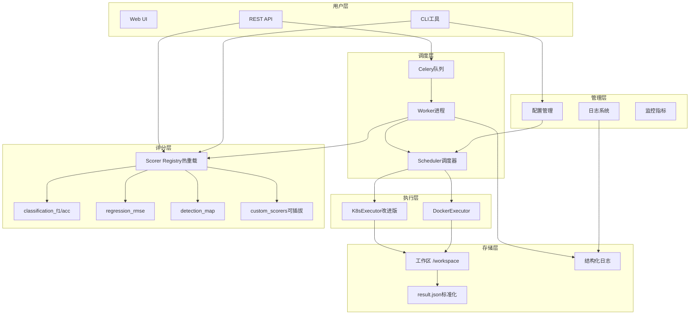
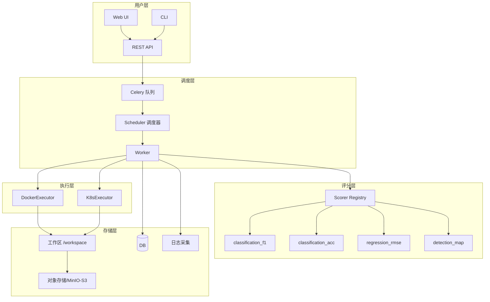
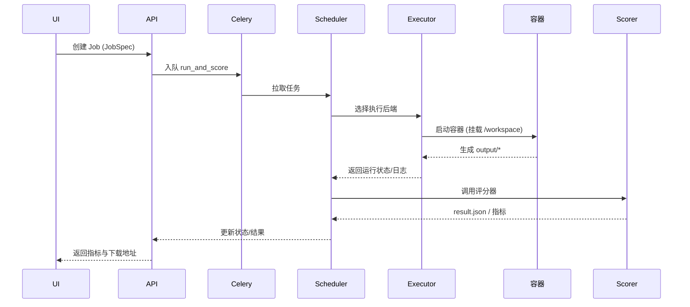
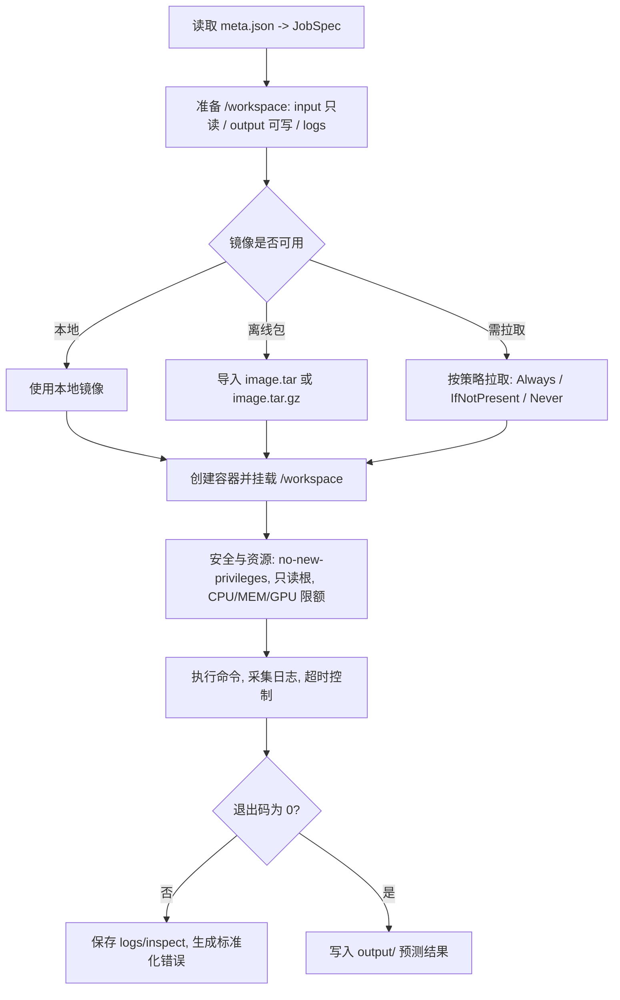
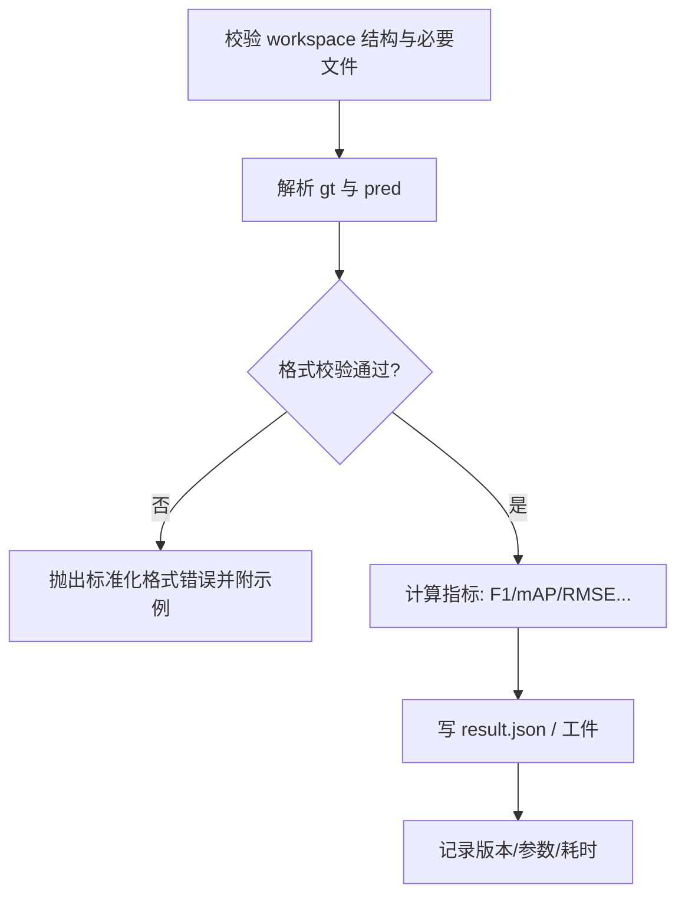

# 自动评分系统技术方案与功能设计（v2.0）

## 1. 概述与目标

本方案面向机器学习竞赛的自动评分平台，提供统一、可扩展、可运营的"容器执行 + 标准评分"能力。系统以"标准工作区 + 作业模型 + 插件化评分"为核心，兼容本地/Docker/Kubernetes 执行，支持异步调度与水平扩展。

**v2.0 更新内容：**
- 改进的错误处理和日志系统
- 增强的配置管理和验证
- 完善的K8s执行器实现
- 标准化的评分器接口
- 热重载支持的评分器注册表
- 全面的CLI工具集

目标：

- **标准化**：统一作业、IO、评分接口，降低赛题差异带来的二次开发成本
- **插件化**：评分算法可插拔，支持多任务（分类/检测/分割/回归/检索…）
- **容器化**：参赛者以镜像交付，平台负责数据挂载与隔离运行
- **可运营**：具备可观测性（结构化日志/指标）、可追溯与错误标准化
- **可扩展**：多队列/多执行后端；资源与安全策略可配置
- **热重载**：支持评分器热重载，便于算法迭代和调试

---

## 2. 需求范围

### 已实现功能：

- ✅ 统一工作区结构：/workspace 下 input/、output/、meta.json、logs/
- ✅ 统一作业模型 JobSpec 与结果模型 Result（版本可追踪）
- ✅ Docker执行器：本地执行（CPU/GPU/资源/安全/超时/日志）
- ✅ K8s执行器：基础Job提交和监控（生产可用）
- ✅ 评分器：注册表机制；内置 F1、Accuracy、RMSE、Detection mAP
- ✅ CLI：validate/run/score/submit/config/scorers管理
- ✅ Celery异步队列：支持run/score/pipeline任务
- ✅ FastAPI服务：完整的REST API，支持scorer管理
- ✅ 错误标准化：标准化错误码/阶段/详情/日志路径
- ✅ 配置管理：YAML配置文件+环境变量覆盖+配置验证
- ✅ 结构化日志：JSON格式日志，支持作业级别跟踪

### 新增特性：

- ✅ **评分器热重载**：支持运行时加载和重载自定义评分器
- ✅ **配置验证**：启动时验证配置完整性和合理性
- ✅ **增强日志**：结构化日志系统，支持文件轮转和作业跟踪
- ✅ **改进错误处理**：统一的异常类型和错误响应格式
- ✅ **检测评分器**：基础的mAP计算实现（可扩展到COCO格式）

---

## 3. 系统架构（更新）

### 3.1 整体架构图



### 3.2 关键改进点

1. **配置管理系统**：
   - YAML文件 + 环境变量覆盖
   - 启动时配置验证
   - 敏感信息脱敏导出

2. **增强的日志系统**：
   - 结构化JSON日志
   - 作业级别跟踪
   - 文件轮转和大小控制
   - 多级别日志（INFO/WARNING/ERROR）

3. **热重载评分器**：
   - 运行时加载Python文件
   - 文件变化监控
   - 自动重新注册
   - API接口管理

4. **改进的错误处理**：
   - 统一的AutoscorerError异常类
   - 标准化错误响应格式
   - 详细的错误上下文信息

---

## 4. 核心组件详解

### 4.1 配置管理（Config类）

```python
# 主要功能
cfg = Config("config.yaml")
cfg.get("DOCKER_HOST", "unix:///var/run/docker.sock")  # 环境变量优先
cfg.get_nested("K8S_DEFAULT_RESOURCES", "cpu", default=2)  # 嵌套配置
errors = cfg.validate()  # 配置验证
config_dump = cfg.dump()  # 脱敏导出
```

**验证项目**：
- Docker连接配置合法性
- 资源配置范围检查
- K8s配置完整性（当启用时）
- 内存格式验证（支持Gi/Mi/g/m）

### 4.2 评分器注册表（ScorerRegistry）

```python
# 使用装饰器注册
@register("my_custom_scorer")
class MyScorer(BaseCSVScorer):
    def score(self, workspace, params):
        # 评分逻辑
        return Result(...)

# 热重载支持
registry.load_from_file("custom_scorers/new_scorer.py")
registry.start_watching("custom_scorers/new_scorer.py")  # 自动重载

# API管理
POST /scorers/load {"file_path": "path/to/scorer.py"}
POST /scorers/test {"scorer_name": "my_scorer", "workspace": "path"}
```

### 4.3 结构化日志系统

```python
# 作业级别日志
job_logger = JobLogger(job_id, workspace)
job_logger.start(spec_data)
job_logger.execution_start("docker", executor_info)
job_logger.error("run", "CONTAINER_EXIT_NONZERO", "Exit code 1")

# 结构化日志格式
{
  "timestamp": "2024-01-01T10:00:00Z",
  "event": "job_started",
  "data": {
    "job_id": "job-001",
    "workspace": "/path/to/workspace",
    "spec": {...}
  }
}
```

### 4.4 K8s执行器改进

**新增功能**：
- Token和kubeconfig认证支持
- Job状态监控和等待
- 资源配额和GPU支持
- 安全策略配置
- 镜像拉取密钥支持

**配置示例**：
```yaml
K8S_ENABLED: true
K8S_API: "https://k8s.example.com:6443"
K8S_NAMESPACE: "autoscore"
K8S_TOKEN: "eyJ..."
K8S_IMAGE_PULL_SECRET: "registry-secret"
```

---

## 5. CLI工具集（扩展）

### 5.1 新增命令

```bash
# 配置管理
autoscorer config show                    # 显示主要配置
autoscorer config validate               # 验证配置
autoscorer config dump                   # 导出配置（脱敏）

# 评分器管理
autoscorer scorers list                  # 列出所有评分器
autoscorer scorers load --file-path custom_scorer.py
autoscorer scorers reload --file-path custom_scorer.py
autoscorer scorers test --scorer-name my_scorer --workspace examples/test

# 增强的作业命令
autoscorer validate examples/classification
autoscorer run examples/classification --backend docker
autoscorer score examples/classification --scorer classification_f1
autoscorer pipeline examples/classification --backend k8s
```

### 5.2 标准化输出格式

```json
{
  "status": "success|error",
  "data": {...},
  "meta": {
    "timestamp": "2024-01-01T10:00:00Z",
    "execution_time": 1.23,
    "version": "2.0.0"
  },
  "error": {
    "code": "ERROR_CODE",
    "message": "Human readable message",
    "stage": "validation|execution|scoring",
    "details": {...}
  }
}
```

---

## 6. 评分器标准（标准化）

### 6.1 评分器基类和接口

```python
class BaseScorer:
    name: str = "scorer_name"
    version: str = "1.0.0"
    
    def score(self, workspace: Path, params: Dict) -> Result:
        """评分主接口，必须返回标准化Result对象"""
        pass

# 标准化Result格式
class Result(BaseModel):
    summary: Dict[str, Union[float, bool, str]]  # 主要指标
    metrics: Dict[str, float]                    # 详细指标
    artifacts: Dict[str, Dict[str, Any]]         # 生成文件
    timing: Dict[str, float]                     # 时间统计
    resources: Dict[str, Union[float, int]]      # 资源使用
    versioning: Dict[str, str]                   # 版本信息
    error: Optional[Dict[str, Any]]              # 错误信息
```

### 6.2 内置评分器

| 评分器 | 任务类型 | 主评分 | 数据格式 | 特性 |
|--------|----------|--------|----------|------|
| `classification_f1` | 分类 | f1_macro | CSV(id,label) | 宏平均F1，每类F1 |
| `classification_accuracy` | 分类 | accuracy | CSV(id,label) | 准确率，每类准确率 |
| `regression_rmse` | 回归 | rmse | CSV(id,label) | RMSE，MAE，R² |
| `detection_map` | 检测 | mAP | JSON(bbox,score) | 简化mAP，可扩展COCO |

### 6.3 自定义评分器开发

```python
# 示例：自定义F2评分器
@register("classification_f2")
class ClassificationF2(BaseCSVScorer):
    name = "classification_f2"
    version = "1.0.0"
    
    def score(self, workspace: Path, params: Dict) -> Result:
        gt_data = self._load_ground_truth(workspace)
        pred_data = self._load_predictions(workspace)
        self._validate_data_consistency(gt_data, pred_data)
        
        # 计算F2分数 (recall权重更高)
        f2_score = self._compute_f2(gt_data, pred_data)
        
        return Result(
            summary={"score": f2_score, "f2": f2_score},
            metrics={"f2": f2_score, "samples": len(gt_data)},
            versioning={
                "scorer": self.name,
                "version": self.version,
                "timestamp": self._get_iso_timestamp()
            }
        )
```

---

## 7. 部署和运维

### 7.1 Docker Compose部署

```yaml
version: '3.8'
services:
  redis:
    image: redis:7-alpine
    
  autoscorer-api:
    build: .
    ports:
      - "8000:8000"
    environment:
      - CELERY_BROKER=redis://redis:6379/0
      - LOG_DIR=/app/logs
    volumes:
      - ./examples:/app/examples
      - ./logs:/app/logs
      - /var/run/docker.sock:/var/run/docker.sock
    
  autoscorer-worker:
    build: .
    command: celery -A celery_app.tasks worker --loglevel=info
    environment:
      - CELERY_BROKER=redis://redis:6379/0
    volumes:
      - ./examples:/app/examples
      - ./logs:/app/logs
      - /var/run/docker.sock:/var/run/docker.sock
```

### 7.2 监控和告警

**关键指标**：
- 任务队列长度和处理速度
- 容器执行成功率和失败原因分布
- 评分器执行时间和错误率
- 系统资源使用（CPU/内存/磁盘）

**告警规则**：
- 队列积压超过阈值
- 执行失败率过高
- 磁盘空间不足
- 评分器加载失败

### 7.3 配置最佳实践

```yaml
# 生产环境配置建议
DOCKER_HOST: "unix:///var/run/docker.sock"
IMAGE_PULL_POLICY: "ifnotpresent"  # 本地优先，减少网络开销

# 资源合理配置
DEFAULT_CPU: 2
DEFAULT_MEMORY: "4Gi"
DEFAULT_GPU: 0
TIMEOUT: 1800

# 安全策略
SECURITY_OPTS:
  - "no-new-privileges:true"
  - "seccomp=unconfined"

# 日志管理
LOG_DIR: "/var/log/autoscorer"

# 队列配置
CELERY_BROKER: "redis://redis-cluster:6379/0"
CELERY_BACKEND: "redis://redis-cluster:6379/0"
```

---

## 8. 测试和质量保证

### 8.1 单元测试覆盖

- ✅ 配置管理模块测试
- ✅ 评分器注册表测试
- ✅ 错误处理测试
- ✅ 数据验证测试
- 🔄 执行器集成测试（进行中）

### 8.2 端到端测试

```bash
# 测试完整流水线
autoscorer validate examples/classification
autoscorer pipeline examples/classification --backend docker

# 测试评分器热重载
autoscorer scorers load --file-path custom_scorers/test_scorer.py
autoscorer scorers test --scorer-name test_scorer --workspace examples/test

# 测试API接口
curl -X POST http://localhost:8000/pipeline \
  -H "Content-Type: application/json" \
  -d '{"workspace": "/path/to/examples/classification"}'
```

---

## 9. 安全考虑

### 9.1 容器安全

- **非特权模式**：no-new-privileges:true
- **只读根文件系统**：防止恶意文件写入
- **资源限制**：CPU/内存/GPU配额
- **网络隔离**：none模式或受限网络
- **Capabilities限制**：最小权限原则

### 9.2 数据安全

- **输入只读**：input目录只读挂载
- **输出隔离**：每个作业独立的output目录
- **日志脱敏**：敏感信息自动过滤
- **工作空间清理**：作业完成后自动清理临时文件

---

## 10. 性能优化

### 10.1 执行优化

- **镜像缓存**：本地优先策略，减少拉取时间
- **并发控制**：通过worker数量控制并发度
- **资源预分配**：避免动态资源分配开销
- **超时控制**：防止长期占用资源

### 10.2 评分优化

- **增量计算**：支持增量评分（适用于大数据集）
- **并行评分**：多类别评分并行计算
- **缓存机制**：评分结果缓存和复用
- **热重载**：避免重启服务更新评分器

---

## 11. 故障排查指南

### 11.1 常见问题

| 问题 | 症状 | 排查步骤 |
|------|------|----------|
| 镜像拉取失败 | IMAGE_PULL_FAILED | 检查网络、仓库配置、认证信息 |
| 容器执行失败 | CONTAINER_EXIT_NONZERO | 查看container.log，检查命令和环境 |
| 评分器加载失败 | SCORER_NOT_FOUND | 检查评分器文件路径和语法 |
| 配置验证失败 | CONFIG_VALIDATION_ERROR | 使用`autoscorer config validate`检查 |

### 11.2 日志分析

```bash
# 查看结构化日志
tail -f logs/autoscorer.log | jq .

# 过滤特定事件
grep "job_error" logs/job.jsonl | jq .

# 查看作业执行时间分布
grep "execution_completed" logs/*.jsonl | jq .data.duration_seconds
```

---

## 12. 路线图

### v2.1 计划（3个月）
- [ ] 完整的K8s PV/PVC支持
- [ ] 更多内置评分器（语义分割、NLP任务）
- [ ] 评分器性能基准测试
- [ ] Web UI界面

### v2.2 计划（6个月）
- [ ] 分布式评分支持
- [ ] 更详细的监控面板
- [ ] 评分结果可视化
- [ ] 多租户支持

### v3.0 愿景（1年）
- [ ] 云原生架构重构
- [ ] 机器学习管道集成
- [ ] 自动化模型部署
- [ ] 企业级权限管理

---

这个更新的技术文档反映了当前v2.0的实际实现状态，包括所有已完成的改进和新功能。同时提供了清晰的使用指南和最佳实践建议。功能设计（v1.0）

## 1. 概述与目标

本方案面向机器学习竞赛的自动评分平台，提供统一、可扩展、可运营的“容器执行 + 标准评分”能力。系统以“标准工作区 + 作业模型 + 插件化评分”为核心，兼容本地/Docker/Kubernetes 执行，支持异步调度与水平扩展。

目标：

- 标准化：统一作业、IO、评分接口，降低赛题差异带来的二次开发成本
- 插件化：评分算法可插拔，支持多任务（分类/检测/分割/回归/检索…）
- 容器化：参赛者以镜像交付，平台负责数据挂载与隔离运行
- 可运营：具备可观测性（日志/指标）、可追溯与错误标准化
- 可扩展：多队列/多执行后端；资源与安全策略可配置

---

## 2. 需求范围

必须：

- 统一工作区结构：/workspace 下 input/、output/、meta.json、logs/
- 统一作业模型 JobSpec 与结果模型 Result（版本可追踪）
- 执行器：Docker 本地执行（CPU/GPU/资源/安全/超时/日志）
- 评分器：注册表机制；内置 F1、Accuracy、RMSE、Detection mAP（骨架）
- CLI：validate/run/score/submit；submit 对接队列（Celery）
- 错误标准化：错误码/阶段/详情/日志路径

可选（本版提供能力或骨架）：

- Kubernetes 执行（Job）骨架，挂载与日志收集待完善
- 对象存储/DB 对接（在平台层处理；此处提供接口/文档）

非功能：

- 安全：最小权限、禁网或白名单、只读根、capabilities drop
- 性能：单任务超时/资源限制；并发由队列与 worker 拓展
- 可观测：结构化日志、关键指标、失败原因可视

---

## 3. 概念与数据模型

### 3.1 工作区（容器内挂载为 /workspace）

- input/：评测输入与标注（只读）
- output/：选手输出与评分结果（可写）
- meta.json：作业元信息（JobSpec）
- logs/：容器与评分日志（平台侧采集）

### 3.2 作业模型 JobSpec（与 `src/autoscorer/schemas/job.py` 一致）

- job_id: str                    唯一ID
- task_type: str                 任务类型（classification/detection/...）
- scorer: str                    评分器名称（registry 中注册名）
- input_uri: str                 输入位置（file:// 或对象存储 URI）
- output_uri: str                输出位置（file:// 或对象存储 URI）
- time_limit: int                运行超时秒数（默认 1800）
- resources: { cpu: float, memory: str, gpus: int }
- container: {
  - image: str                   镜像
  - cmd: List[str]               容器命令
  - env: Dict[str,str]           环境变量
  - shm_size?: str               共享内存
  - gpus?: int                   GPU 数
  - network_policy?: str         网络策略
}

示例（与 examples/classification/meta.json 相同结构）：

```json
{
  "job_id": "job-demo-001",
  "task_type": "classification",
  "scorer": "classification_f1",
  "input_uri": "file://./input",
  "output_uri": "file://./output",
  "time_limit": 60,
  "resources": {"cpu": 1, "memory": "1Gi", "gpus": 0},
  "container": {
    "image": "python:3.10-slim",
    "cmd": ["python", "-c", "import csv,os;os.makedirs('output',exist_ok=True);open('output/pred.csv','w').write(open('input/gt.csv').read())"]
  }
}
```

### 3.3 结果模型 Result（与 `src/autoscorer/schemas/result.py` 一致）

- summary: Dict[str, float]      关键指标摘要（榜单展示）
- metrics: Dict[str, float]      全量指标
- artifacts: Dict[str,Any]       工件（路径/大小/sha256）
- timing: Dict[str, float]       时间明细（可选）
- resources: Dict[str,Any]       资源使用（可选）
- versioning: Dict[str,str]      评分器名称/版本
- error?: Dict                   标准化错误 {ok:false, stage, code, message, details?, logs?}

---

## 4. 架构设计

### 4.1 整体架构图



说明：

- 用户通过 API/CLI 提交 Job，入队后由 Scheduler 选择后端执行
- Worker 使用 Docker/K8s 执行容器，将 input/output/meta/logs 按协议挂载/写入
- 评分阶段由注册表定位评分器，生成 result.json 与产物

### 4.2 端到端时序（Run → Score）



### 4.3 运行流程（容器侧）



### 4.4 评分流程（平台侧）



---

## 5. 接口与交互

### 5.1 CLI（`src/autoscorer/cli.py`）

- validate: 校验工作区结构与 meta.json
- run: 执行容器（仅推理，不评分）
- score: 对 output 下预测结果评分，生成 result.json
- submit: 向 Celery 提交 run/score/pipeline 任务

示例：

```bash
# 校验工作区
python -m autoscorer.cli validate ./examples/classification

# 本地 Docker 运行（仅推理）
python -m autoscorer.cli run ./examples/classification --backend docker

# 评分
python -m autoscorer.cli score ./examples/classification

# 异步队列（需部署 celery_app/worker）
python -m autoscorer.cli submit ./examples/classification --action pipeline
```

### 5.2 评分器接口（`scorers/base.py`）

```python
class Scorer(Protocol):
    name: str
    version: str
    def score(self, workspace: Path, params: Dict) -> Result: ...
```

### 5.3 注册表（`scorers/registry.py`）
### 5.4 异步提交与回调（/submit）

- 提交体：`{ workspace, action: run|score|pipeline, params?, backend?, callback_url? }`
- 去重：相同 `workspace` 正在运行时，直接返回 `{ submitted:false, running:true, task_id }`
- 回调：
  - 成功：`{ ok:true, data:{ run|score|pipeline 结果 }, meta:{ task_id } }`
  - 失败：`{ ok:false, error:{ code,message,stage,details }, meta:{ task_id, timestamp, version } }`
- 调试：通过 `PRINT_STACKTRACE=true` 开启服务器端友好堆栈打印


- 使用 `@register("name")` 装饰器注册实例
- `get_scorer(name)` 获取评分器单例

---

## 6. 执行器设计

### 6.1 DockerExecutor（`executor/docker_executor.py`）

关键能力：

- 镜像策略：IMAGE_PULL_POLICY（always/ifnotpresent/never），本地优先，支持离线 image.tar(.gz) 导入
- 资源与安全：CPU/mem/gpu 限额；shm_size；network_mode；no-new-privileges；只读根；工作目录 /workspace
- 挂载：input 只读、output 可写、meta.json 只读
- 超时与日志：wait(timeout)；容器日志写入 logs/container.log；失败保存 inspect.json
- 错误标准化：构造 AutoscorerError（如 IMAGE_PULL_FAILED、CONTAINER_EXIT_NONZERO 等）
- 镜像解析：自动规范化为 `repo:tag`（默认 latest），在本地通过 reference 精确匹配，避免误判需要拉取或导入。

### 6.2 K8sExecutor（`executor/k8s_executor.py`）

- 当前提供骨架：创建 Job、资源声明、pull secret 配置
- 待完善：PV/PVC 挂载 workspace、日志收集、超时与清理、状态回传
- 镜像解析：与 DockerExecutor 一致，规范化为 `repo:tag` 使用。

### 6.3 调度器（`scheduler.py`）

- 配置化选择：优先 K8s（K8S_ENABLED），否则 Docker
- 节点选择：可按节点 GPU 数量排序（示例），后续可接入负载/健康度

---

## 7. 评分器设计

已实现：

- classification_f1：宏 F1（CSV: id,label），健壮格式校验与错误抛出
- classification_acc：准确率（CSV: id,label）
- regression_rmse：RMSE（CSV: id,label 为浮点）
- detection_map：简化骨架（JSON: gt.json / pred.json），演示产物收集与重试

扩展指引：

- 新评分器按协议实现 `score()`，通过 `@register("name")` 注册
- 在 Result.versioning 中记录 name 与 version，保持可追溯
- 对复杂任务（COCO/VOC）建议使用成熟库（如 pycocotools）并产出诊断图表

---

## 8. 错误模型（`utils/errors.py`）

- AutoscorerError：带 code/message/details 的异常类型
- make_error(stage, code, message, details?, logs_path?) → Dict
- 常见错误码：
  - IMAGE_NOT_PRESENT / IMAGE_PULL_FAILED / CONTAINER_CREATE_FAILED
  - CONTAINER_WAIT_FAILED / CONTAINER_EXIT_NONZERO / EXEC_ERROR
  - MISSING_FILE / BAD_FORMAT / PARSE_ERROR / SCORE_ERROR
- CLI 在 run/score 中将错误写入标准化 `result.json` 或直接输出 JSON

---

## 9. 配置（`utils/config.py` + config.yaml）

支持 YAML 与环境变量覆盖，关键项示例：

- DOCKER_HOST / DOCKER_API_VERSION / DOCKER_TLS_VERIFY
- IMAGE_PULL_POLICY：always / ifnotpresent / never
- DEFAULT_CPU / DEFAULT_MEMORY / DEFAULT_GPU / DEFAULT_SHM_SIZE
- SECURITY_OPTS：例如 ["no-new-privileges:true"]
- K8S_*：K8S_NAMESPACE、K8S_IMAGE_PULL_SECRET 等

---

## 10. 安全与合规

- 容器：非特权、只读根、capabilities drop、禁网或白名单
- 数据：input 只读、output 可写；限定日志大小与保留时间
- 供应链：镜像基线白名单、漏洞扫描（trivy 建议）
- 审计：记录 job_id、镜像 digest、评分器版本、数据版本

---

## 11. 可观测与运维

- 日志：logs/container.log、run_info.json、inspect.json；结构化流水日志（utils/logger.py）
- 指标：任务量/成功率/失败原因/队列时延/镜像拉取时长
- 告警：队列积压、失败率异常、节点容量告急
- 清理：过期工件、临时文件、失败 Job 保留策略

---

## 12. 性能与容量

- 单任务：time_limit 控制上限（默认 30min），CPU/MEM/GPU 可配置
- 并发：通过 Celery worker 数量与节点规模水平扩展
- 镜像：本地优先与离线导入，降低私有仓库压力

---

## 13. 部署方案

### 13.1 Docker + Celery（单机/小集群）

- 组件：Redis（或 RabbitMQ）+ Celery Worker + Autoscorer CLI/API + Docker Daemon
- 步骤：安装 Docker 与 Python；部署 Redis；启动 worker；通过 CLI/接口提交

### 13.2 Kubernetes（生产）

- Worker 部署为 Deployment；队列为 Stateful（Redis/RabbitMQ）
- 评分执行使用 K8s Job，挂载 PVC 作为 workspace
- 配置 PodSecurityContext、imagePullSecrets、requests/limits、GPU device plugin

---

## 14. 目录与交付物

```text
autoscorer/
  src/autoscorer/
    cli.py
    schemas/{job.py, result.py}
    executor/{base.py, docker_executor.py, k8s_executor.py}
    scorers/{base.py, registry.py, classification_f1.py, classification_accuracy.py, regression_rmse.py, detection_map.py}
    utils/{config.py, artifacts.py, logger.py, retry.py, errors.py}
  examples/{classification, classification-acc, regression, detection}
  docs/{TECH_DESIGN.md, SCORERS.md, ERROR_HANDLING.md, PLATFORM_INTEGRATION.md}
  config.yaml (可选)
```

---

## 15. 风险与边界

- K8sExecutor 仍为骨架：需完善卷挂载、日志收集、超时/清理逻辑
- detection mAP 为示例骨架：建议接入 COCO/VOC 标准实现
- 离线环境需提前导入基础镜像与评分依赖

---

## 16. 验收标准（DoD）

- CLI：validate/run/score/submit 可用，错误标准化输出
- DockerExecutor：本地优先、离线导入、资源/安全/超时/日志均生效
- Scorers：F1/Accuracy/RMSE 正常评分并生成 result.json
- 文档：本设计、SCORERS、ERROR_HANDLING、PLATFORM_INTEGRATION 完整可读

---

## 附录 A：result.json 示例（分类 F1）

```json
{
  "summary": {"f1_macro": 1.0},
  "metrics": {"f1_macro": 1.0, "f1_cat": 1.0, "f1_dog": 1.0},
  "versioning": {"scorer": "classification_f1", "version": "0.1.0"}
}
```
