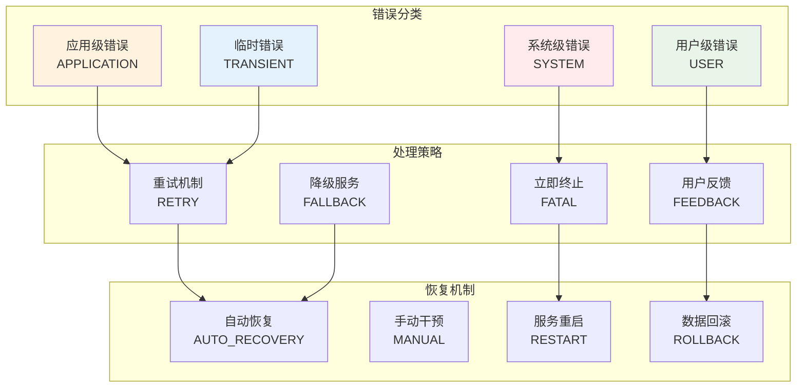

# 错误处理指南

本文档详细说明 AutoScorer 系统中的错误处理机制，包括错误分类、处理策略、恢复机制和故障排查方法。

## 错误处理架构

### 错误分类体系

AutoScorer 采用分层的错误处理架构，将错误按照严重程度和处理层级进行分类：



### 错误代码标准

```python
# src/autoscorer/utils/errors.py
from enum import Enum
from typing import Dict, Any, Optional
import traceback
import json

class ErrorSeverity(Enum):
    """错误严重程度"""
    CRITICAL = "critical"    # 系统无法继续运行
    HIGH = "high"           # 功能受到严重影响
    MEDIUM = "medium"       # 部分功能受影响
    LOW = "low"            # 轻微影响
    INFO = "info"          # 信息性错误

class ErrorCategory(Enum):
    """错误分类"""
    SYSTEM = "system"           # 系统级错误
    VALIDATION = "validation"   # 输入验证错误
    EXECUTION = "execution"     # 执行错误
    RESOURCE = "resource"       # 资源错误
    NETWORK = "network"         # 网络错误
    CONFIGURATION = "config"    # 配置错误
    AUTHENTICATION = "auth"     # 认证错误
    PERMISSION = "permission"   # 权限错误

class AutoScorerError(Exception):
    """AutoScorer 基础错误类"""
    
    def __init__(
        self,
        code: str,
        message: str,
        category: ErrorCategory = ErrorCategory.SYSTEM,
        severity: ErrorSeverity = ErrorSeverity.MEDIUM,
        details: Optional[Dict[str, Any]] = None,
        cause: Optional[Exception] = None,
        retryable: bool = False,
        user_message: Optional[str] = None
    ):
        super().__init__(message)
        self.code = code
        self.message = message
        self.category = category
        self.severity = severity
        self.details = details or {}
        self.cause = cause
        self.retryable = retryable
        self.user_message = user_message or message
        self.timestamp = time.time()
        self.traceback = traceback.format_exc()
    
    def to_dict(self) -> Dict[str, Any]:
        """转换为字典格式"""
        return {
            'code': self.code,
            'message': self.message,
            'category': self.category.value,
            'severity': self.severity.value,
            'details': self.details,
            'retryable': self.retryable,
            'user_message': self.user_message,
            'timestamp': self.timestamp,
            'traceback': self.traceback if self.severity in [ErrorSeverity.CRITICAL, ErrorSeverity.HIGH] else None
        }
    
    def to_json(self) -> str:
        """转换为 JSON 格式"""
        return json.dumps(self.to_dict(), indent=2, ensure_ascii=False)

# 具体错误类型
class ValidationError(AutoScorerError):
    """验证错误"""
    def __init__(self, code: str, message: str, **kwargs):
        super().__init__(
            code=code,
            message=message,
            category=ErrorCategory.VALIDATION,
            severity=ErrorSeverity.MEDIUM,
            retryable=False,
            **kwargs
        )

class ExecutionError(AutoScorerError):
    """执行错误"""
    def __init__(self, code: str, message: str, **kwargs):
        super().__init__(
            code=code,
            message=message,
            category=ErrorCategory.EXECUTION,
            severity=ErrorSeverity.HIGH,
            retryable=True,
            **kwargs
        )

class ResourceError(AutoScorerError):
    """资源错误"""
    def __init__(self, code: str, message: str, **kwargs):
        super().__init__(
            code=code,
            message=message,
            category=ErrorCategory.RESOURCE,
            severity=ErrorSeverity.HIGH,
            retryable=True,
            **kwargs
        )

class ConfigurationError(AutoScorerError):
    """配置错误"""
    def __init__(self, code: str, message: str, **kwargs):
        super().__init__(
            code=code,
            message=message,
            category=ErrorCategory.CONFIGURATION,
            severity=ErrorSeverity.CRITICAL,
            retryable=False,
            **kwargs
        )

class NetworkError(AutoScorerError):
    """网络错误"""
    def __init__(self, code: str, message: str, **kwargs):
        super().__init__(
            code=code,
            message=message,
            category=ErrorCategory.NETWORK,
            severity=ErrorSeverity.MEDIUM,
            retryable=True,
            **kwargs
        )
```

## 常见错误代码

### 系统级错误 (SYS_*)

| 错误代码 | 描述 | 严重程度 | 可重试 | 处理建议 |
|----------|------|----------|--------|----------|
| `SYS_INIT_FAILED` | 系统初始化失败 | CRITICAL | No | 检查配置和依赖 |
| `SYS_DB_CONNECTION_FAILED` | 数据库连接失败 | CRITICAL | Yes | 检查数据库状态 |
| `SYS_REDIS_CONNECTION_FAILED` | Redis 连接失败 | HIGH | Yes | 检查 Redis 服务 |
| `SYS_STORAGE_UNAVAILABLE` | 存储不可用 | HIGH | Yes | 检查存储挂载 |
| `SYS_OUT_OF_MEMORY` | 内存不足 | CRITICAL | No | 增加内存或优化 |
| `SYS_DISK_FULL` | 磁盘空间不足 | HIGH | No | 清理磁盘空间 |

### 验证错误 (VAL_*)

| 错误代码 | 描述 | 严重程度 | 可重试 | 处理建议 |
|----------|------|----------|--------|----------|
| `VAL_INVALID_INPUT_FORMAT` | 输入格式无效 | MEDIUM | No | 检查输入格式 |
| `VAL_MISSING_REQUIRED_FIELD` | 缺少必需字段 | MEDIUM | No | 补充必需字段 |
| `VAL_INVALID_SCORER_CONFIG` | 评分器配置无效 | MEDIUM | No | 修正评分器配置 |
| `VAL_UNSUPPORTED_FILE_TYPE` | 不支持的文件类型 | MEDIUM | No | 使用支持的格式 |
| `VAL_FILE_SIZE_EXCEEDED` | 文件大小超限 | MEDIUM | No | 减小文件大小 |
| `VAL_SCHEMA_VALIDATION_FAILED` | 模式验证失败 | MEDIUM | No | 修正数据格式 |

### 执行错误 (EXE_*)

| 错误代码 | 描述 | 严重程度 | 可重试 | 处理建议 |
|----------|------|----------|--------|----------|
| `EXE_SCORER_NOT_FOUND` | 评分器未找到 | HIGH | No | 检查评分器路径 |
| `EXE_SCORER_IMPORT_FAILED` | 评分器导入失败 | HIGH | No | 检查评分器代码 |
| `EXE_SCORER_EXECUTION_FAILED` | 评分器执行失败 | HIGH | Yes | 检查输入数据 |
| `EXE_TIMEOUT` | 执行超时 | MEDIUM | Yes | 增加超时时间 |
| `EXE_CONTAINER_FAILED` | 容器执行失败 | HIGH | Yes | 检查容器配置 |
| `EXE_PERMISSION_DENIED` | 权限被拒绝 | HIGH | No | 检查文件权限 |

### 资源错误 (RES_*)

| 错误代码 | 描述 | 严重程度 | 可重试 | 处理建议 |
|----------|------|----------|--------|----------|
| `RES_INSUFFICIENT_MEMORY` | 内存不足 | HIGH | Yes | 增加内存限制 |
| `RES_INSUFFICIENT_CPU` | CPU 资源不足 | MEDIUM | Yes | 等待资源释放 |
| `RES_INSUFFICIENT_DISK` | 磁盘空间不足 | HIGH | No | 清理磁盘空间 |
| `RES_GPU_NOT_AVAILABLE` | GPU 不可用 | HIGH | Yes | 等待 GPU 释放 |
| `RES_QUOTA_EXCEEDED` | 配额超限 | MEDIUM | Yes | 等待配额重置 |
| `RES_WORKSPACE_LOCKED` | 工作区被锁定 | MEDIUM | Yes | 等待锁释放 |

## 错误处理器

### 基础错误处理器

```python
# src/autoscorer/utils/error_handler.py
import logging
import time
import asyncio
from typing import Dict, Any, Callable, Optional, Type
from contextlib import asynccontextmanager
from functools import wraps

from .errors import AutoScorerError, ErrorSeverity, ErrorCategory
from .logger import get_logger

logger = get_logger(__name__)

class ErrorHandler:
    """统一错误处理器"""
    
    def __init__(self, config: Dict[str, Any]):
        self.config = config.get('error_handling', {})
        self.retry_config = self.config.get('retry', {})
        self.notification_config = self.config.get('notifications', {})
        self.error_stats = {}
        
    def handle_error(self, error: Exception, context: Dict[str, Any] = None) -> AutoScorerError:
        """处理错误"""
        context = context or {}
        
        # 转换为标准错误格式
        if isinstance(error, AutoScorerError):
            scored_error = error
        else:
            scored_error = self._convert_to_autoscorer_error(error, context)
        
        # 记录错误统计
        self._record_error_stats(scored_error)
        
        # 记录日志
        self._log_error(scored_error, context)
        
        # 发送通知
        if scored_error.severity in [ErrorSeverity.CRITICAL, ErrorSeverity.HIGH]:
            self._send_notification(scored_error, context)
        
        return scored_error
    
    def _convert_to_autoscorer_error(self, error: Exception, context: Dict[str, Any]) -> AutoScorerError:
        """将通用异常转换为 AutoScorer 错误"""
        error_type = type(error).__name__
        
        # 根据异常类型映射错误代码
        error_mapping = {
            'FileNotFoundError': ('VAL_FILE_NOT_FOUND', ErrorCategory.VALIDATION),
            'PermissionError': ('EXE_PERMISSION_DENIED', ErrorCategory.EXECUTION),
            'MemoryError': ('RES_INSUFFICIENT_MEMORY', ErrorCategory.RESOURCE),
            'TimeoutError': ('EXE_TIMEOUT', ErrorCategory.EXECUTION),
            'ConnectionError': ('NET_CONNECTION_FAILED', ErrorCategory.NETWORK),
            'ValueError': ('VAL_INVALID_VALUE', ErrorCategory.VALIDATION),
            'ImportError': ('EXE_IMPORT_FAILED', ErrorCategory.EXECUTION),
        }
        
        code, category = error_mapping.get(error_type, ('SYS_UNKNOWN_ERROR', ErrorCategory.SYSTEM))
        
        return AutoScorerError(
            code=code,
            message=str(error),
            category=category,
            severity=ErrorSeverity.MEDIUM,
            details={'original_error': error_type, 'context': context},
            cause=error,
            retryable=category in [ErrorCategory.NETWORK, ErrorCategory.RESOURCE]
        )
    
    def _record_error_stats(self, error: AutoScorerError):
        """记录错误统计"""
        key = f"{error.category.value}:{error.code}"
        if key not in self.error_stats:
            self.error_stats[key] = {'count': 0, 'last_seen': None}
        
        self.error_stats[key]['count'] += 1
        self.error_stats[key]['last_seen'] = time.time()
    
    def _log_error(self, error: AutoScorerError, context: Dict[str, Any]):
        """记录错误日志"""
        log_data = {
            'error_code': error.code,
            'error_message': error.message,
            'category': error.category.value,
            'severity': error.severity.value,
            'context': context,
            'details': error.details
        }
        
        if error.severity == ErrorSeverity.CRITICAL:
            logger.critical("Critical error occurred", extra=log_data)
        elif error.severity == ErrorSeverity.HIGH:
            logger.error("High severity error occurred", extra=log_data)
        elif error.severity == ErrorSeverity.MEDIUM:
            logger.warning("Medium severity error occurred", extra=log_data)
        else:
            logger.info("Low severity error occurred", extra=log_data)
    
    def _send_notification(self, error: AutoScorerError, context: Dict[str, Any]):
        """发送错误通知"""
        if not self.notification_config.get('enabled', False):
            return
        
        notification_data = {
            'error': error.to_dict(),
            'context': context,
            'timestamp': time.time()
        }
        
        # 这里可以集成多种通知渠道
        # 例如：邮件、Slack、钉钉、短信等
        logger.info(f"Error notification sent for {error.code}")

class RetryHandler:
    """重试处理器"""
    
    def __init__(self, config: Dict[str, Any]):
        self.config = config
        self.max_retries = config.get('max_retries', 3)
        self.base_delay = config.get('base_delay', 1.0)
        self.max_delay = config.get('max_delay', 60.0)
        self.exponential_backoff = config.get('exponential_backoff', True)
        self.jitter = config.get('jitter', True)
    
    async def retry_async(self, func: Callable, *args, **kwargs) -> Any:
        """异步重试执行"""
        last_error = None
        
        for attempt in range(self.max_retries + 1):
            try:
                if asyncio.iscoroutinefunction(func):
                    return await func(*args, **kwargs)
                else:
                    return func(*args, **kwargs)
            except Exception as e:
                last_error = e
                
                # 检查是否应该重试
                if not self._should_retry(e, attempt):
                    break
                
                # 如果不是最后一次尝试，等待后重试
                if attempt < self.max_retries:
                    delay = self._calculate_delay(attempt)
                    logger.info(f"Retrying in {delay:.2f}s (attempt {attempt + 1}/{self.max_retries})")
                    await asyncio.sleep(delay)
        
        # 重试耗尽，抛出最后的错误
        raise last_error
    
    def retry_sync(self, func: Callable, *args, **kwargs) -> Any:
        """同步重试执行"""
        last_error = None
        
        for attempt in range(self.max_retries + 1):
            try:
                return func(*args, **kwargs)
            except Exception as e:
                last_error = e
                
                if not self._should_retry(e, attempt):
                    break
                
                if attempt < self.max_retries:
                    delay = self._calculate_delay(attempt)
                    logger.info(f"Retrying in {delay:.2f}s (attempt {attempt + 1}/{self.max_retries})")
                    time.sleep(delay)
        
        raise last_error
    
    def _should_retry(self, error: Exception, attempt: int) -> bool:
        """判断是否应该重试"""
        if attempt >= self.max_retries:
            return False
        
        # AutoScorer 错误的重试策略
        if isinstance(error, AutoScorerError):
            return error.retryable
        
        # 其他异常的重试策略
        retryable_exceptions = [
            'ConnectionError', 'TimeoutError', 'TemporaryFailure',
            'ResourceExhausted', 'ServiceUnavailable'
        ]
        
        return type(error).__name__ in retryable_exceptions
    
    def _calculate_delay(self, attempt: int) -> float:
        """计算重试延迟"""
        if self.exponential_backoff:
            delay = self.base_delay * (2 ** attempt)
        else:
            delay = self.base_delay
        
        # 限制最大延迟
        delay = min(delay, self.max_delay)
        
        # 添加抖动避免雷群效应
        if self.jitter:
            import random
            delay *= (0.5 + random.random() * 0.5)
        
        return delay

# 装饰器
def handle_errors(error_handler: Optional[ErrorHandler] = None, context: Dict[str, Any] = None):
    """错误处理装饰器"""
    def decorator(func):
        @wraps(func)
        async def async_wrapper(*args, **kwargs):
            try:
                return await func(*args, **kwargs)
            except Exception as e:
                if error_handler:
                    scored_error = error_handler.handle_error(e, context)
                    raise scored_error
                raise
        
        @wraps(func)
        def sync_wrapper(*args, **kwargs):
            try:
                return func(*args, **kwargs)
            except Exception as e:
                if error_handler:
                    scored_error = error_handler.handle_error(e, context)
                    raise scored_error
                raise
        
        return async_wrapper if asyncio.iscoroutinefunction(func) else sync_wrapper
    return decorator

def with_retry(retry_handler: Optional[RetryHandler] = None, **retry_kwargs):
    """重试装饰器"""
    def decorator(func):
        @wraps(func)
        async def async_wrapper(*args, **kwargs):
            handler = retry_handler or RetryHandler(retry_kwargs)
            return await handler.retry_async(func, *args, **kwargs)
        
        @wraps(func)
        def sync_wrapper(*args, **kwargs):
            handler = retry_handler or RetryHandler(retry_kwargs)
            return handler.retry_sync(func, *args, **kwargs)
        
        return async_wrapper if asyncio.iscoroutinefunction(func) else sync_wrapper
    return decorator
```

## 恢复机制

### 自动恢复策略

```python
# src/autoscorer/utils/recovery.py
import asyncio
import time
from typing import Dict, Any, List, Callable
from enum import Enum

from .errors import AutoScorerError, ErrorSeverity
from .logger import get_logger

logger = get_logger(__name__)

class RecoveryStrategy(Enum):
    """恢复策略"""
    RESTART_SERVICE = "restart_service"
    FALLBACK_MODE = "fallback_mode"
    CIRCUIT_BREAKER = "circuit_breaker"
    GRACEFUL_DEGRADATION = "graceful_degradation"
    MANUAL_INTERVENTION = "manual_intervention"

class RecoveryManager:
    """恢复管理器"""
    
    def __init__(self, config: Dict[str, Any]):
        self.config = config.get('recovery', {})
        self.circuit_breakers = {}
        self.recovery_strategies = {
            RecoveryStrategy.RESTART_SERVICE: self._restart_service,
            RecoveryStrategy.FALLBACK_MODE: self._enable_fallback_mode,
            RecoveryStrategy.CIRCUIT_BREAKER: self._trigger_circuit_breaker,
            RecoveryStrategy.GRACEFUL_DEGRADATION: self._graceful_degradation,
            RecoveryStrategy.MANUAL_INTERVENTION: self._manual_intervention
        }
    
    async def recover_from_error(self, error: AutoScorerError, context: Dict[str, Any]) -> bool:
        """从错误中恢复"""
        strategy = self._select_recovery_strategy(error)
        
        logger.info(f"Attempting recovery using strategy: {strategy.value}")
        
        try:
            recovery_func = self.recovery_strategies.get(strategy)
            if recovery_func:
                success = await recovery_func(error, context)
                if success:
                    logger.info(f"Recovery successful using {strategy.value}")
                    return True
                else:
                    logger.warning(f"Recovery failed using {strategy.value}")
            
            # 尝试下一个策略
            return await self._try_fallback_strategies(error, context, strategy)
            
        except Exception as e:
            logger.error(f"Recovery attempt failed: {e}")
            return False
    
    def _select_recovery_strategy(self, error: AutoScorerError) -> RecoveryStrategy:
        """选择恢复策略"""
        # 根据错误类型和严重程度选择策略
        if error.severity == ErrorSeverity.CRITICAL:
            if 'connection' in error.code.lower():
                return RecoveryStrategy.CIRCUIT_BREAKER
            else:
                return RecoveryStrategy.RESTART_SERVICE
        
        elif error.severity == ErrorSeverity.HIGH:
            if error.retryable:
                return RecoveryStrategy.CIRCUIT_BREAKER
            else:
                return RecoveryStrategy.FALLBACK_MODE
        
        else:
            return RecoveryStrategy.GRACEFUL_DEGRADATION
    
    async def _restart_service(self, error: AutoScorerError, context: Dict[str, Any]) -> bool:
        """重启服务"""
        service_name = context.get('service', 'unknown')
        
        logger.warning(f"Restarting service: {service_name}")
        
        # 这里实现服务重启逻辑
        # 例如：重新初始化组件、重新连接数据库等
        
        try:
            # 模拟重启过程
            await asyncio.sleep(2)
            
            # 验证服务状态
            if await self._verify_service_health(service_name):
                logger.info(f"Service {service_name} restarted successfully")
                return True
            else:
                logger.error(f"Service {service_name} restart failed")
                return False
                
        except Exception as e:
            logger.error(f"Failed to restart service {service_name}: {e}")
            return False
    
    async def _enable_fallback_mode(self, error: AutoScorerError, context: Dict[str, Any]) -> bool:
        """启用回退模式"""
        logger.info("Enabling fallback mode")
        
        # 实现回退逻辑
        # 例如：使用备用服务、简化功能等
        
        return True
    
    async def _trigger_circuit_breaker(self, error: AutoScorerError, context: Dict[str, Any]) -> bool:
        """触发熔断器"""
        service_name = context.get('service', 'default')
        
        if service_name not in self.circuit_breakers:
            self.circuit_breakers[service_name] = CircuitBreaker(
                failure_threshold=self.config.get('circuit_breaker', {}).get('failure_threshold', 5),
                timeout=self.config.get('circuit_breaker', {}).get('timeout', 60)
            )
        
        circuit_breaker = self.circuit_breakers[service_name]
        circuit_breaker.record_failure()
        
        if circuit_breaker.is_open():
            logger.warning(f"Circuit breaker opened for {service_name}")
            return await self._enable_fallback_mode(error, context)
        
        return False
    
    async def _graceful_degradation(self, error: AutoScorerError, context: Dict[str, Any]) -> bool:
        """优雅降级"""
        logger.info("Enabling graceful degradation")
        
        # 实现降级逻辑
        # 例如：减少功能、降低精度等
        
        return True
    
    async def _manual_intervention(self, error: AutoScorerError, context: Dict[str, Any]) -> bool:
        """手动干预"""
        logger.critical("Manual intervention required")
        
        # 发送告警通知管理员
        # 记录详细错误信息
        
        return False
    
    async def _try_fallback_strategies(self, error: AutoScorerError, context: Dict[str, Any], 
                                     failed_strategy: RecoveryStrategy) -> bool:
        """尝试回退策略"""
        fallback_order = [
            RecoveryStrategy.CIRCUIT_BREAKER,
            RecoveryStrategy.FALLBACK_MODE,
            RecoveryStrategy.GRACEFUL_DEGRADATION,
            RecoveryStrategy.MANUAL_INTERVENTION
        ]
        
        # 移除已失败的策略
        if failed_strategy in fallback_order:
            fallback_order.remove(failed_strategy)
        
        for strategy in fallback_order:
            try:
                recovery_func = self.recovery_strategies.get(strategy)
                if recovery_func and await recovery_func(error, context):
                    return True
            except Exception as e:
                logger.warning(f"Fallback strategy {strategy.value} failed: {e}")
                continue
        
        return False
    
    async def _verify_service_health(self, service_name: str) -> bool:
        """验证服务健康状态"""
        # 实现健康检查逻辑
        return True

class CircuitBreaker:
    """熔断器"""
    
    def __init__(self, failure_threshold: int = 5, timeout: int = 60):
        self.failure_threshold = failure_threshold
        self.timeout = timeout
        self.failure_count = 0
        self.last_failure_time = None
        self.state = 'closed'  # closed, open, half-open
    
    def is_open(self) -> bool:
        """检查熔断器是否开启"""
        if self.state == 'open':
            if time.time() - self.last_failure_time > self.timeout:
                self.state = 'half-open'
                self.failure_count = 0
                return False
            return True
        return False
    
    def record_failure(self):
        """记录失败"""
        self.failure_count += 1
        self.last_failure_time = time.time()
        
        if self.failure_count >= self.failure_threshold:
            self.state = 'open'
    
    def record_success(self):
        """记录成功"""
        self.failure_count = 0
        self.state = 'closed'
```

## 监控和告警

### 错误监控

```python
# src/autoscorer/utils/monitoring.py
import time
import asyncio
from typing import Dict, Any, List
from collections import defaultdict, deque
from dataclasses import dataclass

from .errors import AutoScorerError, ErrorSeverity
from .logger import get_logger

logger = get_logger(__name__)

@dataclass
class ErrorMetric:
    """错误指标"""
    error_code: str
    count: int
    last_occurrence: float
    avg_frequency: float

class ErrorMonitor:
    """错误监控器"""
    
    def __init__(self, config: Dict[str, Any]):
        self.config = config.get('monitoring', {})
        self.error_counts = defaultdict(int)
        self.error_history = defaultdict(lambda: deque(maxlen=100))
        self.alert_thresholds = self.config.get('alert_thresholds', {})
        self.monitoring_interval = self.config.get('interval', 60)
        self._running = False
    
    async def start_monitoring(self):
        """启动监控"""
        self._running = True
        logger.info("Starting error monitoring")
        
        while self._running:
            try:
                await self._analyze_error_patterns()
                await asyncio.sleep(self.monitoring_interval)
            except Exception as e:
                logger.error(f"Error monitoring failed: {e}")
                await asyncio.sleep(self.monitoring_interval)
    
    def stop_monitoring(self):
        """停止监控"""
        self._running = False
        logger.info("Stopping error monitoring")
    
    def record_error(self, error: AutoScorerError):
        """记录错误"""
        error_key = f"{error.category.value}:{error.code}"
        current_time = time.time()
        
        self.error_counts[error_key] += 1
        self.error_history[error_key].append(current_time)
        
        # 检查是否需要立即告警
        if self._should_alert(error, error_key):
            asyncio.create_task(self._send_alert(error, error_key))
    
    def _should_alert(self, error: AutoScorerError, error_key: str) -> bool:
        """检查是否需要告警"""
        # 严重错误立即告警
        if error.severity in [ErrorSeverity.CRITICAL, ErrorSeverity.HIGH]:
            return True
        
        # 频率阈值检查
        frequency_threshold = self.alert_thresholds.get('error_frequency', {})
        if error_key in frequency_threshold:
            threshold = frequency_threshold[error_key]
            recent_count = len([
                t for t in self.error_history[error_key]
                if time.time() - t <= threshold.get('window', 300)
            ])
            if recent_count >= threshold.get('count', 10):
                return True
        
        return False
    
    async def _analyze_error_patterns(self):
        """分析错误模式"""
        current_time = time.time()
        analysis_window = self.config.get('analysis_window', 3600)  # 1小时
        
        patterns = {}
        
        for error_key, history in self.error_history.items():
            recent_errors = [t for t in history if current_time - t <= analysis_window]
            
            if len(recent_errors) >= 2:
                frequency = len(recent_errors) / analysis_window * 3600  # 每小时频率
                patterns[error_key] = {
                    'frequency': frequency,
                    'trend': self._calculate_trend(recent_errors),
                    'last_occurrence': max(recent_errors)
                }
        
        # 检测异常模式
        await self._detect_anomalies(patterns)
    
    def _calculate_trend(self, timestamps: List[float]) -> str:
        """计算错误趋势"""
        if len(timestamps) < 3:
            return 'stable'
        
        # 简单的趋势分析：比较前半段和后半段的频率
        mid = len(timestamps) // 2
        first_half = timestamps[:mid]
        second_half = timestamps[mid:]
        
        first_freq = len(first_half) / (max(first_half) - min(first_half) + 1)
        second_freq = len(second_half) / (max(second_half) - min(second_half) + 1)
        
        if second_freq > first_freq * 1.5:
            return 'increasing'
        elif second_freq < first_freq * 0.5:
            return 'decreasing'
        else:
            return 'stable'
    
    async def _detect_anomalies(self, patterns: Dict[str, Any]):
        """检测异常模式"""
        anomaly_threshold = self.config.get('anomaly_threshold', {})
        
        for error_key, pattern in patterns.items():
            # 频率异常
            if pattern['frequency'] > anomaly_threshold.get('frequency', 100):
                await self._send_anomaly_alert(error_key, 'high_frequency', pattern)
            
            # 趋势异常
            if pattern['trend'] == 'increasing':
                await self._send_anomaly_alert(error_key, 'increasing_trend', pattern)
    
    async def _send_alert(self, error: AutoScorerError, error_key: str):
        """发送告警"""
        alert_data = {
            'type': 'error_alert',
            'error_code': error.code,
            'error_message': error.message,
            'severity': error.severity.value,
            'count': self.error_counts[error_key],
            'timestamp': time.time()
        }
        
        logger.warning(f"Error alert sent for {error_key}", extra=alert_data)
    
    async def _send_anomaly_alert(self, error_key: str, anomaly_type: str, pattern: Dict[str, Any]):
        """发送异常告警"""
        alert_data = {
            'type': 'anomaly_alert',
            'error_key': error_key,
            'anomaly_type': anomaly_type,
            'pattern': pattern,
            'timestamp': time.time()
        }
        
        logger.warning(f"Anomaly alert sent for {error_key}", extra=alert_data)
    
    def get_error_statistics(self) -> Dict[str, Any]:
        """获取错误统计"""
        current_time = time.time()
        window = 3600  # 1小时
        
        stats = {}
        for error_key, history in self.error_history.items():
            recent_errors = [t for t in history if current_time - t <= window]
            
            stats[error_key] = {
                'total_count': self.error_counts[error_key],
                'recent_count': len(recent_errors),
                'frequency': len(recent_errors) / window * 3600,
                'last_occurrence': max(history) if history else None
            }
        
        return stats
```

## 故障排查手册

### 常见问题排查

#### 1. 系统启动失败

**症状**: 系统无法启动，显示初始化错误

**排查步骤**:
```bash
# 1. 检查配置文件
python -m autoscorer.cli validate-config

# 2. 检查依赖服务
docker ps  # 检查 Redis、数据库等
systemctl status redis
systemctl status postgresql

# 3. 检查日志
tail -f /var/log/autoscorer/main.log

# 4. 检查端口占用
netstat -tlnp | grep :8000

# 5. 检查磁盘空间
df -h
```

**常见原因**:
- 配置文件错误
- 依赖服务未启动
- 端口被占用
- 磁盘空间不足

#### 2. 评分任务执行失败

**症状**: 任务提交后执行失败

**排查步骤**:
```bash
# 1. 检查任务日志
python -m autoscorer.cli logs --job-id <job_id>

# 2. 检查评分器状态
python -m autoscorer.cli list-scorers

# 3. 检查执行器状态
python -m autoscorer.cli status --component executor

# 4. 检查输入数据
ls -la /path/to/workspace/input/

# 5. 手动测试评分器
python -m autoscorer.cli test-scorer --name <scorer_name>
```

**常见原因**:
- 评分器代码错误
- 输入数据格式不正确
- 资源不足
- 权限问题

#### 3. 容器执行失败

**症状**: Docker 或 K8s 容器执行失败

**排查步骤**:
```bash
# Docker 排查
docker logs <container_id>
docker inspect <container_id>
docker exec -it <container_id> /bin/bash

# Kubernetes 排查
kubectl describe pod <pod_name>
kubectl logs <pod_name>
kubectl get events

# 检查资源限制
kubectl top pods
kubectl describe node <node_name>
```

### 性能问题排查

#### 1. 内存使用过高

**排查命令**:
```bash
# 系统内存使用
free -h
ps aux --sort=-%mem | head -20

# 应用内存使用
python -m autoscorer.utils.profiler memory

# 容器内存使用
docker stats
```

**优化建议**:
- 调整内存限制
- 优化评分器算法
- 增加 swap 空间
- 使用内存映射文件

#### 2. CPU 使用过高

**排查命令**:
```bash
# 系统 CPU 使用
top -p $(pgrep -d',' python)
htop

# 应用 CPU 分析
python -m autoscorer.utils.profiler cpu

# 查看进程树
pstree -p $(pgrep autoscorer)
```

### 诊断工具

#### 健康检查脚本

```bash
#!/bin/bash
# health_check.sh

echo "=== AutoScorer Health Check ==="

# 检查服务状态
echo "1. Service Status:"
systemctl is-active autoscorer-api
systemctl is-active autoscorer-worker

# 检查端口
echo "2. Port Status:"
netstat -tlnp | grep :8000

# 检查依赖服务
echo "3. Dependencies:"
redis-cli ping
pg_isready -h localhost

# 检查磁盘空间
echo "4. Disk Usage:"
df -h | grep -E "/(|tmp|var)"

# 检查内存使用
echo "5. Memory Usage:"
free -h

# 检查错误日志
echo "6. Recent Errors:"
tail -n 20 /var/log/autoscorer/error.log

echo "=== Health Check Complete ==="
```

#### 性能监控脚本

```bash
#!/bin/bash
# performance_monitor.sh

echo "=== Performance Monitor ==="

# CPU 使用率
echo "CPU Usage:"
top -bn1 | grep "Cpu(s)" | awk '{print $2}' | cut -d'%' -f1

# 内存使用率
echo "Memory Usage:"
free | grep Mem | awk '{printf "%.2f%%\n", $3/$2 * 100.0}'

# 磁盘 I/O
echo "Disk I/O:"
iostat -x 1 1 | tail -n +4

# 网络连接
echo "Network Connections:"
netstat -an | grep :8000 | wc -l

# 应用指标
echo "Application Metrics:"
curl -s http://localhost:8000/health | jq '.'
```

## 配置示例

### 完整错误处理配置

```yaml
# config.yaml
error_handling:
  # 基础配置
  enabled: true
  log_level: "INFO"
  
  # 重试配置
  retry:
    max_retries: 3
    base_delay: 1.0
    max_delay: 60.0
    exponential_backoff: true
    jitter: true
  
  # 恢复配置
  recovery:
    enabled: true
    circuit_breaker:
      failure_threshold: 5
      timeout: 60
    
  # 监控配置
  monitoring:
    enabled: true
    interval: 60
    analysis_window: 3600
    
    alert_thresholds:
      error_frequency:
        "execution:EXE_SCORER_EXECUTION_FAILED":
          window: 300  # 5分钟
          count: 10
        "system:SYS_DB_CONNECTION_FAILED":
          window: 60   # 1分钟
          count: 3
    
    anomaly_threshold:
      frequency: 100  # 每小时超过100次
  
  # 通知配置
  notifications:
    enabled: true
    channels:
      - type: "log"
        level: "ERROR"
      - type: "webhook"
        url: "https://hooks.slack.com/services/..."
        severity_filter: ["CRITICAL", "HIGH"]
```

## 相关文档

- **[配置管理](configuration.md)** - 错误处理配置选项
- **[监控指南](monitoring.md)** - 系统监控和告警
- **[API 参考](api-reference.md)** - 错误响应格式
- **[部署指南](deployment.md)** - 生产环境错误处理
