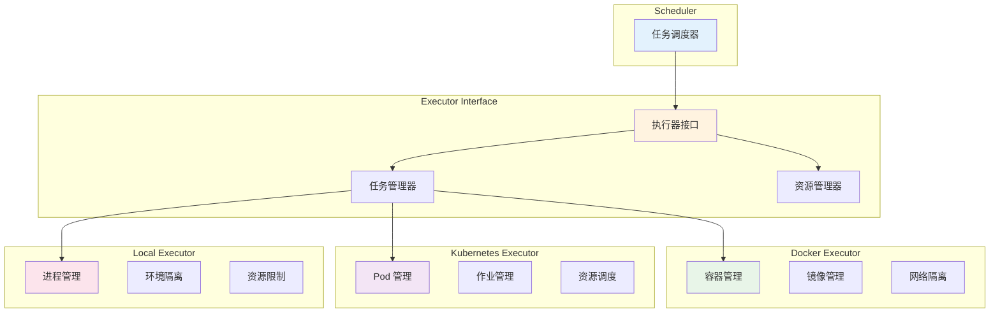

# 执行器指南

本文档详细说明 AutoScorer 系统中的执行器组件，包括 Docker 执行器、Kubernetes 执行器和本地执行器的配置与使用。

## 执行器概述

执行器（Executor）是 AutoScorer 系统中负责运行评分算法的核心组件。它们为评分任务提供隔离的运行环境，确保安全性、可靠性和可扩展性。

### 执行器架构



### 支持的执行器类型

| 执行器类型 | 隔离级别 | 资源控制 | 扩展性 | 适用场景 |
|------------|----------|----------|--------|----------|
| Docker | 容器级 | 精确 | 高 | 生产环境，云部署 |
| Kubernetes | Pod 级 | 精确 | 极高 | 大规模集群 |
| Local | 进程级 | 基础 | 低 | 开发环境，小规模 |

## Docker 执行器

### 基础配置

```yaml
# config.yaml
executors:
  default: docker
  
  docker:
    enabled: true
    host: "unix:///var/run/docker.sock"
    api_version: "auto"
    timeout: 60
    
    # 网络配置
    network:
      name: "autoscorer-network"
      driver: "bridge"
      create_if_missing: true
      
    # 镜像配置
    images:
      base: "autoscorer/base:latest"
      python: "autoscorer/python:3.10"
      gpu: "autoscorer/gpu:latest"
      
    # 默认资源限制
    default_limits:
      memory: "2g"
      cpus: "1.0"
      swap: "1g"
      
    # 安全配置
    security:
      read_only: true
      no_new_privileges: true
      user: "1000:1000"
      cap_drop: ["ALL"]
      cap_add: []
      
    # 挂载配置
    volumes:
      workspace: "/workspace"
      results: "/results"
      temp: "/tmp"
      
    # 环境变量
    environment:
      PYTHONPATH: "/app"
      TMPDIR: "/tmp"
```

### Docker 执行器实现

```python
# src/autoscorer/executor/docker_executor.py
import docker
import tempfile
import json
import time
from pathlib import Path
from typing import Dict, Any, Optional, List
from contextlib import contextmanager

from .base import BaseExecutor, ExecutionResult, ExecutionError
from ..utils.logger import get_logger
from ..schemas.job import JobSpec

logger = get_logger(__name__)

class DockerExecutor(BaseExecutor):
    """Docker 容器执行器"""
    
    def __init__(self, config: Dict[str, Any]):
        super().__init__(config)
        self.client = self._initialize_client()
        self._ensure_network()
        
    def _initialize_client(self) -> docker.DockerClient:
        """初始化 Docker 客户端"""
        try:
            docker_config = self.config.get('docker', {})
            
            client = docker.DockerClient(
                base_url=docker_config.get('host', 'unix:///var/run/docker.sock'),
                version=docker_config.get('api_version', 'auto'),
                timeout=docker_config.get('timeout', 60)
            )
            
            # 测试连接
            client.ping()
            logger.info("Docker client initialized successfully")
            return client
            
        except Exception as e:
            logger.error(f"Failed to initialize Docker client: {e}")
            raise ExecutionError(
                code="DOCKER_INIT_FAILED",
                message=f"Docker initialization failed: {e}"
            )
    
    def _ensure_network(self):
        """确保 Docker 网络存在"""
        network_config = self.config.get('docker', {}).get('network', {})
        network_name = network_config.get('name', 'autoscorer-network')
        
        try:
            self.client.networks.get(network_name)
            logger.debug(f"Using existing network: {network_name}")
        except docker.errors.NotFound:
            if network_config.get('create_if_missing', True):
                logger.info(f"Creating Docker network: {network_name}")
                self.client.networks.create(
                    network_name,
                    driver=network_config.get('driver', 'bridge')
                )
            else:
                raise ExecutionError(
                    code="NETWORK_NOT_FOUND",
                    message=f"Docker network {network_name} not found"
                )
    
    def execute(self, job: JobSpec, workspace_path: Path) -> ExecutionResult:
        """执行评分任务"""
        start_time = time.time()
        container = None
        
        try:
            # 准备执行环境
            execution_config = self._prepare_execution_config(job, workspace_path)
            
            # 创建并启动容器
            container = self._create_container(execution_config)
            logger.info(f"Created container {container.short_id} for job {job.job_id}")
            
            # 执行任务
            result = self._run_container(container, job, execution_config)
            
            # 收集执行结果
            execution_time = time.time() - start_time
            return ExecutionResult(
                job_id=job.job_id,
                status="completed",
                result=result,
                execution_time=execution_time,
                executor="docker",
                container_id=container.short_id
            )
            
        except Exception as e:
            execution_time = time.time() - start_time
            logger.error(f"Docker execution failed for job {job.job_id}: {e}")
            
            return ExecutionResult(
                job_id=job.job_id,
                status="failed",
                error=str(e),
                execution_time=execution_time,
                executor="docker",
                container_id=container.short_id if container else None
            )
            
        finally:
            # 清理容器
            if container:
                self._cleanup_container(container)
    
    def _prepare_execution_config(self, job: JobSpec, workspace_path: Path) -> Dict[str, Any]:
        """准备执行配置"""
        docker_config = self.config.get('docker', {})
        
        # 选择镜像
        image = self._select_image(job)
        
        # 资源限制
        limits = self._get_resource_limits(job)
        
        # 挂载点
        volumes = self._prepare_volumes(workspace_path)
        
        # 环境变量
        environment = self._prepare_environment(job)
        
        # 执行命令
        command = self._build_command(job)
        
        return {
            'image': image,
            'command': command,
            'environment': environment,
            'volumes': volumes,
            'limits': limits,
            'network': docker_config.get('network', {}).get('name', 'autoscorer-network'),
            'security': docker_config.get('security', {})
        }
    
    def _select_image(self, job: JobSpec) -> str:
        """选择合适的 Docker 镜像"""
        images_config = self.config.get('docker', {}).get('images', {})
        
        # 检查是否需要 GPU 支持
        if job.resources and job.resources.get('gpu', 0) > 0:
            return images_config.get('gpu', 'autoscorer/gpu:latest')
        
        # 根据任务类型选择镜像
        task_type = job.task_type.lower()
        if task_type in ['python', 'ml', 'ai']:
            return images_config.get('python', 'autoscorer/python:3.10')
        
        # 默认镜像
        return images_config.get('base', 'autoscorer/base:latest')
    
    def _get_resource_limits(self, job: JobSpec) -> Dict[str, Any]:
        """获取资源限制配置"""
        default_limits = self.config.get('docker', {}).get('default_limits', {})
        
        limits = {}
        
        # 内存限制
        if job.resources and 'memory' in job.resources:
            limits['mem_limit'] = job.resources['memory']
        else:
            limits['mem_limit'] = default_limits.get('memory', '2g')
        
        # CPU 限制
        if job.resources and 'cpu' in job.resources:
            limits['cpu_quota'] = int(job.resources['cpu'] * 100000)
            limits['cpu_period'] = 100000
        else:
            default_cpu = float(default_limits.get('cpus', '1.0'))
            limits['cpu_quota'] = int(default_cpu * 100000)
            limits['cpu_period'] = 100000
        
        # Swap 限制
        limits['memswap_limit'] = default_limits.get('swap', '1g')
        
        return limits
    
    def _prepare_volumes(self, workspace_path: Path) -> Dict[str, Dict[str, str]]:
        """准备卷挂载配置"""
        volume_config = self.config.get('docker', {}).get('volumes', {})
        
        volumes = {}
        
        # 工作区挂载
        workspace_mount = volume_config.get('workspace', '/workspace')
        volumes[str(workspace_path)] = {
            'bind': workspace_mount,
            'mode': 'rw'
        }
        
        # 结果目录挂载
        results_path = workspace_path / 'output'
        results_mount = volume_config.get('results', '/results')
        volumes[str(results_path)] = {
            'bind': results_mount,
            'mode': 'rw'
        }
        
        # 临时目录挂载
        temp_mount = volume_config.get('temp', '/tmp')
        volumes['/tmp'] = {
            'bind': temp_mount,
            'mode': 'rw'
        }
        
        return volumes
    
    def _prepare_environment(self, job: JobSpec) -> Dict[str, str]:
        """准备环境变量"""
        base_env = self.config.get('docker', {}).get('environment', {})
        
        environment = dict(base_env)
        
        # 添加任务特定环境变量
        environment.update({
            'JOB_ID': job.job_id,
            'TASK_TYPE': job.task_type,
            'SCORER_NAME': job.scorer,
        })
        
        # 添加用户定义的环境变量
        if job.environment:
            environment.update(job.environment)
        
        return environment
    
    def _build_command(self, job: JobSpec) -> List[str]:
        """构建执行命令"""
        # 基础命令
        command = [
            'python', '-m', 'autoscorer.cli',
            'score',
            '--workspace', '/workspace',
            '--scorer', job.scorer
        ]
        
        # 添加参数
        if job.scorer_params:
            command.extend(['--params', json.dumps(job.scorer_params)])
        
        # 添加输出格式
        command.extend(['--output-format', 'json'])
        
        return command
    
    def _create_container(self, config: Dict[str, Any]) -> docker.models.containers.Container:
        """创建 Docker 容器"""
        security_config = config['security']
        
        container_config = {
            'image': config['image'],
            'command': config['command'],
            'environment': config['environment'],
            'volumes': config['volumes'],
            'network': config['network'],
            'detach': True,
            'remove': False,  # 手动清理以收集日志
            
            # 资源限制
            **config['limits'],
            
            # 安全配置
            'read_only': security_config.get('read_only', True),
            'user': security_config.get('user', '1000:1000'),
            'cap_drop': security_config.get('cap_drop', ['ALL']),
            'cap_add': security_config.get('cap_add', []),
            'security_opt': ['no-new-privileges:true'] if security_config.get('no_new_privileges', True) else []
        }
        
        try:
            container = self.client.containers.create(**container_config)
            return container
        except Exception as e:
            logger.error(f"Failed to create container: {e}")
            raise ExecutionError(
                code="CONTAINER_CREATE_FAILED",
                message=f"Container creation failed: {e}"
            )
    
    def _run_container(self, container: docker.models.containers.Container, 
                      job: JobSpec, config: Dict[str, Any]) -> Dict[str, Any]:
        """运行容器并收集结果"""
        try:
            # 启动容器
            container.start()
            logger.info(f"Started container {container.short_id}")
            
            # 等待执行完成
            timeout = job.timeout if job.timeout else 1800  # 默认 30 分钟
            result = container.wait(timeout=timeout)
            
            # 收集输出
            logs = container.logs(stdout=True, stderr=True).decode('utf-8')
            
            # 检查退出状态
            exit_code = result['StatusCode']
            if exit_code != 0:
                raise ExecutionError(
                    code="CONTAINER_EXECUTION_FAILED",
                    message=f"Container exited with code {exit_code}",
                    details={'logs': logs, 'exit_code': exit_code}
                )
            
            # 解析输出结果
            return self._parse_execution_output(logs)
            
        except docker.errors.ContainerError as e:
            logger.error(f"Container execution error: {e}")
            raise ExecutionError(
                code="CONTAINER_RUNTIME_ERROR",
                message=f"Container runtime error: {e}"
            )
        except Exception as e:
            logger.error(f"Unexpected error during container execution: {e}")
            raise ExecutionError(
                code="EXECUTION_ERROR",
                message=f"Execution error: {e}"
            )
    
    def _parse_execution_output(self, logs: str) -> Dict[str, Any]:
        """解析执行输出"""
        try:
            # 查找 JSON 结果输出
            lines = logs.strip().split('\n')
            for line in reversed(lines):  # 从后往前查找
                if line.strip().startswith('{') and line.strip().endswith('}'):
                    return json.loads(line.strip())
            
            # 如果没找到 JSON 输出，返回基础信息
            return {
                'status': 'completed',
                'message': 'Execution completed but no JSON result found',
                'logs': logs
            }
            
        except json.JSONDecodeError:
            logger.warning("Failed to parse JSON output from container")
            return {
                'status': 'completed',
                'message': 'Execution completed but output format invalid',
                'logs': logs
            }
    
    def _cleanup_container(self, container: docker.models.containers.Container):
        """清理容器"""
        try:
            # 停止容器 (如果还在运行)
            if container.status in ['running', 'paused']:
                container.stop(timeout=10)
            
            # 删除容器
            container.remove()
            logger.debug(f"Cleaned up container {container.short_id}")
            
        except Exception as e:
            logger.warning(f"Failed to cleanup container {container.short_id}: {e}")
    
    def get_status(self) -> Dict[str, Any]:
        """获取执行器状态"""
        try:
            # Docker 系统信息
            info = self.client.info()
            
            # 获取容器统计
            containers = self.client.containers.list(all=True)
            running_containers = [c for c in containers if c.status == 'running']
            
            return {
                'type': 'docker',
                'status': 'healthy',
                'docker_version': info.get('ServerVersion'),
                'containers': {
                    'total': len(containers),
                    'running': len(running_containers)
                },
                'system': {
                    'cpus': info.get('NCPU'),
                    'memory': info.get('MemTotal'),
                    'storage_driver': info.get('Driver')
                }
            }
            
        except Exception as e:
            return {
                'type': 'docker',
                'status': 'unhealthy',
                'error': str(e)
            }
    
    def cleanup(self):
        """清理资源"""
        try:
            # 清理已停止的容器
            self.client.containers.prune()
            
            # 清理未使用的镜像
            self.client.images.prune()
            
            logger.info("Docker executor cleanup completed")
            
        except Exception as e:
            logger.warning(f"Docker cleanup failed: {e}")
```

### Docker 镜像构建

```dockerfile
# Dockerfile.base - 基础镜像
FROM python:3.10-slim

# 安装系统依赖
RUN apt-get update && apt-get install -y \
    curl \
    git \
    build-essential \
    && rm -rf /var/lib/apt/lists/*

# 创建应用用户
RUN groupadd -r autoscorer && useradd -r -g autoscorer autoscorer

# 设置工作目录
WORKDIR /app

# 复制应用代码
COPY src/ src/
COPY pyproject.toml .
COPY README.md .

# 安装 Python 依赖
RUN pip install --no-cache-dir -e .

# 切换到应用用户
USER autoscorer

# 设置入口点
ENTRYPOINT ["python", "-m", "autoscorer.cli"]
```

```dockerfile
# Dockerfile.python - Python 评分镜像
FROM autoscorer/base:latest

USER root

# 安装常用的数据科学库
RUN pip install --no-cache-dir \
    numpy \
    pandas \
    scikit-learn \
    scipy \
    matplotlib \
    seaborn \
    jupyter

USER autoscorer
```

```dockerfile
# Dockerfile.gpu - GPU 评分镜像
FROM nvidia/cuda:11.8-devel-ubuntu20.04

# 安装 Python
RUN apt-get update && apt-get install -y \
    python3.10 \
    python3.10-pip \
    python3.10-dev \
    && ln -s /usr/bin/python3.10 /usr/bin/python

# 其余配置同基础镜像...
```

## Kubernetes 执行器

### 基础配置

```yaml
# config.yaml
executors:
  default: kubernetes
  
  kubernetes:
    enabled: true
    config_file: "~/.kube/config"  # 或者使用 in-cluster 配置
    namespace: "autoscorer"
    
    # 作业配置
    job_template:
      api_version: "batch/v1"
      kind: "Job"
      
    # Pod 模板
    pod_template:
      restart_policy: "Never"
      service_account: "autoscorer-worker"
      
      # 安全上下文
      security_context:
        run_as_non_root: true
        run_as_user: 1000
        fs_group: 1000
        
    # 资源配置
    default_resources:
      requests:
        memory: "1Gi"
        cpu: "500m"
      limits:
        memory: "2Gi"
        cpu: "1000m"
        
    # 镜像配置
    images:
      base: "autoscorer/base:latest"
      python: "autoscorer/python:3.10"
      gpu: "autoscorer/gpu:latest"
      
    # 存储配置
    storage:
      workspace_pvc: "autoscorer-workspace-pvc"
      results_pvc: "autoscorer-results-pvc"
      
    # 清理配置
    cleanup:
      ttl_seconds_after_finished: 300  # 5 分钟后清理
      failed_jobs_history_limit: 3
      successful_jobs_history_limit: 1
```

### Kubernetes 执行器实现

```python
# src/autoscorer/executor/k8s_executor.py
from kubernetes import client, config
from kubernetes.client.rest import ApiException
import yaml
import uuid
import time
from pathlib import Path
from typing import Dict, Any, Optional

from .base import BaseExecutor, ExecutionResult, ExecutionError
from ..utils.logger import get_logger
from ..schemas.job import JobSpec

logger = get_logger(__name__)

class KubernetesExecutor(BaseExecutor):
    """Kubernetes 作业执行器"""
    
    def __init__(self, executor_config: Dict[str, Any]):
        super().__init__(executor_config)
        self.k8s_config = executor_config.get('kubernetes', {})
        self.namespace = self.k8s_config.get('namespace', 'autoscorer')
        
        # 初始化 Kubernetes 客户端
        self._initialize_k8s_client()
        
    def _initialize_k8s_client(self):
        """初始化 Kubernetes 客户端"""
        try:
            # 尝试集群内配置
            try:
                config.load_incluster_config()
                logger.info("Using in-cluster Kubernetes configuration")
            except config.ConfigException:
                # 使用本地配置文件
                config_file = self.k8s_config.get('config_file', '~/.kube/config')
                config.load_kube_config(config_file=config_file)
                logger.info(f"Using Kubernetes configuration from {config_file}")
            
            # 创建 API 客户端
            self.batch_v1 = client.BatchV1Api()
            self.core_v1 = client.CoreV1Api()
            
            # 测试连接
            self.core_v1.list_namespace()
            logger.info("Kubernetes client initialized successfully")
            
        except Exception as e:
            logger.error(f"Failed to initialize Kubernetes client: {e}")
            raise ExecutionError(
                code="K8S_INIT_FAILED",
                message=f"Kubernetes initialization failed: {e}"
            )
    
    def execute(self, job: JobSpec, workspace_path: Path) -> ExecutionResult:
        """执行评分任务"""
        start_time = time.time()
        k8s_job = None
        
        try:
            # 创建 Kubernetes Job
            job_manifest = self._create_job_manifest(job, workspace_path)
            k8s_job = self._create_k8s_job(job_manifest)
            
            logger.info(f"Created Kubernetes job {k8s_job.metadata.name} for {job.job_id}")
            
            # 等待作业完成
            result = self._wait_for_completion(k8s_job, job)
            
            execution_time = time.time() - start_time
            return ExecutionResult(
                job_id=job.job_id,
                status="completed",
                result=result,
                execution_time=execution_time,
                executor="kubernetes",
                k8s_job_name=k8s_job.metadata.name
            )
            
        except Exception as e:
            execution_time = time.time() - start_time
            logger.error(f"Kubernetes execution failed for job {job.job_id}: {e}")
            
            return ExecutionResult(
                job_id=job.job_id,
                status="failed",
                error=str(e),
                execution_time=execution_time,
                executor="kubernetes",
                k8s_job_name=k8s_job.metadata.name if k8s_job else None
            )
            
        finally:
            # 清理作业
            if k8s_job:
                self._cleanup_job(k8s_job)
    
    def _create_job_manifest(self, job: JobSpec, workspace_path: Path) -> Dict[str, Any]:
        """创建 Kubernetes Job 清单"""
        job_name = f"autoscorer-{job.job_id}-{uuid.uuid4().hex[:8]}"
        
        # 基础清单
        manifest = {
            "apiVersion": "batch/v1",
            "kind": "Job",
            "metadata": {
                "name": job_name,
                "namespace": self.namespace,
                "labels": {
                    "app": "autoscorer",
                    "job-id": job.job_id,
                    "scorer": job.scorer,
                    "task-type": job.task_type
                }
            },
            "spec": {
                "ttlSecondsAfterFinished": self.k8s_config.get('cleanup', {}).get('ttl_seconds_after_finished', 300),
                "template": {
                    "spec": {
                        "restartPolicy": "Never",
                        "serviceAccountName": self.k8s_config.get('pod_template', {}).get('service_account', 'autoscorer-worker'),
                        "securityContext": self.k8s_config.get('pod_template', {}).get('security_context', {}),
                        "containers": [{
                            "name": "scorer",
                            "image": self._select_image(job),
                            "command": self._build_command(job),
                            "env": self._build_environment(job),
                            "resources": self._build_resources(job),
                            "volumeMounts": self._build_volume_mounts()
                        }],
                        "volumes": self._build_volumes(workspace_path)
                    }
                }
            }
        }
        
        return manifest
    
    def _select_image(self, job: JobSpec) -> str:
        """选择合适的容器镜像"""
        images_config = self.k8s_config.get('images', {})
        
        # GPU 支持
        if job.resources and job.resources.get('gpu', 0) > 0:
            return images_config.get('gpu', 'autoscorer/gpu:latest')
        
        # 任务类型
        task_type = job.task_type.lower()
        if task_type in ['python', 'ml', 'ai']:
            return images_config.get('python', 'autoscorer/python:3.10')
        
        return images_config.get('base', 'autoscorer/base:latest')
    
    def _build_command(self, job: JobSpec) -> List[str]:
        """构建容器执行命令"""
        command = [
            'python', '-m', 'autoscorer.cli',
            'score',
            '--workspace', '/workspace',
            '--scorer', job.scorer,
            '--output-format', 'json'
        ]
        
        if job.scorer_params:
            command.extend(['--params', json.dumps(job.scorer_params)])
        
        return command
    
    def _build_environment(self, job: JobSpec) -> List[Dict[str, str]]:
        """构建环境变量"""
        env_vars = [
            {"name": "JOB_ID", "value": job.job_id},
            {"name": "TASK_TYPE", "value": job.task_type},
            {"name": "SCORER_NAME", "value": job.scorer},
            {"name": "PYTHONPATH", "value": "/app"}
        ]
        
        # 添加用户定义的环境变量
        if job.environment:
            for key, value in job.environment.items():
                env_vars.append({"name": key, "value": str(value)})
        
        return env_vars
    
    def _build_resources(self, job: JobSpec) -> Dict[str, Any]:
        """构建资源配置"""
        default_resources = self.k8s_config.get('default_resources', {})
        
        resources = {
            "requests": dict(default_resources.get('requests', {})),
            "limits": dict(default_resources.get('limits', {}))
        }
        
        # 应用作业特定资源配置
        if job.resources:
            if 'memory' in job.resources:
                resources['requests']['memory'] = job.resources['memory']
                resources['limits']['memory'] = job.resources['memory']
            
            if 'cpu' in job.resources:
                cpu_str = f"{job.resources['cpu']}"
                if not cpu_str.endswith('m'):
                    cpu_str = f"{int(float(cpu_str) * 1000)}m"
                resources['requests']['cpu'] = cpu_str
                resources['limits']['cpu'] = cpu_str
            
            if 'gpu' in job.resources and job.resources['gpu'] > 0:
                resources['requests']['nvidia.com/gpu'] = str(job.resources['gpu'])
                resources['limits']['nvidia.com/gpu'] = str(job.resources['gpu'])
        
        return resources
    
    def _build_volume_mounts(self) -> List[Dict[str, str]]:
        """构建卷挂载配置"""
        return [
            {
                "name": "workspace",
                "mountPath": "/workspace"
            },
            {
                "name": "results",
                "mountPath": "/results"
            }
        ]
    
    def _build_volumes(self, workspace_path: Path) -> List[Dict[str, Any]]:
        """构建卷配置"""
        storage_config = self.k8s_config.get('storage', {})
        
        return [
            {
                "name": "workspace",
                "persistentVolumeClaim": {
                    "claimName": storage_config.get('workspace_pvc', 'autoscorer-workspace-pvc')
                }
            },
            {
                "name": "results",
                "persistentVolumeClaim": {
                    "claimName": storage_config.get('results_pvc', 'autoscorer-results-pvc')
                }
            }
        ]
    
    def _create_k8s_job(self, manifest: Dict[str, Any]) -> client.V1Job:
        """创建 Kubernetes Job"""
        try:
            job = self.batch_v1.create_namespaced_job(
                namespace=self.namespace,
                body=manifest
            )
            return job
        except ApiException as e:
            logger.error(f"Failed to create Kubernetes job: {e}")
            raise ExecutionError(
                code="K8S_JOB_CREATE_FAILED",
                message=f"Kubernetes job creation failed: {e}"
            )
    
    def _wait_for_completion(self, k8s_job: client.V1Job, job: JobSpec) -> Dict[str, Any]:
        """等待作业完成"""
        job_name = k8s_job.metadata.name
        timeout = job.timeout if job.timeout else 1800  # 默认 30 分钟
        start_time = time.time()
        
        while time.time() - start_time < timeout:
            try:
                # 获取作业状态
                job_status = self.batch_v1.read_namespaced_job_status(
                    name=job_name,
                    namespace=self.namespace
                )
                
                # 检查完成状态
                if job_status.status.succeeded:
                    logger.info(f"Kubernetes job {job_name} completed successfully")
                    return self._collect_job_result(k8s_job)
                
                if job_status.status.failed:
                    logger.error(f"Kubernetes job {job_name} failed")
                    logs = self._collect_job_logs(k8s_job)
                    raise ExecutionError(
                        code="K8S_JOB_FAILED",
                        message="Kubernetes job execution failed",
                        details={'logs': logs}
                    )
                
                # 等待并重试
                time.sleep(5)
                
            except ApiException as e:
                logger.error(f"Error checking job status: {e}")
                raise ExecutionError(
                    code="K8S_STATUS_CHECK_FAILED",
                    message=f"Failed to check job status: {e}"
                )
        
        # 超时
        logger.error(f"Kubernetes job {job_name} timed out")
        raise ExecutionError(
            code="K8S_JOB_TIMEOUT",
            message=f"Job execution timed out after {timeout} seconds"
        )
    
    def _collect_job_result(self, k8s_job: client.V1Job) -> Dict[str, Any]:
        """收集作业执行结果"""
        try:
            # 获取 Pod 日志
            logs = self._collect_job_logs(k8s_job)
            
            # 解析结果
            return self._parse_execution_output(logs)
            
        except Exception as e:
            logger.warning(f"Failed to collect job result: {e}")
            return {
                'status': 'completed',
                'message': 'Execution completed but result collection failed',
                'error': str(e)
            }
    
    def _collect_job_logs(self, k8s_job: client.V1Job) -> str:
        """收集作业日志"""
        job_name = k8s_job.metadata.name
        
        try:
            # 获取作业的 Pod
            pods = self.core_v1.list_namespaced_pod(
                namespace=self.namespace,
                label_selector=f"job-name={job_name}"
            )
            
            if not pods.items:
                return "No pods found for job"
            
            # 获取第一个 Pod 的日志
            pod = pods.items[0]
            logs = self.core_v1.read_namespaced_pod_log(
                name=pod.metadata.name,
                namespace=self.namespace,
                container='scorer'
            )
            
            return logs
            
        except ApiException as e:
            logger.warning(f"Failed to collect logs for job {job_name}: {e}")
            return f"Log collection failed: {e}"
    
    def _parse_execution_output(self, logs: str) -> Dict[str, Any]:
        """解析执行输出"""
        try:
            # 查找 JSON 结果输出
            lines = logs.strip().split('\n')
            for line in reversed(lines):
                if line.strip().startswith('{') and line.strip().endswith('}'):
                    return json.loads(line.strip())
            
            return {
                'status': 'completed',
                'message': 'Execution completed but no JSON result found',
                'logs': logs
            }
            
        except json.JSONDecodeError:
            return {
                'status': 'completed',
                'message': 'Execution completed but output format invalid',
                'logs': logs
            }
    
    def _cleanup_job(self, k8s_job: client.V1Job):
        """清理 Kubernetes Job"""
        job_name = k8s_job.metadata.name
        
        try:
            # 删除作业 (会自动清理 Pod)
            self.batch_v1.delete_namespaced_job(
                name=job_name,
                namespace=self.namespace,
                body=client.V1DeleteOptions(propagation_policy='Background')
            )
            logger.debug(f"Cleaned up Kubernetes job {job_name}")
            
        except ApiException as e:
            logger.warning(f"Failed to cleanup job {job_name}: {e}")
    
    def get_status(self) -> Dict[str, Any]:
        """获取执行器状态"""
        try:
            # 获取命名空间信息
            namespace_info = self.core_v1.read_namespace(self.namespace)
            
            # 获取作业统计
            jobs = self.batch_v1.list_namespaced_job(namespace=self.namespace)
            running_jobs = sum(1 for job in jobs.items if not job.status.completion_time)
            
            # 获取 Pod 统计
            pods = self.core_v1.list_namespaced_pod(namespace=self.namespace)
            running_pods = sum(1 for pod in pods.items if pod.status.phase == 'Running')
            
            return {
                'type': 'kubernetes',
                'status': 'healthy',
                'namespace': self.namespace,
                'jobs': {
                    'total': len(jobs.items),
                    'running': running_jobs
                },
                'pods': {
                    'total': len(pods.items),
                    'running': running_pods
                }
            }
            
        except Exception as e:
            return {
                'type': 'kubernetes',
                'status': 'unhealthy',
                'error': str(e)
            }
```

## 本地执行器

### 配置

```yaml
# config.yaml
executors:
  default: local
  
  local:
    enabled: true
    
    # 进程限制
    max_processes: 4
    process_timeout: 1800  # 30 分钟
    
    # 资源限制
    default_limits:
      memory_mb: 2048
      cpu_percent: 100
      
    # 环境隔离
    isolation:
      use_virtual_env: true
      python_path: "/usr/bin/python3"
      temp_dir: "/tmp/autoscorer"
      
    # 安全配置
    security:
      allow_network: false
      read_only_filesystem: false
      restricted_user: true
```

### 本地执行器实现

```python
# src/autoscorer/executor/local_executor.py
import subprocess
import psutil
import json
import tempfile
import os
import signal
import time
from pathlib import Path
from typing import Dict, Any, Optional
from contextlib import contextmanager

from .base import BaseExecutor, ExecutionResult, ExecutionError
from ..utils.logger import get_logger
from ..schemas.job import JobSpec

logger = get_logger(__name__)

class LocalExecutor(BaseExecutor):
    """本地进程执行器"""
    
    def __init__(self, config: Dict[str, Any]):
        super().__init__(config)
        self.local_config = config.get('local', {})
        self.running_processes = {}
        
    def execute(self, job: JobSpec, workspace_path: Path) -> ExecutionResult:
        """执行评分任务"""
        start_time = time.time()
        process = None
        
        try:
            # 准备执行环境
            execution_config = self._prepare_execution_config(job, workspace_path)
            
            # 启动进程
            process = self._start_process(execution_config)
            self.running_processes[job.job_id] = process
            
            logger.info(f"Started local process {process.pid} for job {job.job_id}")
            
            # 等待完成
            result = self._wait_for_completion(process, job)
            
            execution_time = time.time() - start_time
            return ExecutionResult(
                job_id=job.job_id,
                status="completed",
                result=result,
                execution_time=execution_time,
                executor="local",
                process_id=process.pid
            )
            
        except Exception as e:
            execution_time = time.time() - start_time
            logger.error(f"Local execution failed for job {job.job_id}: {e}")
            
            return ExecutionResult(
                job_id=job.job_id,
                status="failed",
                error=str(e),
                execution_time=execution_time,
                executor="local",
                process_id=process.pid if process else None
            )
            
        finally:
            # 清理进程
            if job.job_id in self.running_processes:
                del self.running_processes[job.job_id]
            if process:
                self._cleanup_process(process)
    
    def _prepare_execution_config(self, job: JobSpec, workspace_path: Path) -> Dict[str, Any]:
        """准备执行配置"""
        # 构建命令
        command = self._build_command(job, workspace_path)
        
        # 环境变量
        environment = self._prepare_environment(job)
        
        # 资源限制
        limits = self._get_resource_limits(job)
        
        # 工作目录
        working_dir = workspace_path
        
        return {
            'command': command,
            'environment': environment,
            'working_dir': working_dir,
            'limits': limits,
            'timeout': job.timeout or self.local_config.get('process_timeout', 1800)
        }
    
    def _build_command(self, job: JobSpec, workspace_path: Path) -> List[str]:
        """构建执行命令"""
        python_path = self.local_config.get('isolation', {}).get('python_path', 'python')
        
        command = [
            python_path, '-m', 'autoscorer.cli',
            'score',
            '--workspace', str(workspace_path),
            '--scorer', job.scorer,
            '--output-format', 'json'
        ]
        
        if job.scorer_params:
            command.extend(['--params', json.dumps(job.scorer_params)])
        
        return command
    
    def _prepare_environment(self, job: JobSpec) -> Dict[str, str]:
        """准备环境变量"""
        env = dict(os.environ)
        
        # 添加任务特定环境变量
        env.update({
            'JOB_ID': job.job_id,
            'TASK_TYPE': job.task_type,
            'SCORER_NAME': job.scorer,
        })
        
        # 添加用户定义的环境变量
        if job.environment:
            env.update(job.environment)
        
        # 隔离配置
        isolation_config = self.local_config.get('isolation', {})
        if isolation_config.get('use_virtual_env'):
            # 设置虚拟环境路径
            venv_path = isolation_config.get('venv_path')
            if venv_path:
                env['VIRTUAL_ENV'] = venv_path
                env['PATH'] = f"{venv_path}/bin:{env['PATH']}"
        
        return env
    
    def _get_resource_limits(self, job: JobSpec) -> Dict[str, Any]:
        """获取资源限制"""
        default_limits = self.local_config.get('default_limits', {})
        
        limits = {}
        
        # 内存限制
        if job.resources and 'memory' in job.resources:
            memory_str = job.resources['memory']
            if memory_str.endswith('Gi'):
                limits['memory_mb'] = int(float(memory_str[:-2]) * 1024)
            elif memory_str.endswith('Mi'):
                limits['memory_mb'] = int(memory_str[:-2])
            else:
                limits['memory_mb'] = default_limits.get('memory_mb', 2048)
        else:
            limits['memory_mb'] = default_limits.get('memory_mb', 2048)
        
        # CPU 限制
        if job.resources and 'cpu' in job.resources:
            limits['cpu_percent'] = int(float(job.resources['cpu']) * 100)
        else:
            limits['cpu_percent'] = default_limits.get('cpu_percent', 100)
        
        return limits
    
    def _start_process(self, config: Dict[str, Any]) -> subprocess.Popen:
        """启动进程"""
        try:
            process = subprocess.Popen(
                config['command'],
                cwd=config['working_dir'],
                env=config['environment'],
                stdout=subprocess.PIPE,
                stderr=subprocess.STDOUT,
                text=True,
                preexec_fn=os.setsid  # 创建新的进程组
            )
            
            return process
            
        except Exception as e:
            logger.error(f"Failed to start process: {e}")
            raise ExecutionError(
                code="PROCESS_START_FAILED",
                message=f"Process start failed: {e}"
            )
    
    def _wait_for_completion(self, process: subprocess.Popen, job: JobSpec) -> Dict[str, Any]:
        """等待进程完成"""
        timeout = job.timeout or self.local_config.get('process_timeout', 1800)
        
        try:
            # 设置资源监控
            if process.pid:
                self._monitor_resources(process, job)
            
            # 等待完成
            stdout, stderr = process.communicate(timeout=timeout)
            
            # 检查退出码
            if process.returncode != 0:
                raise ExecutionError(
                    code="PROCESS_EXECUTION_FAILED",
                    message=f"Process exited with code {process.returncode}",
                    details={'stdout': stdout, 'stderr': stderr, 'exit_code': process.returncode}
                )
            
            # 解析输出
            return self._parse_execution_output(stdout)
            
        except subprocess.TimeoutExpired:
            logger.error(f"Process {process.pid} timed out")
            self._kill_process(process)
            raise ExecutionError(
                code="PROCESS_TIMEOUT",
                message=f"Process execution timed out after {timeout} seconds"
            )
        except Exception as e:
            logger.error(f"Process execution error: {e}")
            self._kill_process(process)
            raise ExecutionError(
                code="PROCESS_ERROR",
                message=f"Process execution error: {e}"
            )
    
    def _monitor_resources(self, process: subprocess.Popen, job: JobSpec):
        """监控进程资源使用"""
        try:
            proc = psutil.Process(process.pid)
            limits = self._get_resource_limits(job)
            
            # 内存限制
            memory_limit_bytes = limits['memory_mb'] * 1024 * 1024
            
            def check_resources():
                try:
                    # 检查内存使用
                    memory_info = proc.memory_info()
                    if memory_info.rss > memory_limit_bytes:
                        logger.warning(f"Process {process.pid} exceeded memory limit")
                        self._kill_process(process)
                        return
                    
                    # 检查 CPU 使用 (简单检查)
                    cpu_percent = proc.cpu_percent()
                    if cpu_percent > limits['cpu_percent'] * 1.5:  # 允许 50% 的弹性
                        logger.warning(f"Process {process.pid} high CPU usage: {cpu_percent}%")
                    
                except (psutil.NoSuchProcess, psutil.AccessDenied):
                    # 进程已结束
                    return
            
            # 启动资源监控线程
            import threading
            monitor_thread = threading.Thread(target=lambda: [
                check_resources() or time.sleep(5) for _ in iter(lambda: process.poll() is None, False)
            ])
            monitor_thread.daemon = True
            monitor_thread.start()
            
        except Exception as e:
            logger.warning(f"Failed to set up resource monitoring: {e}")
    
    def _kill_process(self, process: subprocess.Popen):
        """终止进程"""
        try:
            if process.poll() is None:  # 进程还在运行
                # 尝试优雅终止
                os.killpg(os.getpgid(process.pid), signal.SIGTERM)
                
                # 等待 5 秒
                try:
                    process.wait(timeout=5)
                except subprocess.TimeoutExpired:
                    # 强制终止
                    os.killpg(os.getpgid(process.pid), signal.SIGKILL)
                    process.wait()
                    
        except Exception as e:
            logger.warning(f"Failed to kill process {process.pid}: {e}")
    
    def _parse_execution_output(self, output: str) -> Dict[str, Any]:
        """解析执行输出"""
        try:
            lines = output.strip().split('\n')
            for line in reversed(lines):
                if line.strip().startswith('{') and line.strip().endswith('}'):
                    return json.loads(line.strip())
            
            return {
                'status': 'completed',
                'message': 'Execution completed but no JSON result found',
                'output': output
            }
            
        except json.JSONDecodeError:
            return {
                'status': 'completed',
                'message': 'Execution completed but output format invalid',
                'output': output
            }
    
    def _cleanup_process(self, process: subprocess.Popen):
        """清理进程资源"""
        try:
            if process.poll() is None:
                self._kill_process(process)
            
            # 关闭管道
            if process.stdout:
                process.stdout.close()
            if process.stderr:
                process.stderr.close()
                
        except Exception as e:
            logger.warning(f"Failed to cleanup process {process.pid}: {e}")
    
    def get_status(self) -> Dict[str, Any]:
        """获取执行器状态"""
        try:
            # 系统资源信息
            cpu_count = psutil.cpu_count()
            memory = psutil.virtual_memory()
            disk = psutil.disk_usage('/')
            
            return {
                'type': 'local',
                'status': 'healthy',
                'processes': {
                    'running': len(self.running_processes),
                    'max_allowed': self.local_config.get('max_processes', 4)
                },
                'system': {
                    'cpu_count': cpu_count,
                    'cpu_percent': psutil.cpu_percent(),
                    'memory_total': memory.total,
                    'memory_available': memory.available,
                    'memory_percent': memory.percent,
                    'disk_total': disk.total,
                    'disk_free': disk.free,
                    'disk_percent': disk.percent
                }
            }
            
        except Exception as e:
            return {
                'type': 'local',
                'status': 'unhealthy',
                'error': str(e)
            }
    
    def cleanup(self):
        """清理所有进程"""
        for job_id, process in list(self.running_processes.items()):
            try:
                self._kill_process(process)
            except Exception as e:
                logger.warning(f"Failed to cleanup process for job {job_id}: {e}")
        
        self.running_processes.clear()
        logger.info("Local executor cleanup completed")
```

## 执行器选择和配置

### 动态执行器选择

```python
# src/autoscorer/executor/manager.py
from typing import Dict, Any, Optional
from .docker_executor import DockerExecutor
from .k8s_executor import KubernetesExecutor
from .local_executor import LocalExecutor
from ..schemas.job import JobSpec

class ExecutorManager:
    """执行器管理器"""
    
    def __init__(self, config: Dict[str, Any]):
        self.config = config
        self.executors = {}
        self._initialize_executors()
    
    def _initialize_executors(self):
        """初始化可用的执行器"""
        executors_config = self.config.get('executors', {})
        
        # Docker 执行器
        if executors_config.get('docker', {}).get('enabled', False):
            try:
                self.executors['docker'] = DockerExecutor(self.config)
            except Exception as e:
                logger.warning(f"Failed to initialize Docker executor: {e}")
        
        # Kubernetes 执行器
        if executors_config.get('kubernetes', {}).get('enabled', False):
            try:
                self.executors['kubernetes'] = KubernetesExecutor(self.config)
            except Exception as e:
                logger.warning(f"Failed to initialize Kubernetes executor: {e}")
        
        # 本地执行器
        if executors_config.get('local', {}).get('enabled', True):
            try:
                self.executors['local'] = LocalExecutor(self.config)
            except Exception as e:
                logger.warning(f"Failed to initialize Local executor: {e}")
    
    def select_executor(self, job: JobSpec) -> str:
        """选择合适的执行器"""
        # 显式指定的执行器
        if job.executor and job.executor in self.executors:
            return job.executor
        
        # 基于资源需求选择
        if job.resources:
            # GPU 任务优先使用 Kubernetes 或 Docker
            if job.resources.get('gpu', 0) > 0:
                if 'kubernetes' in self.executors:
                    return 'kubernetes'
                elif 'docker' in self.executors:
                    return 'docker'
            
            # 高内存任务
            memory_str = job.resources.get('memory', '0')
            if memory_str.endswith('Gi'):
                memory_gb = float(memory_str[:-2])
                if memory_gb > 4:  # 大于 4GB
                    if 'kubernetes' in self.executors:
                        return 'kubernetes'
                    elif 'docker' in self.executors:
                        return 'docker'
        
        # 默认执行器
        default_executor = self.config.get('executors', {}).get('default', 'docker')
        if default_executor in self.executors:
            return default_executor
        
        # 回退到任何可用的执行器
        if self.executors:
            return next(iter(self.executors.keys()))
        
        raise ExecutionError(
            code="NO_EXECUTOR_AVAILABLE",
            message="No suitable executor available"
        )
    
    def get_executor(self, executor_type: str) -> BaseExecutor:
        """获取指定类型的执行器"""
        if executor_type not in self.executors:
            raise ExecutionError(
                code="EXECUTOR_NOT_FOUND",
                message=f"Executor {executor_type} not available"
            )
        
        return self.executors[executor_type]
    
    def get_status(self) -> Dict[str, Any]:
        """获取所有执行器状态"""
        status = {}
        for name, executor in self.executors.items():
            status[name] = executor.get_status()
        
        return {
            'available_executors': list(self.executors.keys()),
            'default_executor': self.config.get('executors', {}).get('default'),
            'executor_status': status
        }
```

## 相关文档

- **[配置管理](configuration.md)** - 执行器配置选项
- **[部署指南](deployment.md)** - 生产环境执行器部署
- **[API 参考](api-reference.md)** - 执行器 API 接口
- **[错误处理](error-handling.md)** - 执行器错误排查
