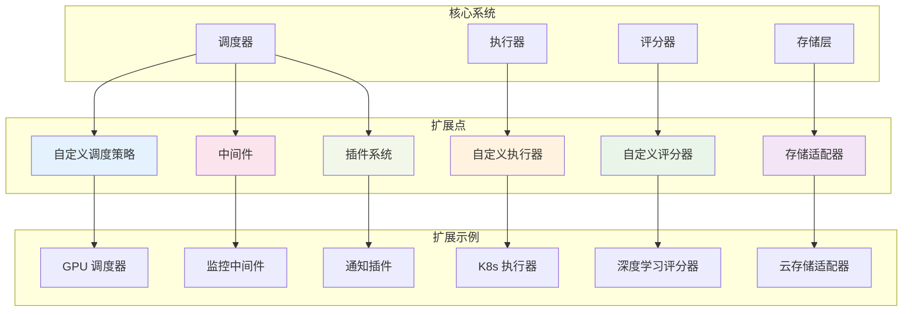

# 扩展开发指南

本文档详细说明如何扩展 AutoScorer 系统功能，包括插件开发、自定义组件、第三方集成和高级定制等方面。

## 扩展架构概览

### 扩展点

AutoScorer 提供了多个扩展点，允许开发者在不修改核心代码的情况下添加自定义功能：



### 扩展类型

| 扩展类型 | 描述 | 复杂度 | 适用场景 |
|----------|------|--------|----------|
| **评分器扩展** | 自定义评分算法 | 低 | 新的评价指标 |
| **执行器扩展** | 自定义执行环境 | 中 | 特殊硬件支持 |
| **存储扩展** | 自定义存储后端 | 中 | 云存储集成 |
| **调度扩展** | 自定义调度策略 | 高 | 复杂资源管理 |
| **插件扩展** | 独立功能模块 | 低-高 | 附加功能 |

## 插件系统

### 插件架构

```python
# src/autoscorer/plugins/base.py
from abc import ABC, abstractmethod
from typing import Dict, Any, Optional
import logging

logger = logging.getLogger(__name__)

class BasePlugin(ABC):
    """插件基类"""
    
    def __init__(self, config: Dict[str, Any]):
        self.config = config
        self.enabled = config.get('enabled', True)
        self.name = self.__class__.__name__
        
    @abstractmethod
    def initialize(self) -> None:
        """初始化插件"""
        pass
    
    @abstractmethod
    def cleanup(self) -> None:
        """清理插件资源"""
        pass
    
    @property
    @abstractmethod
    def plugin_info(self) -> Dict[str, Any]:
        """插件信息"""
        pass
    
    def is_enabled(self) -> bool:
        """检查插件是否启用"""
        return self.enabled

class PluginManager:
    """插件管理器"""
    
    def __init__(self, config: Dict[str, Any]):
        self.config = config
        self.plugins = {}
        self.hooks = {}
        
    def register_plugin(self, plugin_name: str, plugin_class: type, 
                       plugin_config: Dict[str, Any]) -> None:
        """注册插件"""
        try:
            plugin = plugin_class(plugin_config)
            if plugin.is_enabled():
                plugin.initialize()
                self.plugins[plugin_name] = plugin
                logger.info(f"Plugin {plugin_name} registered successfully")
            else:
                logger.info(f"Plugin {plugin_name} is disabled")
        except Exception as e:
            logger.error(f"Failed to register plugin {plugin_name}: {e}")
    
    def unregister_plugin(self, plugin_name: str) -> None:
        """注销插件"""
        if plugin_name in self.plugins:
            try:
                self.plugins[plugin_name].cleanup()
                del self.plugins[plugin_name]
                logger.info(f"Plugin {plugin_name} unregistered")
            except Exception as e:
                logger.error(f"Failed to unregister plugin {plugin_name}: {e}")
    
    def get_plugin(self, plugin_name: str) -> Optional[BasePlugin]:
        """获取插件实例"""
        return self.plugins.get(plugin_name)
    
    def list_plugins(self) -> Dict[str, Dict[str, Any]]:
        """列出所有插件"""
        return {
            name: plugin.plugin_info 
            for name, plugin in self.plugins.items()
        }
    
    def execute_hook(self, hook_name: str, *args, **kwargs) -> None:
        """执行钩子函数"""
        for plugin in self.plugins.values():
            if hasattr(plugin, hook_name):
                try:
                    hook_func = getattr(plugin, hook_name)
                    hook_func(*args, **kwargs)
                except Exception as e:
                    logger.error(f"Hook {hook_name} failed in plugin {plugin.name}: {e}")
```

### 生命周期钩子

```python
# src/autoscorer/plugins/hooks.py
class LifecycleHooks:
    """生命周期钩子定义"""
    
    # 系统启动钩子
    def on_system_startup(self, context: Dict[str, Any]) -> None:
        """系统启动时调用"""
        pass
    
    def on_system_shutdown(self, context: Dict[str, Any]) -> None:
        """系统关闭时调用"""
        pass
    
    # 任务生命周期钩子
    def on_job_submitted(self, job_id: str, job_spec: Dict[str, Any]) -> None:
        """任务提交时调用"""
        pass
    
    def on_job_started(self, job_id: str, context: Dict[str, Any]) -> None:
        """任务开始执行时调用"""
        pass
    
    def on_job_completed(self, job_id: str, result: Dict[str, Any]) -> None:
        """任务完成时调用"""
        pass
    
    def on_job_failed(self, job_id: str, error: Dict[str, Any]) -> None:
        """任务失败时调用"""
        pass
    
    # 数据处理钩子
    def on_data_loaded(self, job_id: str, data_info: Dict[str, Any]) -> None:
        """数据加载完成时调用"""
        pass
    
    def on_result_generated(self, job_id: str, result: Dict[str, Any]) -> Dict[str, Any]:
        """结果生成时调用，可修改结果"""
        return result
```

## 自定义评分器扩展

### 高级评分器基类

```python
# src/autoscorer/scorers/advanced_base.py
from abc import abstractmethod
from typing import Dict, Any, List, Optional, Union
import numpy as np
import pandas as pd

from .base import BaseScorer

class AdvancedScorer(BaseScorer):
    """高级评分器基类"""
    
    def __init__(self, config: Dict[str, Any]):
        super().__init__(config)
        self.supports_visualization = True
        self.supports_artifacts = True
        self.supports_streaming = False
        
    @abstractmethod
    def validate_advanced_input(self, gt_data: Any, pred_data: Any) -> bool:
        """高级输入验证"""
        pass
    
    @abstractmethod
    def compute_advanced_metrics(self, gt_data: Any, pred_data: Any) -> Dict[str, float]:
        """计算高级指标"""
        pass
    
    def generate_visualizations(self, gt_data: Any, pred_data: Any, 
                              metrics: Dict[str, float]) -> Dict[str, str]:
        """生成可视化图表"""
        visualizations = {}
        
        if hasattr(self, '_generate_confusion_matrix'):
            viz_path = self._generate_confusion_matrix(gt_data, pred_data)
            if viz_path:
                visualizations['confusion_matrix'] = viz_path
        
        if hasattr(self, '_generate_distribution_plot'):
            viz_path = self._generate_distribution_plot(gt_data, pred_data)
            if viz_path:
                visualizations['distribution_plot'] = viz_path
        
        return visualizations
    
    def generate_artifacts(self, gt_data: Any, pred_data: Any, 
                          metrics: Dict[str, float]) -> Dict[str, Dict[str, Any]]:
        """生成产物文件"""
        artifacts = {}
        
        # 详细预测结果
        if hasattr(self, '_generate_detailed_predictions'):
            pred_file = self._generate_detailed_predictions(gt_data, pred_data)
            if pred_file:
                artifacts['detailed_predictions'] = {
                    'path': pred_file,
                    'content_type': 'text/csv',
                    'description': 'Detailed prediction results'
                }
        
        # 性能报告
        if hasattr(self, '_generate_performance_report'):
            report_file = self._generate_performance_report(metrics)
            if report_file:
                artifacts['performance_report'] = {
                    'path': report_file,
                    'content_type': 'application/json',
                    'description': 'Performance analysis report'
                }
        
        return artifacts
    
    def score(self, gt_data: Any, pred_data: Any) -> Dict[str, Any]:
        """评分主方法"""
        # 基础验证
        if not self.validate_input(gt_data, pred_data):
            raise ValueError("Input validation failed")
        
        # 高级验证
        if not self.validate_advanced_input(gt_data, pred_data):
            raise ValueError("Advanced input validation failed")
        
        # 计算指标
        metrics = self.compute_advanced_metrics(gt_data, pred_data)
        
        # 生成可视化
        visualizations = {}
        if self.supports_visualization:
            visualizations = self.generate_visualizations(gt_data, pred_data, metrics)
        
        # 生成产物
        artifacts = {}
        if self.supports_artifacts:
            artifacts = self.generate_artifacts(gt_data, pred_data, metrics)
        
        # 构建结果
        result = {
            'summary': self._build_summary(metrics),
            'metrics': metrics,
            'versioning': self._build_versioning(),
            'timing': self._get_timing_info(),
            'resources': self._get_resource_info()
        }
        
        if visualizations:
            # 将可视化文件添加到 artifacts
            for name, path in visualizations.items():
                artifacts[name] = {
                    'path': path,
                    'content_type': self._get_content_type(path),
                    'description': f'Generated {name}'
                }
        
        if artifacts:
            result['artifacts'] = artifacts
        
        return result
    
    def _get_content_type(self, file_path: str) -> str:
        """根据文件扩展名推断 MIME 类型"""
        extension = file_path.split('.')[-1].lower()
        mime_types = {
            'png': 'image/png',
            'jpg': 'image/jpeg',
            'jpeg': 'image/jpeg',
            'svg': 'image/svg+xml',
            'pdf': 'application/pdf',
            'html': 'text/html',
            'json': 'application/json',
            'csv': 'text/csv'
        }
        return mime_types.get(extension, 'application/octet-stream')
```

### 深度学习评分器示例

```python
# custom_scorers/deep_learning_scorer.py
import torch
import torchvision.transforms as transforms
from PIL import Image
import matplotlib.pyplot as plt
import seaborn as sns
from sklearn.metrics import classification_report, confusion_matrix
import json
import os

from src.autoscorer.scorers.advanced_base import AdvancedScorer

class DeepLearningImageClassifier(AdvancedScorer):
    """深度学习图像分类评分器"""
    
    def __init__(self, config: Dict[str, Any]):
        super().__init__(config)
        self.class_names = config.get('class_names', [])
        self.confidence_threshold = config.get('confidence_threshold', 0.5)
        self.device = torch.device('cuda' if torch.cuda.is_available() else 'cpu')
        
    def validate_advanced_input(self, gt_data: Any, pred_data: Any) -> bool:
        """验证深度学习模型输入"""
        # 验证预测格式：应包含 class_id, confidence, bbox (可选)
        required_fields = ['image_id', 'class_id', 'confidence']
        
        if not all(field in pred_data.columns for field in required_fields):
            return False
        
        # 验证置信度范围
        if not (pred_data['confidence'] >= 0).all() or not (pred_data['confidence'] <= 1).all():
            return False
        
        # 验证类别ID
        if self.class_names:
            max_class_id = len(self.class_names) - 1
            if not (pred_data['class_id'] <= max_class_id).all():
                return False
        
        return True
    
    def compute_advanced_metrics(self, gt_data: pd.DataFrame, 
                                pred_data: pd.DataFrame) -> Dict[str, float]:
        """计算深度学习特定指标"""
        # 基础分类指标
        metrics = super().compute_metrics(gt_data, pred_data)
        
        # 置信度相关指标
        confidence_metrics = self._compute_confidence_metrics(gt_data, pred_data)
        metrics.update(confidence_metrics)
        
        # Top-K 准确率
        top_k_metrics = self._compute_top_k_accuracy(gt_data, pred_data)
        metrics.update(top_k_metrics)
        
        # 校准指标
        calibration_metrics = self._compute_calibration_metrics(gt_data, pred_data)
        metrics.update(calibration_metrics)
        
        return metrics
    
    def _compute_confidence_metrics(self, gt_data: pd.DataFrame, 
                                   pred_data: pd.DataFrame) -> Dict[str, float]:
        """计算置信度相关指标"""
        # 合并数据
        merged = pd.merge(gt_data, pred_data, on='image_id', suffixes=('_gt', '_pred'))
        
        # 正确预测的平均置信度
        correct_mask = merged['class_id_gt'] == merged['class_id_pred']
        correct_confidence = merged[correct_mask]['confidence'].mean()
        
        # 错误预测的平均置信度
        incorrect_confidence = merged[~correct_mask]['confidence'].mean()
        
        # 高置信度预测的准确率
        high_conf_mask = merged['confidence'] >= self.confidence_threshold
        high_conf_accuracy = correct_mask[high_conf_mask].mean() if high_conf_mask.sum() > 0 else 0
        
        return {
            'avg_confidence_correct': correct_confidence,
            'avg_confidence_incorrect': incorrect_confidence,
            'high_confidence_accuracy': high_conf_accuracy,
            'confidence_gap': correct_confidence - incorrect_confidence
        }
    
    def _compute_top_k_accuracy(self, gt_data: pd.DataFrame, 
                               pred_data: pd.DataFrame, k_values: List[int] = [1, 3, 5]) -> Dict[str, float]:
        """计算 Top-K 准确率"""
        # 如果预测数据包含多个候选，计算 Top-K
        # 这里假设有 top_k_predictions 字段包含排序后的预测
        metrics = {}
        
        if 'top_k_predictions' in pred_data.columns:
            merged = pd.merge(gt_data, pred_data, on='image_id')
            
            for k in k_values:
                correct_count = 0
                total_count = len(merged)
                
                for _, row in merged.iterrows():
                    gt_class = row['class_id_gt']
                    top_k_preds = row['top_k_predictions'][:k]
                    
                    if gt_class in top_k_preds:
                        correct_count += 1
                
                metrics[f'top_{k}_accuracy'] = correct_count / total_count if total_count > 0 else 0
        
        return metrics
    
    def _compute_calibration_metrics(self, gt_data: pd.DataFrame, 
                                   pred_data: pd.DataFrame) -> Dict[str, float]:
        """计算模型校准指标"""
        from sklearn.calibration import calibration_curve
        
        merged = pd.merge(gt_data, pred_data, on='image_id', suffixes=('_gt', '_pred'))
        
        # 二分类校准 (每个类别 vs 其他)
        calibration_errors = []
        
        for class_id in merged['class_id_gt'].unique():
            # 创建二分类标签
            y_true = (merged['class_id_gt'] == class_id).astype(int)
            y_prob = merged['confidence'][merged['class_id_pred'] == class_id]
            
            if len(y_prob) > 10:  # 需要足够的样本
                fraction_of_positives, mean_predicted_value = calibration_curve(
                    y_true, y_prob, n_bins=10
                )
                
                # 计算期望校准误差 (ECE)
                ece = np.abs(fraction_of_positives - mean_predicted_value).mean()
                calibration_errors.append(ece)
        
        avg_calibration_error = np.mean(calibration_errors) if calibration_errors else 0
        
        return {
            'expected_calibration_error': avg_calibration_error
        }
    
    def _generate_confusion_matrix(self, gt_data: pd.DataFrame, 
                                  pred_data: pd.DataFrame) -> str:
        """生成混淆矩阵可视化"""
        merged = pd.merge(gt_data, pred_data, on='image_id', suffixes=('_gt', '_pred'))
        
        # 创建混淆矩阵
        cm = confusion_matrix(merged['class_id_gt'], merged['class_id_pred'])
        
        # 绘制热力图
        plt.figure(figsize=(10, 8))
        sns.heatmap(
            cm, 
            annot=True, 
            fmt='d', 
            cmap='Blues',
            xticklabels=self.class_names if self.class_names else None,
            yticklabels=self.class_names if self.class_names else None
        )
        plt.title('Confusion Matrix')
        plt.xlabel('Predicted')
        plt.ylabel('Actual')
        
        output_path = os.path.join(self.workspace_path, 'output', 'confusion_matrix.png')
        plt.savefig(output_path, dpi=300, bbox_inches='tight')
        plt.close()
        
        return output_path
    
    def _generate_confidence_distribution(self, gt_data: pd.DataFrame, 
                                        pred_data: pd.DataFrame) -> str:
        """生成置信度分布图"""
        merged = pd.merge(gt_data, pred_data, on='image_id', suffixes=('_gt', '_pred'))
        
        # 分别获取正确和错误预测的置信度
        correct_mask = merged['class_id_gt'] == merged['class_id_pred']
        correct_conf = merged[correct_mask]['confidence']
        incorrect_conf = merged[~correct_mask]['confidence']
        
        plt.figure(figsize=(12, 6))
        
        # 左子图：置信度分布
        plt.subplot(1, 2, 1)
        plt.hist(correct_conf, bins=20, alpha=0.7, label='Correct', color='green')
        plt.hist(incorrect_conf, bins=20, alpha=0.7, label='Incorrect', color='red')
        plt.xlabel('Confidence')
        plt.ylabel('Count')
        plt.title('Confidence Distribution')
        plt.legend()
        
        # 右子图：置信度 vs 准确率校准图
        plt.subplot(1, 2, 2)
        
        # 将置信度分成区间
        bins = np.linspace(0, 1, 11)
        bin_centers = (bins[:-1] + bins[1:]) / 2
        bin_accuracies = []
        bin_confidences = []
        
        for i in range(len(bins) - 1):
            mask = (merged['confidence'] >= bins[i]) & (merged['confidence'] < bins[i+1])
            if mask.sum() > 0:
                bin_acc = correct_mask[mask].mean()
                bin_conf = merged[mask]['confidence'].mean()
                bin_accuracies.append(bin_acc)
                bin_confidences.append(bin_conf)
        
        plt.plot([0, 1], [0, 1], 'k--', label='Perfect Calibration')
        plt.scatter(bin_confidences, bin_accuracies, c='blue', s=50, label='Model')
        plt.xlabel('Mean Predicted Confidence')
        plt.ylabel('Accuracy')
        plt.title('Calibration Plot')
        plt.legend()
        
        output_path = os.path.join(self.workspace_path, 'output', 'confidence_analysis.png')
        plt.savefig(output_path, dpi=300, bbox_inches='tight')
        plt.close()
        
        return output_path
    
    def _generate_performance_report(self, metrics: Dict[str, float]) -> str:
        """生成详细性能报告"""
        report = {
            'model_performance': {
                'accuracy': metrics.get('accuracy', 0),
                'f1_macro': metrics.get('f1_macro', 0),
                'precision_macro': metrics.get('precision_macro', 0),
                'recall_macro': metrics.get('recall_macro', 0)
            },
            'confidence_analysis': {
                'avg_confidence_correct': metrics.get('avg_confidence_correct', 0),
                'avg_confidence_incorrect': metrics.get('avg_confidence_incorrect', 0),
                'confidence_gap': metrics.get('confidence_gap', 0),
                'high_confidence_accuracy': metrics.get('high_confidence_accuracy', 0)
            },
            'calibration': {
                'expected_calibration_error': metrics.get('expected_calibration_error', 0)
            },
            'top_k_performance': {
                k: v for k, v in metrics.items() if k.startswith('top_')
            },
            'recommendations': self._generate_recommendations(metrics)
        }
        
        output_path = os.path.join(self.workspace_path, 'output', 'performance_report.json')
        with open(output_path, 'w') as f:
            json.dump(report, f, indent=2)
        
        return output_path
    
    def _generate_recommendations(self, metrics: Dict[str, float]) -> List[str]:
        """基于指标生成改进建议"""
        recommendations = []
        
        accuracy = metrics.get('accuracy', 0)
        confidence_gap = metrics.get('confidence_gap', 0)
        calibration_error = metrics.get('expected_calibration_error', 0)
        
        if accuracy < 0.8:
            recommendations.append("考虑增加训练数据或改进模型架构以提高整体准确率")
        
        if confidence_gap < 0.1:
            recommendations.append("模型对正确和错误预测的置信度差异较小，建议改进置信度估计")
        
        if calibration_error > 0.1:
            recommendations.append("模型校准性较差，建议使用温度缩放或Platt缩放进行校准")
        
        f1_macro = metrics.get('f1_macro', 0)
        if f1_macro < accuracy - 0.05:
            recommendations.append("存在类别不平衡问题，建议使用重采样或加权损失函数")
        
        return recommendations
```

## 自定义执行器扩展

### GPU 集群执行器

```python
# src/autoscorer/executor/gpu_cluster_executor.py
import asyncio
import aiohttp
from typing import Dict, Any, List
from dataclasses import dataclass

from .base import BaseExecutor, ExecutionResult, ExecutionError

@dataclass
class GPUNode:
    """GPU 节点信息"""
    node_id: str
    hostname: str
    gpu_count: int
    available_gpus: int
    memory_per_gpu: int
    status: str  # online, offline, busy

class GPUClusterExecutor(BaseExecutor):
    """GPU 集群执行器"""
    
    def __init__(self, config: Dict[str, Any]):
        super().__init__(config)
        self.cluster_config = config.get('gpu_cluster', {})
        self.cluster_manager_url = self.cluster_config.get('manager_url')
        self.nodes = {}
        self.session = None
        
    async def initialize(self):
        """初始化集群连接"""
        self.session = aiohttp.ClientSession()
        await self._discover_nodes()
        await self._start_health_monitor()
    
    async def _discover_nodes(self):
        """发现集群节点"""
        try:
            async with self.session.get(f"{self.cluster_manager_url}/nodes") as response:
                nodes_data = await response.json()
                
                for node_data in nodes_data:
                    node = GPUNode(
                        node_id=node_data['id'],
                        hostname=node_data['hostname'],
                        gpu_count=node_data['gpu_count'],
                        available_gpus=node_data['available_gpus'],
                        memory_per_gpu=node_data['memory_per_gpu'],
                        status=node_data['status']
                    )
                    self.nodes[node.node_id] = node
                    
        except Exception as e:
            raise ExecutionError(
                code="GPU_CLUSTER_DISCOVERY_FAILED",
                message=f"Failed to discover GPU nodes: {e}"
            )
    
    async def _start_health_monitor(self):
        """启动健康监控"""
        asyncio.create_task(self._health_monitor_loop())
    
    async def _health_monitor_loop(self):
        """健康监控循环"""
        while True:
            try:
                await self._update_node_status()
                await asyncio.sleep(30)  # 每30秒检查一次
            except Exception as e:
                logger.warning(f"Health monitor error: {e}")
                await asyncio.sleep(30)
    
    async def _update_node_status(self):
        """更新节点状态"""
        for node_id in list(self.nodes.keys()):
            try:
                node = self.nodes[node_id]
                async with self.session.get(
                    f"{self.cluster_manager_url}/nodes/{node_id}/status"
                ) as response:
                    status_data = await response.json()
                    
                    node.available_gpus = status_data['available_gpus']
                    node.status = status_data['status']
                    
            except Exception as e:
                logger.warning(f"Failed to update node {node_id} status: {e}")
                self.nodes[node_id].status = 'offline'
    
    def _select_optimal_node(self, gpu_requirement: int, memory_requirement: int) -> GPUNode:
        """选择最优节点"""
        available_nodes = [
            node for node in self.nodes.values()
            if (node.status == 'online' and 
                node.available_gpus >= gpu_requirement and
                node.memory_per_gpu >= memory_requirement)
        ]
        
        if not available_nodes:
            raise ExecutionError(
                code="NO_GPU_NODES_AVAILABLE",
                message=f"No nodes available with {gpu_requirement} GPUs and {memory_requirement}MB memory"
            )
        
        # 选择 GPU 利用率最低的节点
        optimal_node = min(
            available_nodes,
            key=lambda n: (n.gpu_count - n.available_gpus) / n.gpu_count
        )
        
        return optimal_node
    
    async def execute(self, job: JobSpec, workspace_path: Path) -> ExecutionResult:
        """在 GPU 集群上执行任务"""
        gpu_requirement = job.resources.get('gpu', 1)
        memory_requirement = job.resources.get('gpu_memory', 8192)  # MB
        
        # 选择节点
        selected_node = self._select_optimal_node(gpu_requirement, memory_requirement)
        
        # 在选定节点上执行
        try:
            result = await self._execute_on_node(selected_node, job, workspace_path)
            return result
            
        except Exception as e:
            # 标记节点状态并重试其他节点
            selected_node.status = 'busy'
            
            # 尝试其他节点
            for node in self.nodes.values():
                if (node != selected_node and 
                    node.status == 'online' and
                    node.available_gpus >= gpu_requirement):
                    try:
                        return await self._execute_on_node(node, job, workspace_path)
                    except Exception:
                        continue
            
            # 所有节点都失败
            raise ExecutionError(
                code="GPU_EXECUTION_FAILED",
                message=f"Execution failed on all available nodes: {e}"
            )
    
    async def _execute_on_node(self, node: GPUNode, job: JobSpec, 
                              workspace_path: Path) -> ExecutionResult:
        """在指定节点上执行任务"""
        execution_payload = {
            'job_id': job.job_id,
            'image': job.container.image,
            'command': job.container.command,
            'workspace_path': str(workspace_path),
            'gpu_count': job.resources.get('gpu', 1),
            'memory_limit': job.resources.get('memory', '8Gi'),
            'timeout': job.timeout or 3600
        }
        
        async with self.session.post(
            f"{self.cluster_manager_url}/nodes/{node.node_id}/execute",
            json=execution_payload
        ) as response:
            
            if response.status != 200:
                error_data = await response.json()
                raise ExecutionError(
                    code="NODE_EXECUTION_FAILED",
                    message=f"Node execution failed: {error_data.get('error')}"
                )
            
            execution_data = await response.json()
            
            # 等待执行完成
            execution_id = execution_data['execution_id']
            result = await self._wait_for_execution(node, execution_id)
            
            return ExecutionResult(
                job_id=job.job_id,
                status="completed",
                result=result,
                executor="gpu_cluster",
                node_id=node.node_id
            )
    
    async def _wait_for_execution(self, node: GPUNode, execution_id: str) -> Dict[str, Any]:
        """等待节点执行完成"""
        while True:
            async with self.session.get(
                f"{self.cluster_manager_url}/nodes/{node.node_id}/executions/{execution_id}"
            ) as response:
                exec_data = await response.json()
                
                status = exec_data['status']
                if status == 'completed':
                    return exec_data['result']
                elif status == 'failed':
                    raise ExecutionError(
                        code="NODE_EXECUTION_FAILED",
                        message=f"Execution failed: {exec_data.get('error')}"
                    )
                
                await asyncio.sleep(5)  # 每5秒检查一次
```

## 自定义存储适配器

### 云存储适配器

```python
# src/autoscorer/storage/cloud_adapter.py
import boto3
import asyncio
from typing import Dict, Any, Optional, List
from pathlib import Path
import aiofiles
import hashlib

class CloudStorageAdapter:
    """云存储适配器"""
    
    def __init__(self, config: Dict[str, Any]):
        self.config = config
        self.provider = config.get('provider', 'aws')  # aws, gcp, azure
        self.bucket = config.get('bucket')
        self.prefix = config.get('prefix', 'autoscorer')
        
        # 初始化客户端
        if self.provider == 'aws':
            self.client = boto3.client(
                's3',
                aws_access_key_id=config.get('access_key'),
                aws_secret_access_key=config.get('secret_key'),
                region_name=config.get('region', 'us-east-1')
            )
        elif self.provider == 'gcp':
            from google.cloud import storage
            self.client = storage.Client.from_service_account_json(
                config.get('service_account_file')
            )
        else:
            raise ValueError(f"Unsupported storage provider: {self.provider}")
    
    async def upload_workspace(self, workspace_path: Path, job_id: str) -> str:
        """上传工作区到云存储"""
        storage_key = f"{self.prefix}/workspaces/{job_id}/"
        
        # 递归上传所有文件
        for file_path in workspace_path.rglob('*'):
            if file_path.is_file():
                relative_path = file_path.relative_to(workspace_path)
                object_key = f"{storage_key}{relative_path}"
                
                await self._upload_file(file_path, object_key)
        
        return storage_key
    
    async def download_workspace(self, storage_key: str, local_path: Path) -> None:
        """从云存储下载工作区"""
        # 列出所有对象
        objects = await self._list_objects(storage_key)
        
        # 下载每个文件
        for obj_key in objects:
            relative_path = obj_key[len(storage_key):]
            local_file_path = local_path / relative_path
            
            # 确保目录存在
            local_file_path.parent.mkdir(parents=True, exist_ok=True)
            
            await self._download_file(obj_key, local_file_path)
    
    async def upload_result(self, result_data: Dict[str, Any], job_id: str) -> str:
        """上传结果数据"""
        import json
        
        result_key = f"{self.prefix}/results/{job_id}/result.json"
        
        # 转换为 JSON 字符串
        result_json = json.dumps(result_data, indent=2)
        
        # 上传到云存储
        if self.provider == 'aws':
            self.client.put_object(
                Bucket=self.bucket,
                Key=result_key,
                Body=result_json,
                ContentType='application/json'
            )
        
        return result_key
    
    async def get_signed_url(self, object_key: str, expiration: int = 3600) -> str:
        """生成签名URL用于临时访问"""
        if self.provider == 'aws':
            url = self.client.generate_presigned_url(
                'get_object',
                Params={'Bucket': self.bucket, 'Key': object_key},
                ExpiresIn=expiration
            )
            return url
        else:
            raise NotImplementedError(f"Signed URL not implemented for {self.provider}")
    
    async def _upload_file(self, local_path: Path, object_key: str) -> None:
        """上传单个文件"""
        if self.provider == 'aws':
            # 计算文件哈希
            file_hash = await self._compute_file_hash(local_path)
            
            # 检查是否已存在相同文件
            if await self._object_exists_with_hash(object_key, file_hash):
                return  # 跳过重复文件
            
            # 上传文件
            async with aiofiles.open(local_path, 'rb') as f:
                content = await f.read()
                
                self.client.put_object(
                    Bucket=self.bucket,
                    Key=object_key,
                    Body=content,
                    Metadata={'sha256': file_hash}
                )
    
    async def _download_file(self, object_key: str, local_path: Path) -> None:
        """下载单个文件"""
        if self.provider == 'aws':
            response = self.client.get_object(Bucket=self.bucket, Key=object_key)
            
            async with aiofiles.open(local_path, 'wb') as f:
                # 流式下载大文件
                chunk_size = 8192
                while True:
                    chunk = response['Body'].read(chunk_size)
                    if not chunk:
                        break
                    await f.write(chunk)
    
    async def _list_objects(self, prefix: str) -> List[str]:
        """列出指定前缀的所有对象"""
        objects = []
        
        if self.provider == 'aws':
            paginator = self.client.get_paginator('list_objects_v2')
            page_iterator = paginator.paginate(Bucket=self.bucket, Prefix=prefix)
            
            for page in page_iterator:
                if 'Contents' in page:
                    objects.extend([obj['Key'] for obj in page['Contents']])
        
        return objects
    
    async def _compute_file_hash(self, file_path: Path) -> str:
        """计算文件 SHA256 哈希"""
        hash_sha256 = hashlib.sha256()
        
        async with aiofiles.open(file_path, 'rb') as f:
            while chunk := await f.read(8192):
                hash_sha256.update(chunk)
        
        return hash_sha256.hexdigest()
    
    async def _object_exists_with_hash(self, object_key: str, file_hash: str) -> bool:
        """检查对象是否存在且哈希匹配"""
        try:
            if self.provider == 'aws':
                response = self.client.head_object(Bucket=self.bucket, Key=object_key)
                stored_hash = response.get('Metadata', {}).get('sha256')
                return stored_hash == file_hash
        except:
            pass
        
        return False
```

## 监控和日志扩展

### 高级监控插件

```python
# plugins/monitoring_plugin.py
from src.autoscorer.plugins.base import BasePlugin, LifecycleHooks
import asyncio
import aiohttp
import time
from typing import Dict, Any
from dataclasses import dataclass, asdict

@dataclass
class MetricPoint:
    """监控指标点"""
    name: str
    value: float
    timestamp: float
    tags: Dict[str, str]

class AdvancedMonitoringPlugin(BasePlugin, LifecycleHooks):
    """高级监控插件"""
    
    def __init__(self, config: Dict[str, Any]):
        super().__init__(config)
        self.metrics_queue = asyncio.Queue()
        self.exporters = []
        self.metric_cache = {}
        
        # 初始化导出器
        self._init_exporters()
    
    def _init_exporters(self):
        """初始化监控导出器"""
        exporters_config = self.config.get('exporters', {})
        
        # Prometheus 导出器
        if exporters_config.get('prometheus', {}).get('enabled', False):
            from .exporters.prometheus_exporter import PrometheusExporter
            self.exporters.append(PrometheusExporter(exporters_config['prometheus']))
        
        # InfluxDB 导出器
        if exporters_config.get('influxdb', {}).get('enabled', False):
            from .exporters.influxdb_exporter import InfluxDBExporter
            self.exporters.append(InfluxDBExporter(exporters_config['influxdb']))
        
        # 自定义 Webhook 导出器
        if exporters_config.get('webhook', {}).get('enabled', False):
            from .exporters.webhook_exporter import WebhookExporter
            self.exporters.append(WebhookExporter(exporters_config['webhook']))
    
    def initialize(self) -> None:
        """初始化监控插件"""
        # 启动指标处理循环
        asyncio.create_task(self._metrics_processor())
        
        # 启动系统指标收集
        asyncio.create_task(self._system_metrics_collector())
        
        # 初始化所有导出器
        for exporter in self.exporters:
            exporter.initialize()
    
    def cleanup(self) -> None:
        """清理监控插件"""
        # 清理所有导出器
        for exporter in self.exporters:
            exporter.cleanup()
    
    @property
    def plugin_info(self) -> Dict[str, Any]:
        """插件信息"""
        return {
            'name': 'AdvancedMonitoringPlugin',
            'version': '1.0.0',
            'description': 'Advanced monitoring and metrics collection',
            'exporters': [exporter.__class__.__name__ for exporter in self.exporters]
        }
    
    async def _metrics_processor(self):
        """指标处理循环"""
        while True:
            try:
                # 批量处理指标
                metrics_batch = []
                
                # 收集一批指标（最多等待1秒或收集100个）
                try:
                    metrics_batch.append(await asyncio.wait_for(
                        self.metrics_queue.get(), timeout=1.0
                    ))
                    
                    # 尝试收集更多指标（非阻塞）
                    for _ in range(99):
                        try:
                            metric = self.metrics_queue.get_nowait()
                            metrics_batch.append(metric)
                        except asyncio.QueueEmpty:
                            break
                            
                except asyncio.TimeoutError:
                    continue
                
                # 导出指标到所有导出器
                for exporter in self.exporters:
                    try:
                        await exporter.export_metrics(metrics_batch)
                    except Exception as e:
                        logger.error(f"Exporter {exporter.__class__.__name__} failed: {e}")
                
            except Exception as e:
                logger.error(f"Metrics processor error: {e}")
                await asyncio.sleep(1)
    
    async def _system_metrics_collector(self):
        """系统指标收集器"""
        import psutil
        
        while True:
            try:
                current_time = time.time()
                
                # CPU 使用率
                cpu_percent = psutil.cpu_percent(interval=1)
                await self._emit_metric('system.cpu.usage_percent', cpu_percent, current_time)
                
                # 内存使用率
                memory = psutil.virtual_memory()
                await self._emit_metric('system.memory.usage_percent', memory.percent, current_time)
                await self._emit_metric('system.memory.available_bytes', memory.available, current_time)
                
                # 磁盘使用率
                disk = psutil.disk_usage('/')
                disk_percent = (disk.used / disk.total) * 100
                await self._emit_metric('system.disk.usage_percent', disk_percent, current_time)
                
                # GPU 指标（如果可用）
                try:
                    import GPUtil
                    gpus = GPUtil.getGPUs()
                    for i, gpu in enumerate(gpus):
                        tags = {'gpu_id': str(i), 'gpu_name': gpu.name}
                        await self._emit_metric('system.gpu.usage_percent', 
                                              gpu.load * 100, current_time, tags)
                        await self._emit_metric('system.gpu.memory_percent', 
                                              gpu.memoryUtil * 100, current_time, tags)
                except ImportError:
                    pass  # GPU 监控不可用
                
                await asyncio.sleep(10)  # 每10秒收集一次
                
            except Exception as e:
                logger.error(f"System metrics collection error: {e}")
                await asyncio.sleep(10)
    
    async def _emit_metric(self, name: str, value: float, timestamp: float = None, 
                          tags: Dict[str, str] = None):
        """发送指标"""
        if timestamp is None:
            timestamp = time.time()
        
        if tags is None:
            tags = {}
        
        metric = MetricPoint(
            name=name,
            value=value,
            timestamp=timestamp,
            tags=tags
        )
        
        await self.metrics_queue.put(metric)
    
    # 生命周期钩子实现
    def on_job_submitted(self, job_id: str, job_spec: Dict[str, Any]) -> None:
        """任务提交时调用"""
        asyncio.create_task(self._emit_metric(
            'autoscorer.jobs.submitted',
            1,
            tags={
                'job_id': job_id,
                'scorer': job_spec.get('scorer', 'unknown')
            }
        ))
    
    def on_job_started(self, job_id: str, context: Dict[str, Any]) -> None:
        """任务开始时调用"""
        # 记录任务开始时间
        self.metric_cache[f"job_start_{job_id}"] = time.time()
        
        asyncio.create_task(self._emit_metric(
            'autoscorer.jobs.started',
            1,
            tags={
                'job_id': job_id,
                'executor': context.get('executor', 'unknown')
            }
        ))
    
    def on_job_completed(self, job_id: str, result: Dict[str, Any]) -> None:
        """任务完成时调用"""
        current_time = time.time()
        start_time = self.metric_cache.pop(f"job_start_{job_id}", current_time)
        execution_time = current_time - start_time
        
        asyncio.create_task(self._emit_metric(
            'autoscorer.jobs.completed',
            1,
            tags={'job_id': job_id}
        ))
        
        asyncio.create_task(self._emit_metric(
            'autoscorer.jobs.execution_time',
            execution_time,
            tags={'job_id': job_id}
        ))
        
        # 记录评分结果指标
        if 'result' in result and 'summary' in result['result']:
            score = result['result']['summary'].get('score', 0)
            asyncio.create_task(self._emit_metric(
                'autoscorer.jobs.score',
                score,
                tags={'job_id': job_id}
            ))
    
    def on_job_failed(self, job_id: str, error: Dict[str, Any]) -> None:
        """任务失败时调用"""
        # 清理缓存
        self.metric_cache.pop(f"job_start_{job_id}", None)
        
        asyncio.create_task(self._emit_metric(
            'autoscorer.jobs.failed',
            1,
            tags={
                'job_id': job_id,
                'error_code': error.get('code', 'unknown')
            }
        ))
```

## 扩展配置示例

### 完整扩展配置

```yaml
# config.yaml
plugins:
  enabled: true
  plugin_dirs:
    - "./plugins"
    - "./custom_plugins"
  
  monitoring:
    enabled: true
    class: "AdvancedMonitoringPlugin"
    config:
      exporters:
        prometheus:
          enabled: true
          port: 9090
          metrics_path: "/metrics"
        
        influxdb:
          enabled: false
          url: "http://influxdb:8086"
          database: "autoscorer"
          username: "admin"
          password: "password"
        
        webhook:
          enabled: true
          url: "https://monitoring.example.com/metrics"
          headers:
            Authorization: "Bearer token"
  
  notification:
    enabled: true
    class: "NotificationPlugin"
    config:
      channels:
        slack:
          enabled: true
          webhook_url: "https://hooks.slack.com/services/..."
          channel: "#autoscorer"
        
        email:
          enabled: true
          smtp_server: "smtp.gmail.com"
          smtp_port: 587
          username: "notifications@example.com"
          password: "password"
          from_address: "AutoScorer <notifications@example.com>"

executors:
  gpu_cluster:
    enabled: true
    class: "GPUClusterExecutor"
    config:
      manager_url: "http://gpu-cluster-manager:8080"
      health_check_interval: 30
      retry_attempts: 3

storage:
  adapters:
    cloud:
      enabled: true
      class: "CloudStorageAdapter"
      config:
        provider: "aws"
        bucket: "autoscorer-storage"
        prefix: "v2"
        access_key: "${AWS_ACCESS_KEY_ID}"
        secret_key: "${AWS_SECRET_ACCESS_KEY}"
        region: "us-east-1"

scorers:
  deep_learning:
    enabled: true
    class: "DeepLearningImageClassifier"
    config:
      class_names: ["cat", "dog", "bird", "fish", "rabbit"]
      confidence_threshold: 0.8
      visualization: true
      artifacts: true
```

## 扩展开发最佳实践

### 1. 插件设计原则

- **单一职责**: 每个插件只负责一个特定功能
- **低耦合**: 插件间不应相互依赖
- **可配置**: 所有行为都应通过配置控制
- **错误隔离**: 插件错误不应影响核心系统
- **文档完整**: 提供详细的使用文档和示例

### 2. 性能优化

```python
# 异步操作
async def process_large_dataset(self, data):
    """处理大数据集的异步方法"""
    tasks = []
    chunk_size = 1000
    
    for i in range(0, len(data), chunk_size):
        chunk = data[i:i + chunk_size]
        task = asyncio.create_task(self._process_chunk(chunk))
        tasks.append(task)
    
    results = await asyncio.gather(*tasks)
    return self._merge_results(results)

# 缓存机制
from functools import lru_cache

class CachedScorer(BaseScorer):
    @lru_cache(maxsize=128)
    def compute_expensive_metric(self, data_hash: str) -> float:
        """缓存昂贵的计算结果"""
        # 执行计算...
        pass

# 资源管理
from contextlib import asynccontextmanager

@asynccontextmanager
async def managed_resource(self, resource_config):
    """资源管理上下文"""
    resource = await self._acquire_resource(resource_config)
    try:
        yield resource
    finally:
        await self._release_resource(resource)
```

### 3. 测试策略

```python
# tests/test_extensions.py
import pytest
import asyncio
from unittest.mock import Mock, patch

class TestCustomPlugin:
    """自定义插件测试"""
    
    @pytest.fixture
    async def plugin(self):
        """插件实例"""
        config = {
            'enabled': True,
            'test_mode': True
        }
        plugin = CustomPlugin(config)
        await plugin.initialize()
        yield plugin
        await plugin.cleanup()
    
    async def test_plugin_initialization(self, plugin):
        """测试插件初始化"""
        assert plugin.is_enabled()
        assert plugin.name == "CustomPlugin"
    
    async def test_hook_execution(self, plugin):
        """测试钩子执行"""
        # 模拟钩子调用
        job_id = "test_job_123"
        job_spec = {"scorer": "test_scorer"}
        
        # 应该不抛出异常
        plugin.on_job_submitted(job_id, job_spec)
    
    @patch('external_service.api_call')
    async def test_external_integration(self, mock_api, plugin):
        """测试外部服务集成"""
        mock_api.return_value = {"status": "success"}
        
        result = await plugin.call_external_service("test_data")
        assert result["status"] == "success"
        mock_api.assert_called_once()
```

### 4. 部署注意事项

```dockerfile
# Dockerfile.extensions
FROM autoscorer/base:latest

# 安装扩展依赖
COPY requirements-extensions.txt .
RUN pip install -r requirements-extensions.txt

# 复制扩展代码
COPY plugins/ /app/plugins/
COPY custom_scorers/ /app/custom_scorers/

# 设置环境变量
ENV AUTOSCORER_PLUGINS_DIR=/app/plugins
ENV AUTOSCORER_CUSTOM_SCORERS_DIR=/app/custom_scorers

# 验证扩展
RUN python -c "from plugins.monitoring_plugin import AdvancedMonitoringPlugin; print('Extensions loaded successfully')"
```

## 相关文档

- **[评分器开发](scorer-development.md)** - 自定义评分器开发
- **[配置管理](configuration.md)** - 扩展配置选项
- **[API 参考](api-reference.md)** - 扩展 API 接口
- **[部署指南](deployment.md)** - 扩展部署配置
