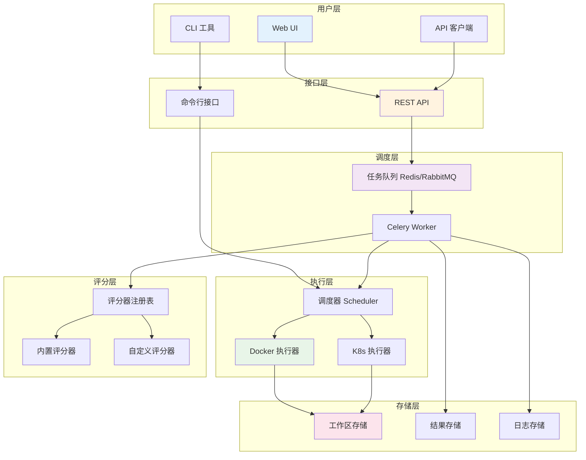

# AutoScorer 系统概述

## 系统简介

AutoScorer 是一个面向机器学习竞赛的自动评分平台，提供统一、可扩展、可运营的"容器执行 + 标准评分"能力。系统以"标准工作区 + 作业模型 + 插件化评分"为核心，兼容本地/Docker/Kubernetes 执行，支持异步调度与水平扩展。

## 核心特性

### 🎯 标准化设计
- **统一工作区结构**: 标准化的 `/workspace` 目录结构
- **标准作业模型**: 基于 JobSpec 的任务描述
- **标准评分输出**: 统一的 Result 格式和错误处理

### 🔌 插件化架构
- **可插拔评分器**: 支持多种评分算法（分类、回归、检测等）
- **热重载支持**: 运行时动态加载和更新评分器
- **扩展友好**: 简单的接口便于第三方算法集成

### 📦 容器化执行
- **安全隔离**: 容器化执行保证安全性和一致性
- **资源管控**: CPU/内存/GPU 配额和超时控制
- **多后端支持**: Docker 和 Kubernetes 执行器

### 🚀 可扩展性
- **异步队列**: 基于 Celery 的任务调度
- **水平扩展**: 多 Worker 并发处理
- **多执行器**: 支持本地、Docker、K8s 等执行环境

### 📊 可观测性
- **结构化日志**: JSON 格式的详细日志记录
- **性能监控**: 任务执行时间和资源使用统计
- **错误标准化**: 统一的错误码和处理机制

## 架构设计

### 整体架构



### 核心组件

#### 1. 任务调度系统
- **调度器**: 根据配置选择最优执行器
- **队列管理**: 支持优先级和多队列
- **任务状态**: 完整的生命周期管理

#### 2. 执行器系统
- **Docker 执行器**: 本地 Docker 容器执行
- **K8s 执行器**: Kubernetes Job 执行
- **资源管理**: CPU/内存/GPU 配额控制

#### 3. 评分器系统
- **注册机制**: 自动发现和注册评分器
- **热重载**: 运行时更新无需重启
- **标准接口**: 统一的评分器开发规范

#### 4. 配置管理
- **YAML 配置**: 结构化的配置文件
- **环境变量**: 运行时配置覆盖
- **配置验证**: 启动时自动验证配置合法性

## 数据模型

### 工作区结构

```
workspace/
├── input/          # 输入数据（只读）
│   ├── gt.csv      # 标准答案
│   └── data/       # 其他输入文件
├── output/         # 输出结果（读写）
│   ├── pred.csv    # 模型预测
│   └── result.json # 评分结果
├── logs/           # 日志文件（读写）
│   ├── container.log
│   └── run_info.json
└── meta.json       # 任务配置
```

### 任务规范 (JobSpec)

```json
{
  "job_id": "job-demo-001",
  "task_type": "classification",
  "scorer": "classification_f1",
  "input_uri": "file://./input",
  "output_uri": "file://./output",
  "time_limit": 1800,
  "resources": {
    "cpu": 2.0,
    "memory": "4Gi",
    "gpus": 0
  },
  "container": {
    "image": "python:3.10-slim",
    "cmd": ["python", "inference.py"],
    "env": {
      "PYTHONUNBUFFERED": "1"
    }
  }
}
```

### 评分结果 (Result)

```json
{
  "summary": {
    "score": 0.85,
    "rank": "A",
    "pass": true
  },
  "metrics": {
    "f1_macro": 0.85,
    "accuracy": 0.88,
    "precision": 0.83,
    "recall": 0.87
  },
  "artifacts": {},
  "timing": {
    "total_time": 1.234
  },
  "versioning": {
    "scorer": "classification_f1",
    "version": "2.0.0",
    "timestamp": "2024-08-24T10:00:00Z"
  }
}
```

## 支持的评分算法

### 内置评分器

| 评分器名称 | 适用任务 | 主要指标 | 数据格式 |
|-----------|----------|----------|----------|
| `classification_f1` | 分类 | F1-Macro | CSV |
| `classification_accuracy` | 分类 | 准确率 | CSV |
| `regression_rmse` | 回归 | RMSE | CSV |
| `detection_map` | 目标检测 | mAP | JSON |

### 自定义评分器

支持通过实现标准接口开发自定义评分器：

```python
from autoscorer.scorers.registry import register
from autoscorer.scorers.base import BaseScorer

@register("my_custom_scorer")
class MyCustomScorer(BaseScorer):
    name = "my_custom_scorer"
    version = "1.0.0"
    
    def score(self, workspace: Path, params: Dict) -> Result:
        # 实现评分逻辑
        pass
```

## 部署模式

### 开发环境
- **本地开发**: 单机 Docker + Redis
- **快速测试**: Docker Compose 一键启动

### 生产环境
- **单机部署**: SystemD 服务管理
- **集群部署**: Kubernetes 原生支持
- **混合部署**: Docker + K8s 混合执行

## 安全特性

### 容器安全
- **非特权执行**: no-new-privileges 策略
- **只读根文件系统**: 防止恶意文件写入
- **网络隔离**: 支持 none/restricted 网络模式
- **资源限制**: CPU/内存/时间配额

### 数据安全
- **输入保护**: input 目录只读挂载
- **输出隔离**: 每个作业独立的 output 目录
- **权限控制**: 基于用户/队伍的访问控制
- **审计日志**: 完整的操作记录

## 性能特性

### 并发处理
- **多 Worker**: 支持多进程并发评分
- **任务队列**: 基于 Redis/RabbitMQ 的可靠队列
- **负载均衡**: 自动任务分发和负载平衡

### 资源优化
- **镜像缓存**: 本地优先策略减少拉取时间
- **结果缓存**: 支持评分结果缓存和复用
- **资源回收**: 自动清理临时文件和容器

### 扩展性
- **水平扩展**: 通过增加 Worker 节点提升处理能力
- **垂直扩展**: 支持高性能硬件（GPU、大内存）
- **多区域**: 支持跨区域分布式部署

## 监控与运维

### 健康检查
- **服务状态**: 实时监控各组件运行状态
- **资源使用**: CPU、内存、磁盘使用监控
- **任务统计**: 成功率、失败率、执行时间统计

### 日志管理
- **结构化日志**: JSON 格式便于分析
- **分级记录**: 不同级别的日志输出
- **日志轮转**: 自动管理日志文件大小

### 告警机制
- **阈值告警**: 资源使用、错误率告警
- **通知渠道**: 支持邮件、Slack、钉钉等
- **故障恢复**: 自动重启和故障切换

## 下一步

- **[快速开始](getting-started.md)**: 立即开始使用 AutoScorer
- **[工作区规范](workspace-spec.md)**: 了解数据准备要求
- **[CLI 指南](cli-guide.md)**: 学习命令行工具使用
- **[API 参考](api-reference.md)**: 集成 REST API 服务

## 版本历史

### v2.0.0 (2024-08-24)
- ✨ 新增热重载评分器支持
- 🔧 改进配置管理和验证
- 📈 增强日志系统和监控
- 🐛 修复多项稳定性问题

### v1.0.0 (2024-06-01)
- 🎉 首个正式版本发布
- 🔥 支持 Docker 和 K8s 执行器
- 📊 内置常用评分算法
- 🚀 完整的 CLI 和 API 接口
